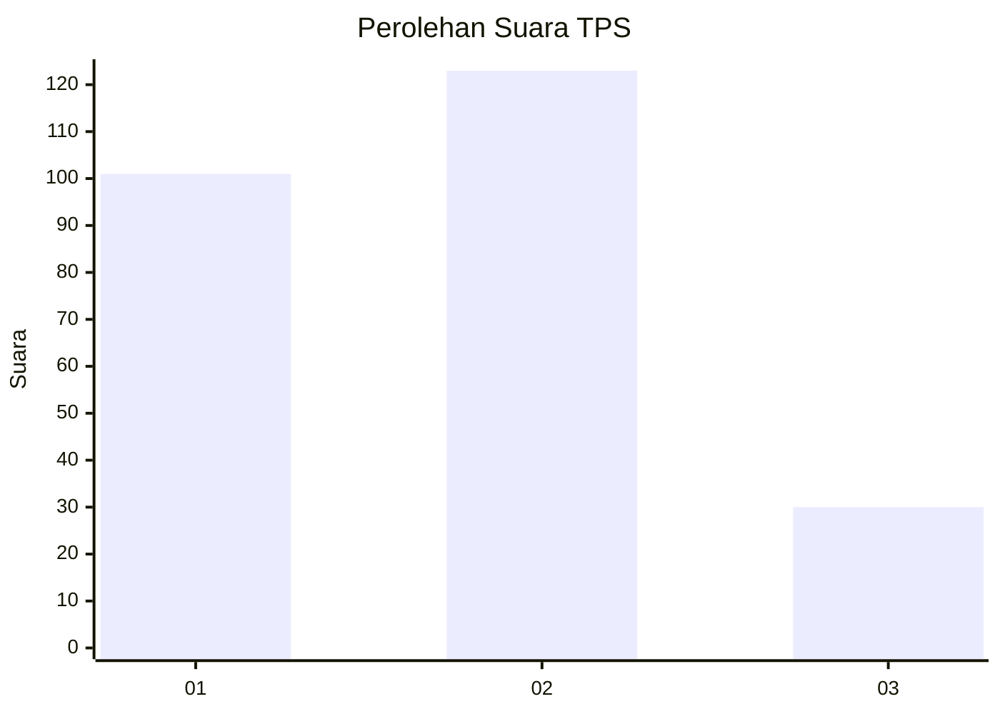
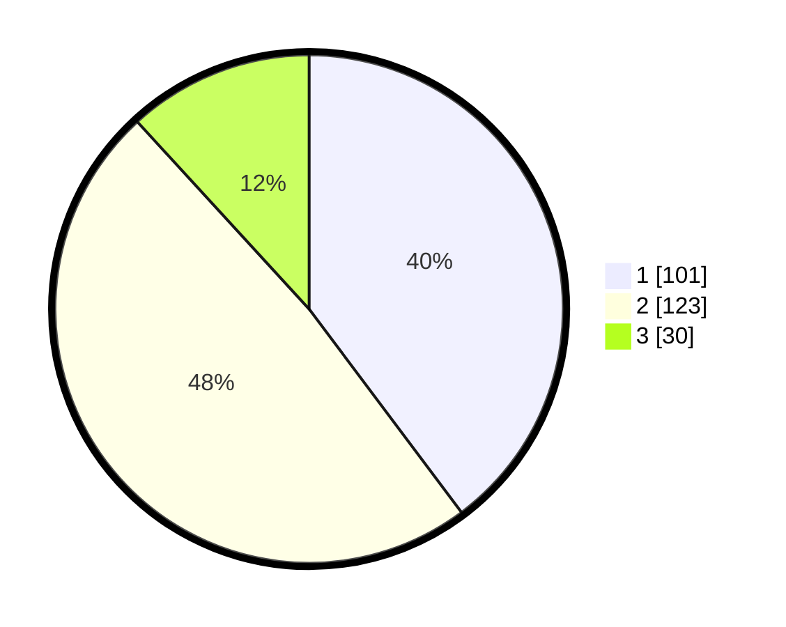

# Hasil

## Grafik

## Tabel

| No. | Nama Paslon    | Suara | Suara (raw) | Persentase |
|:--- |:-------------- | -----:| -----------:| ----------:|
| 1   | ANIES MUHAIMIN | 101   | [101][p-1]  | 39,76      |
| 2   | PRABOWO GIBRAN | 123   | [123][p-2]  | 48,43      |
| 3   | GANJAR MAHFUD  | 30    | [30][p-3]   | 11,81      |

[p-1]: https://github.com/gigit-pemilu/pemilu-2024/blob/main/pilpres/hitung-suara/sub/32-jawa-barat/sub/01-bogor/sub/01-cibinong/sub/1001-pondok-rajeg/sub/001-tps/sub/paslon-1.txt
[p-2]: https://github.com/gigit-pemilu/pemilu-2024/blob/main/pilpres/hitung-suara/sub/32-jawa-barat/sub/01-bogor/sub/01-cibinong/sub/1001-pondok-rajeg/sub/001-tps/sub/paslon-2.txt
[p-3]: https://github.com/gigit-pemilu/pemilu-2024/blob/main/pilpres/hitung-suara/sub/32-jawa-barat/sub/01-bogor/sub/01-cibinong/sub/1001-pondok-rajeg/sub/001-tps/sub/paslon-3.txt

## Foto C Plano

https://sirekap-obj-formc.kpu.go.id/600f/pemilu/ppwp/32/01/01/10/01/3201011001001-20240217-112413--262803d7-e9b3-4aae-ba4a-db2ce98acaea.jpg

https://sirekap-obj-formc.kpu.go.id/600f/pemilu/ppwp/32/01/01/10/01/3201011001001-20240217-112518--445eeff8-254c-4bd2-b6c8-f2b8847bdcac.jpg

https://sirekap-obj-formc.kpu.go.id/600f/pemilu/ppwp/32/01/01/10/01/3201011001001-20240217-112615--5dacc9b5-a3e4-49d5-a1f5-0e989bfb0b3a.jpg

## Metadata

| Key        | Value               |
| ---------- | ------------------- |
| Time Stamp | 2024-02-17 13:37:34 |

