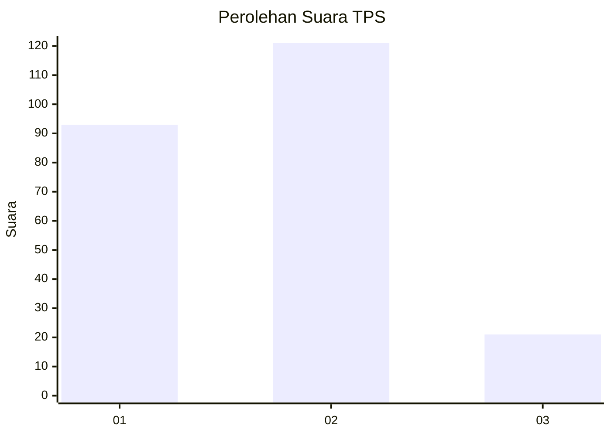
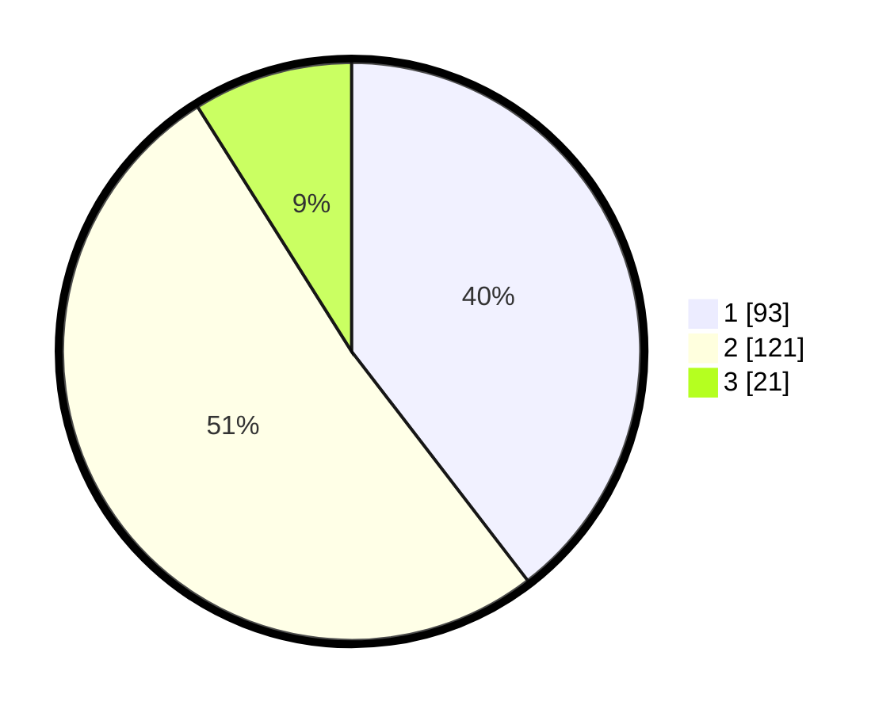

# Hasil

## Grafik

## Tabel

| No. | Nama Paslon    | Suara | Suara (raw) | Persentase |
|:--- |:-------------- | -----:| -----------:| ----------:|
| 1   | ANIES MUHAIMIN | 93    | [93][p-1]   | 39,57      |
| 2   | PRABOWO GIBRAN | 121   | [121][p-2]  | 51,49      |
| 3   | GANJAR MAHFUD  | 21    | [21][p-3]   | 8,94       |

[p-1]: https://github.com/gigit-pemilu/pemilu-2024/blob/main/pilpres/hitung-suara/sub/32-jawa-barat/sub/01-bogor/sub/01-cibinong/sub/1001-pondok-rajeg/sub/004-tps/sub/paslon-1.txt
[p-2]: https://github.com/gigit-pemilu/pemilu-2024/blob/main/pilpres/hitung-suara/sub/32-jawa-barat/sub/01-bogor/sub/01-cibinong/sub/1001-pondok-rajeg/sub/004-tps/sub/paslon-2.txt
[p-3]: https://github.com/gigit-pemilu/pemilu-2024/blob/main/pilpres/hitung-suara/sub/32-jawa-barat/sub/01-bogor/sub/01-cibinong/sub/1001-pondok-rajeg/sub/004-tps/sub/paslon-3.txt

## Foto C Plano

https://sirekap-obj-formc.kpu.go.id/81f0/pemilu/ppwp/32/01/01/10/01/3201011001004-20240216-194501--20d89bd2-f4f8-43f1-a479-406f8764f1d2.jpg

https://sirekap-obj-formc.kpu.go.id/81f0/pemilu/ppwp/32/01/01/10/01/3201011001004-20240214-191442--1fa48922-cdc1-4404-b744-9ec29a04001b.jpg

https://sirekap-obj-formc.kpu.go.id/81f0/pemilu/ppwp/32/01/01/10/01/3201011001004-20240214-192246--b49108fe-0c47-4bbe-8139-b11f1e008742.jpg

## Metadata

| Key        | Value               |
| ---------- | ------------------- |
| Time Stamp | 2024-02-16 21:01:00 |

