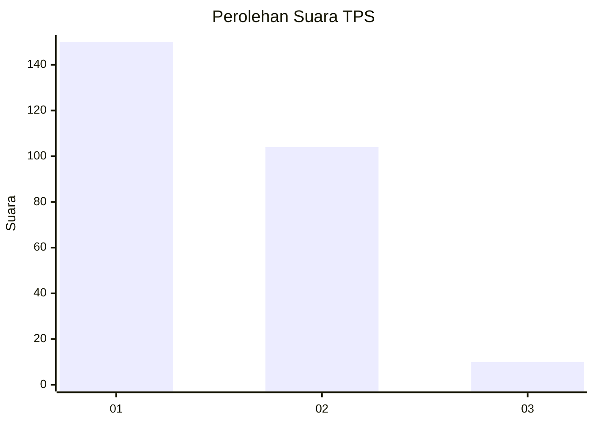
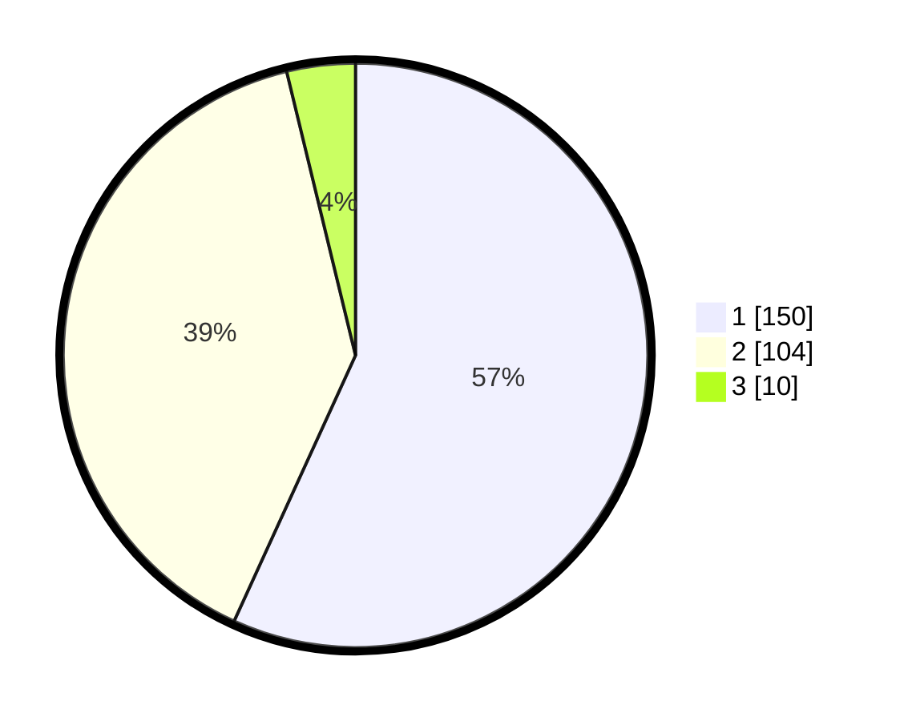

# Hasil

## Grafik

## Tabel

| No. | Nama Paslon    | Suara | Suara (raw) | Persentase |
|:--- |:-------------- | -----:| -----------:| ----------:|
| 1   | ANIES MUHAIMIN | 150   | [150][p-1]  | 56,82      |
| 2   | PRABOWO GIBRAN | 104   | [104][p-2]  | 39,39      |
| 3   | GANJAR MAHFUD  | 10    | [10][p-3]   | 3,79       |

[p-1]: https://github.com/gigit-pemilu/pemilu-2024/blob/main/pilpres/hitung-suara/sub/32-jawa-barat/sub/01-bogor/sub/01-cibinong/sub/1001-pondok-rajeg/sub/034-tps/sub/paslon-1.txt
[p-2]: https://github.com/gigit-pemilu/pemilu-2024/blob/main/pilpres/hitung-suara/sub/32-jawa-barat/sub/01-bogor/sub/01-cibinong/sub/1001-pondok-rajeg/sub/034-tps/sub/paslon-2.txt
[p-3]: https://github.com/gigit-pemilu/pemilu-2024/blob/main/pilpres/hitung-suara/sub/32-jawa-barat/sub/01-bogor/sub/01-cibinong/sub/1001-pondok-rajeg/sub/034-tps/sub/paslon-3.txt

## Foto C Plano

https://sirekap-obj-formc.kpu.go.id/7a63/pemilu/ppwp/32/01/01/10/01/3201011001034-20240215-054826--d952b770-91f4-4fbf-8687-984e53400b55.jpg

https://sirekap-obj-formc.kpu.go.id/7a63/pemilu/ppwp/32/01/01/10/01/3201011001034-20240215-054948--5bf7e4d4-c435-43d2-bd54-c7c694d361d9.jpg

https://sirekap-obj-formc.kpu.go.id/7a63/pemilu/ppwp/32/01/01/10/01/3201011001034-20240215-055102--cc3a1124-daa1-4e1d-8149-acf8d48d658b.jpg

## Metadata

| Key        | Value               |
| ---------- | ------------------- |
| Time Stamp | 2024-02-16 01:00:27 |

