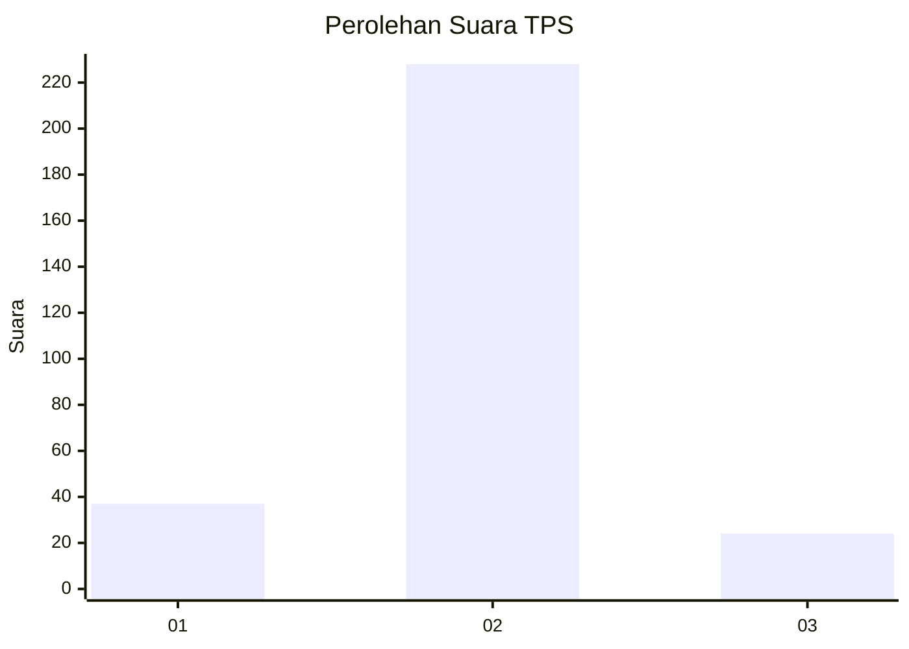
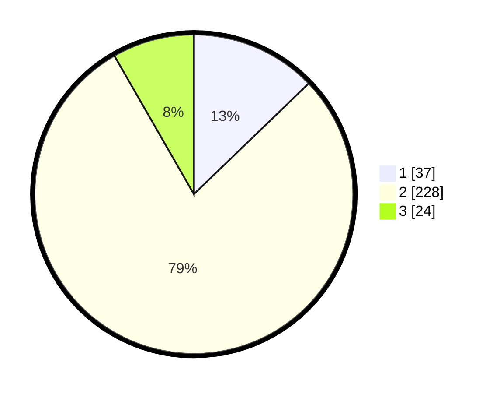

# Hasil

## Grafik

## Tabel

| No. | Nama Paslon    | Suara | Suara (raw) | Persentase |
|:--- |:-------------- | -----:| -----------:| ----------:|
| 1   | ANIES MUHAIMIN | 37    | [37][p-1]   | 12,80      |
| 2   | PRABOWO GIBRAN | 228   | [228][p-2]  | 78,89      |
| 3   | GANJAR MAHFUD  | 24    | [24][p-3]   | 8,30       |

[p-1]: https://github.com/gigit-pemilu/pemilu-2024-32-jawa-barat/blob/main/pilpres/hitung-suara/sub/32-jawa-barat/sub/01-bogor/sub/01-cibinong/sub/1001-pondok-rajeg/sub/902-tps/sub/paslon-1.txt
[p-2]: https://github.com/gigit-pemilu/pemilu-2024-32-jawa-barat/blob/main/pilpres/hitung-suara/sub/32-jawa-barat/sub/01-bogor/sub/01-cibinong/sub/1001-pondok-rajeg/sub/902-tps/sub/paslon-2.txt
[p-3]: https://github.com/gigit-pemilu/pemilu-2024-32-jawa-barat/blob/main/pilpres/hitung-suara/sub/32-jawa-barat/sub/01-bogor/sub/01-cibinong/sub/1001-pondok-rajeg/sub/902-tps/sub/paslon-3.txt

## Foto C Plano

https://sirekap-obj-formc.kpu.go.id/d67d/pemilu/ppwp/32/01/01/10/01/3201011001902-20240216-055032--a48a72bd-2d8e-4d36-8524-9e1680991a2a.jpg

https://sirekap-obj-formc.kpu.go.id/d67d/pemilu/ppwp/32/01/01/10/01/3201011001902-20240214-223334--f2baaf73-d5dd-4788-b4dc-255075ffcc73.jpg

https://sirekap-obj-formc.kpu.go.id/d67d/pemilu/ppwp/32/01/01/10/01/3201011001902-20240214-223448--066b66ac-f165-4986-af50-2d716c973f6c.jpg

## Metadata

| Key        | Value               |
| ---------- | ------------------- |
| Time Stamp | 2024-02-16 06:00:27 |

