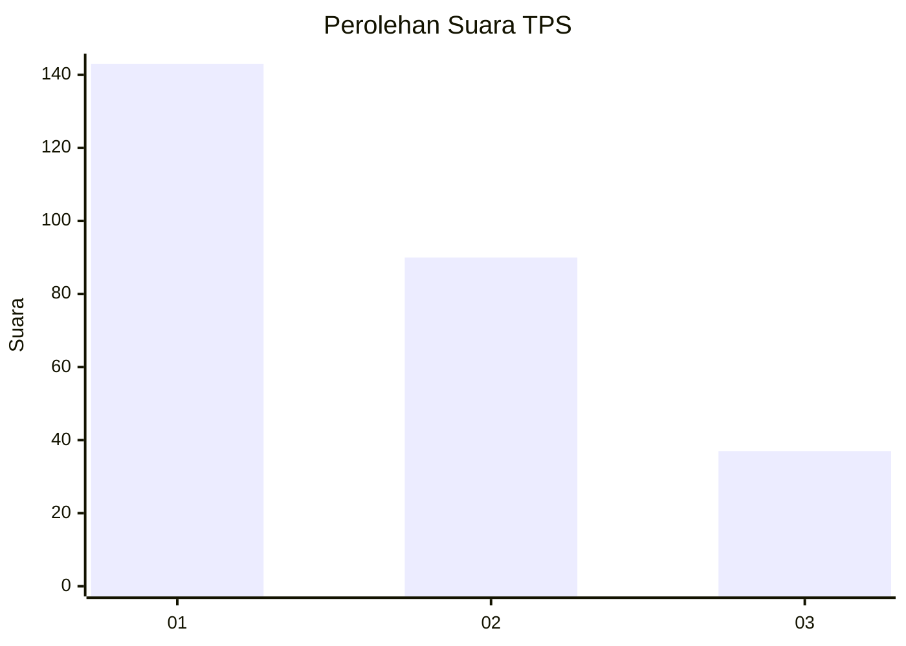
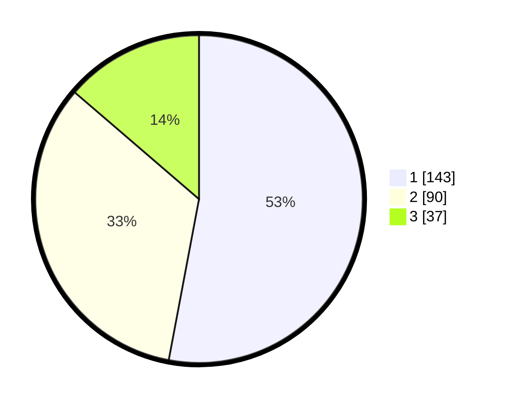

# Hasil

## Grafik

## Tabel

| No. | Nama Paslon    | Suara | Suara (raw) | Persentase |
|:--- |:-------------- | -----:| -----------:| ----------:|
| 1   | ANIES MUHAIMIN | 143   | [143][p-1]  | 52,96      |
| 2   | PRABOWO GIBRAN | 90    | [90][p-2]   | 33,33      |
| 3   | GANJAR MAHFUD  | 37    | [37][p-3]   | 13,70      |

[p-1]: https://github.com/gigit-pemilu/pemilu-2024-32-jawa-barat/blob/main/pilpres/hitung-suara/sub/32-jawa-barat/sub/01-bogor/sub/01-cibinong/sub/1002-karadenan/sub/067-tps/sub/paslon-1.txt
[p-2]: https://github.com/gigit-pemilu/pemilu-2024-32-jawa-barat/blob/main/pilpres/hitung-suara/sub/32-jawa-barat/sub/01-bogor/sub/01-cibinong/sub/1002-karadenan/sub/067-tps/sub/paslon-2.txt
[p-3]: https://github.com/gigit-pemilu/pemilu-2024-32-jawa-barat/blob/main/pilpres/hitung-suara/sub/32-jawa-barat/sub/01-bogor/sub/01-cibinong/sub/1002-karadenan/sub/067-tps/sub/paslon-3.txt

## Foto C Plano

https://sirekap-obj-formc.kpu.go.id/c8a1/pemilu/ppwp/32/01/01/10/02/3201011002067-20240214-194950--c72df578-1941-442a-a7af-88a420eec24a.jpg

https://sirekap-obj-formc.kpu.go.id/c8a1/pemilu/ppwp/32/01/01/10/02/3201011002067-20240214-195006--8a48bd19-bbca-40e1-adb9-ef881ba1e6a7.jpg

https://sirekap-obj-formc.kpu.go.id/c8a1/pemilu/ppwp/32/01/01/10/02/3201011002067-20240214-195011--8d26d758-3886-4a5a-9275-e52adc01c50d.jpg

## Metadata

| Key        | Value               |
| ---------- | ------------------- |
| Time Stamp | 2024-02-14 21:46:01 |

