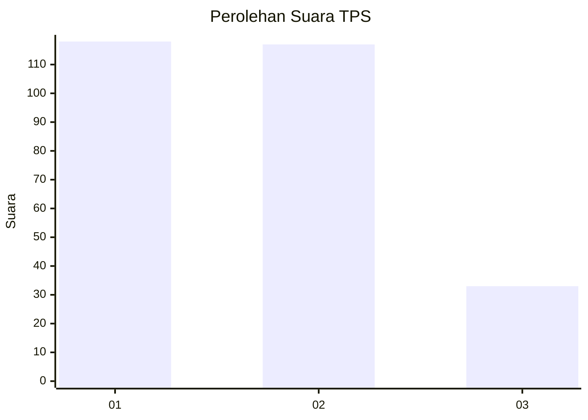
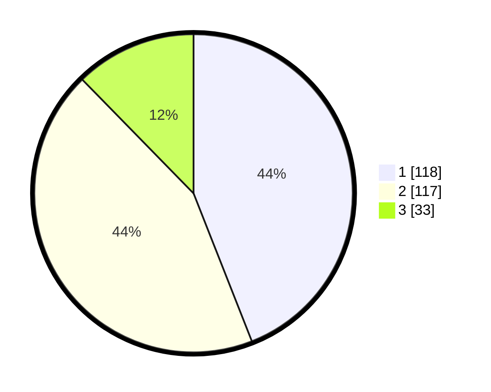

# Hasil

## Grafik

## Tabel

| No. | Nama Paslon    | Suara | Suara (raw) | Persentase |
|:--- |:-------------- | -----:| -----------:| ----------:|
| 1   | ANIES MUHAIMIN | 118   | [118][p-1]  | 44,03      |
| 2   | PRABOWO GIBRAN | 117   | [117][p-2]  | 43,66      |
| 3   | GANJAR MAHFUD  | 33    | [33][p-3]   | 12,31      |

[p-1]: https://github.com/gigit-pemilu/pemilu-2024-32-jawa-barat/blob/main/pilpres/hitung-suara/sub/32-jawa-barat/sub/01-bogor/sub/01-cibinong/sub/1004-nanggewer/sub/023-tps/sub/paslon-1.txt
[p-2]: https://github.com/gigit-pemilu/pemilu-2024-32-jawa-barat/blob/main/pilpres/hitung-suara/sub/32-jawa-barat/sub/01-bogor/sub/01-cibinong/sub/1004-nanggewer/sub/023-tps/sub/paslon-2.txt
[p-3]: https://github.com/gigit-pemilu/pemilu-2024-32-jawa-barat/blob/main/pilpres/hitung-suara/sub/32-jawa-barat/sub/01-bogor/sub/01-cibinong/sub/1004-nanggewer/sub/023-tps/sub/paslon-3.txt

## Foto C Plano

https://sirekap-obj-formc.kpu.go.id/d944/pemilu/ppwp/32/01/01/10/04/3201011004023-20240215-003618--e89eca0f-8227-48e7-a222-5530db5aa492.jpg

https://sirekap-obj-formc.kpu.go.id/d944/pemilu/ppwp/32/01/01/10/04/3201011004023-20240215-003734--798828a8-88dc-462b-b428-f3fcda31e495.jpg

https://sirekap-obj-formc.kpu.go.id/d944/pemilu/ppwp/32/01/01/10/04/3201011004023-20240215-003847--b1f22d3f-225b-4d20-ba3a-b0d411b95246.jpg

## Metadata

| Key        | Value               |
| ---------- | ------------------- |
| Time Stamp | 2024-02-15 21:01:18 |

