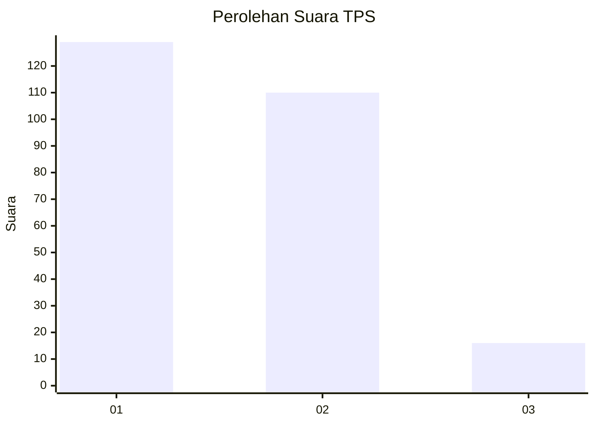
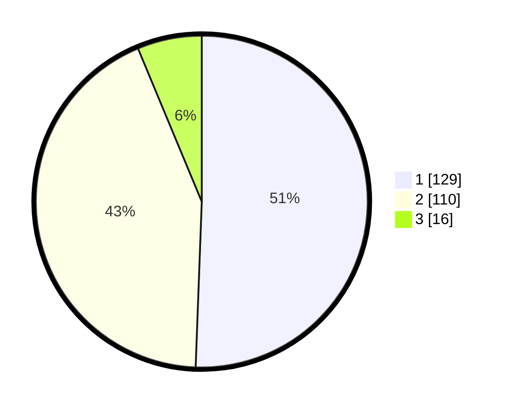

# Hasil

## Grafik

## Tabel

| No. | Nama Paslon    | Suara | Suara (raw) | Persentase |
|:--- |:-------------- | -----:| -----------:| ----------:|
| 1   | ANIES MUHAIMIN | 129   | [129][p-1]  | 50,59      |
| 2   | PRABOWO GIBRAN | 110   | [110][p-2]  | 43,14      |
| 3   | GANJAR MAHFUD  | 16    | [16][p-3]   | 6,27       |

[p-1]: https://github.com/gigit-pemilu/pemilu-2024/blob/main/pilpres/hitung-suara/sub/32-jawa-barat/sub/01-bogor/sub/01-cibinong/sub/1004-nanggewer/sub/033-tps/sub/paslon-1.txt
[p-2]: https://github.com/gigit-pemilu/pemilu-2024/blob/main/pilpres/hitung-suara/sub/32-jawa-barat/sub/01-bogor/sub/01-cibinong/sub/1004-nanggewer/sub/033-tps/sub/paslon-2.txt
[p-3]: https://github.com/gigit-pemilu/pemilu-2024/blob/main/pilpres/hitung-suara/sub/32-jawa-barat/sub/01-bogor/sub/01-cibinong/sub/1004-nanggewer/sub/033-tps/sub/paslon-3.txt

## Foto C Plano

https://sirekap-obj-formc.kpu.go.id/59fa/pemilu/ppwp/32/01/01/10/04/3201011004033-20240214-203348--b453e53c-5ec3-4e77-b0ae-e5fdb727def2.jpg

https://sirekap-obj-formc.kpu.go.id/59fa/pemilu/ppwp/32/01/01/10/04/3201011004033-20240214-203506--bcf052fd-3b79-4bac-9901-afd0e5634815.jpg

https://sirekap-obj-formc.kpu.go.id/59fa/pemilu/ppwp/32/01/01/10/04/3201011004033-20240214-203552--264ea125-5956-49fa-aa96-90baf7990521.jpg

## Metadata

| Key        | Value               |
| ---------- | ------------------- |
| Time Stamp | 2024-02-16 11:00:29 |

