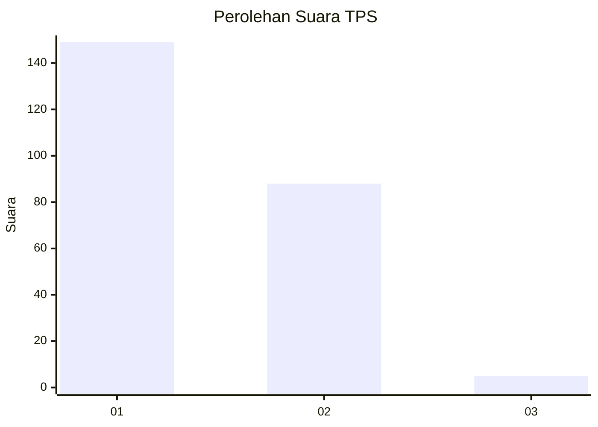
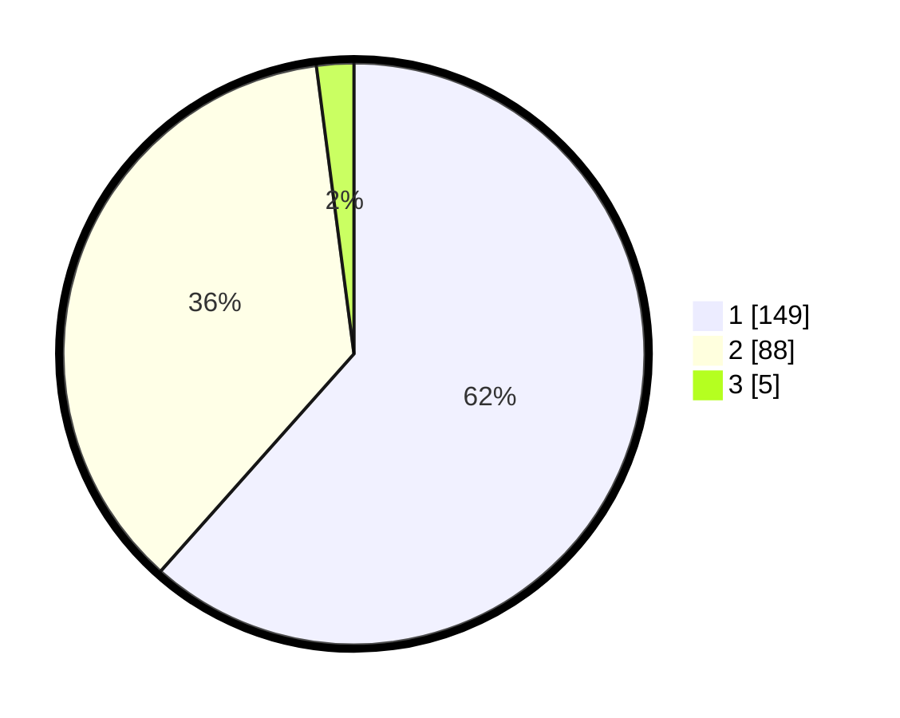

# Hasil

## Grafik

## Tabel

| No. | Nama Paslon    | Suara | Suara (raw) | Persentase |
|:--- |:-------------- | -----:| -----------:| ----------:|
| 1   | ANIES MUHAIMIN | 149   | [149][p-1]  | 61,57      |
| 2   | PRABOWO GIBRAN | 88    | [88][p-2]   | 36,36      |
| 3   | GANJAR MAHFUD  | 5     | [5][p-3]    | 2,07       |

[p-1]: https://github.com/gigit-pemilu/pemilu-2024-32-jawa-barat/blob/main/pilpres/hitung-suara/sub/32-jawa-barat/sub/01-bogor/sub/01-cibinong/sub/1004-nanggewer/sub/052-tps/sub/paslon-1.txt
[p-2]: https://github.com/gigit-pemilu/pemilu-2024-32-jawa-barat/blob/main/pilpres/hitung-suara/sub/32-jawa-barat/sub/01-bogor/sub/01-cibinong/sub/1004-nanggewer/sub/052-tps/sub/paslon-2.txt
[p-3]: https://github.com/gigit-pemilu/pemilu-2024-32-jawa-barat/blob/main/pilpres/hitung-suara/sub/32-jawa-barat/sub/01-bogor/sub/01-cibinong/sub/1004-nanggewer/sub/052-tps/sub/paslon-3.txt

## Foto C Plano

https://sirekap-obj-formc.kpu.go.id/c6eb/pemilu/ppwp/32/01/01/10/04/3201011004052-20240215-030221--c9a8f550-405a-4cdc-b403-698ede76f473.jpg

https://sirekap-obj-formc.kpu.go.id/c6eb/pemilu/ppwp/32/01/01/10/04/3201011004052-20240215-030350--f4a4c0f8-89ef-40b7-b7c0-5c37f63ee054.jpg

https://sirekap-obj-formc.kpu.go.id/c6eb/pemilu/ppwp/32/01/01/10/04/3201011004052-20240215-030451--0a375e68-5db2-4dd2-8c4c-5536f0bdb194.jpg

## Metadata

| Key        | Value               |
| ---------- | ------------------- |
| Time Stamp | 2024-02-16 11:00:29 |

