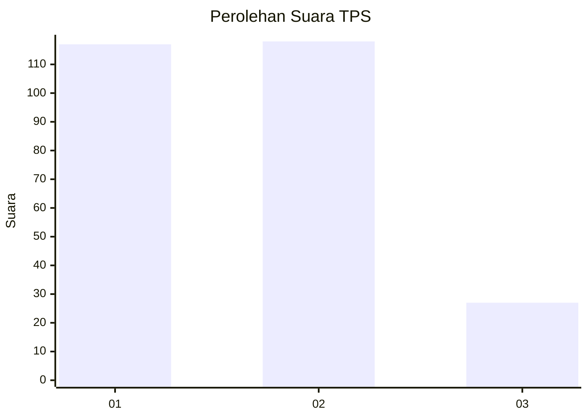
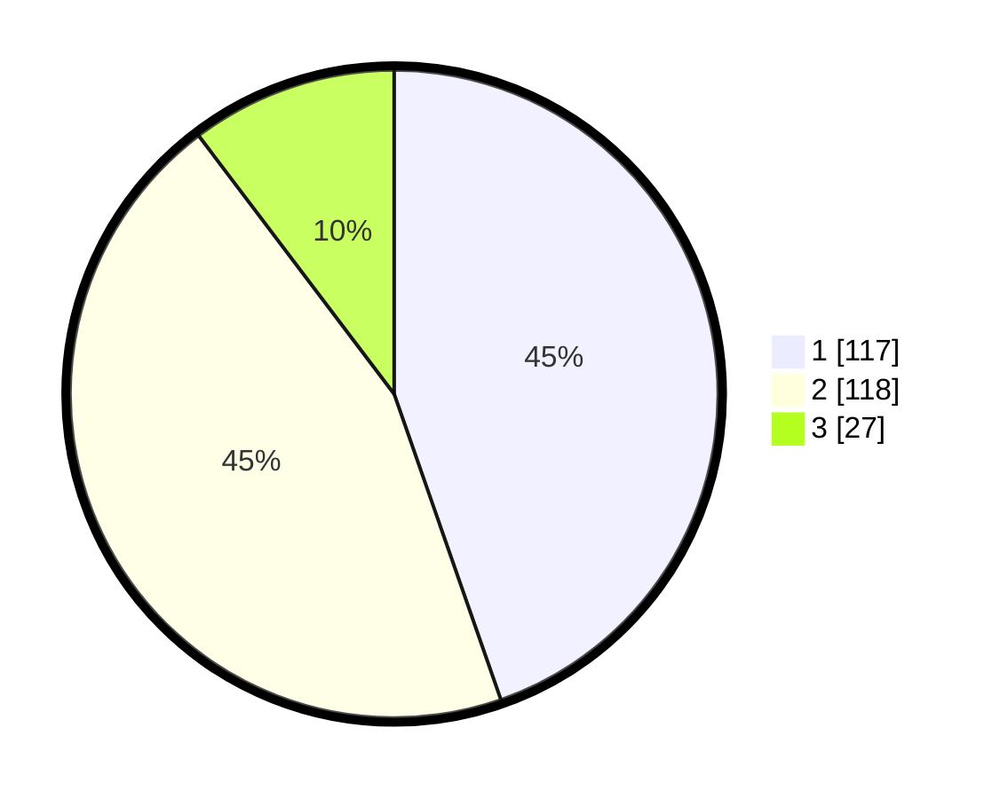

# Hasil

## Grafik

## Tabel

| No. | Nama Paslon    | Suara | Suara (raw) | Persentase |
|:--- |:-------------- | -----:| -----------:| ----------:|
| 1   | ANIES MUHAIMIN | 117   | [117][p-1]  | 44,66      |
| 2   | PRABOWO GIBRAN | 118   | [118][p-2]  | 45,04      |
| 3   | GANJAR MAHFUD  | 27    | [27][p-3]   | 10,31      |

[p-1]: https://github.com/gigit-pemilu/pemilu-2024/blob/main/pilpres/hitung-suara/sub/32-jawa-barat/sub/01-bogor/sub/01-cibinong/sub/1004-nanggewer/sub/064-tps/sub/paslon-1.txt
[p-2]: https://github.com/gigit-pemilu/pemilu-2024/blob/main/pilpres/hitung-suara/sub/32-jawa-barat/sub/01-bogor/sub/01-cibinong/sub/1004-nanggewer/sub/064-tps/sub/paslon-2.txt
[p-3]: https://github.com/gigit-pemilu/pemilu-2024/blob/main/pilpres/hitung-suara/sub/32-jawa-barat/sub/01-bogor/sub/01-cibinong/sub/1004-nanggewer/sub/064-tps/sub/paslon-3.txt

## Foto C Plano

https://sirekap-obj-formc.kpu.go.id/4d92/pemilu/ppwp/32/01/01/10/04/3201011004064-20240214-160111--d19f1d79-b6cf-4ea5-b64a-5f1cb6b51402.jpg

https://sirekap-obj-formc.kpu.go.id/4d92/pemilu/ppwp/32/01/01/10/04/3201011004064-20240214-160103--5832d7ed-eccd-4f06-85f3-eae2baf45349.jpg

https://sirekap-obj-formc.kpu.go.id/4d92/pemilu/ppwp/32/01/01/10/04/3201011004064-20240214-155712--dd13270a-1605-4cf3-b2ec-b3a7b2263c0e.jpg

## Metadata

| Key        | Value               |
| ---------- | ------------------- |
| Time Stamp | 2024-02-15 21:30:27 |

