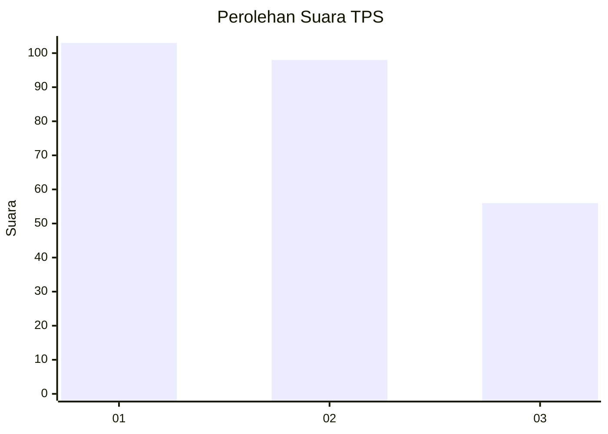
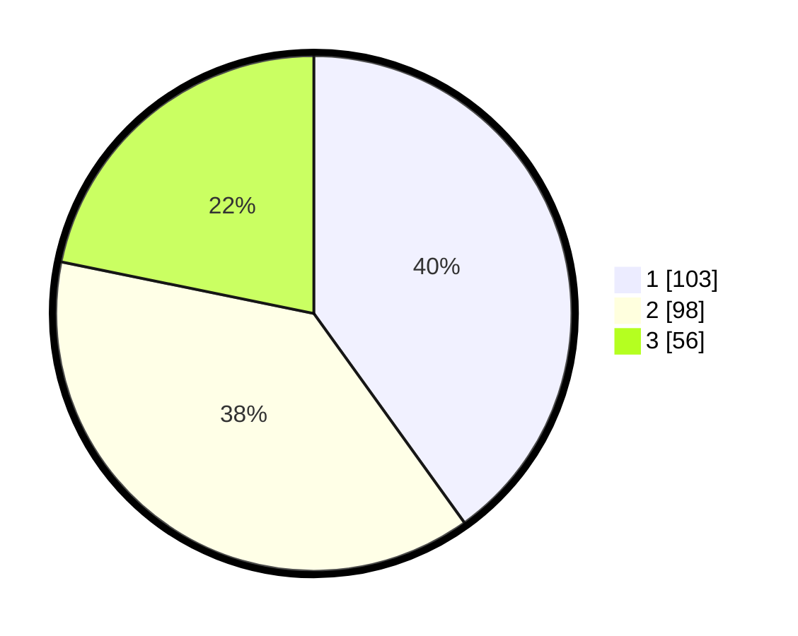

# Hasil

## Grafik

## Tabel

| No. | Nama Paslon    | Suara | Suara (raw) | Persentase |
|:--- |:-------------- | -----:| -----------:| ----------:|
| 1   | ANIES MUHAIMIN | 103   | [103][p-1]  | 40,08      |
| 2   | PRABOWO GIBRAN | 98    | [98][p-2]   | 38,13      |
| 3   | GANJAR MAHFUD  | 56    | [56][p-3]   | 21,79      |

[p-1]: https://github.com/gigit-pemilu/pemilu-2024-32-jawa-barat/blob/main/pilpres/hitung-suara/sub/32-jawa-barat/sub/01-bogor/sub/01-cibinong/sub/1007-pakansari/sub/004-tps/sub/paslon-1.txt
[p-2]: https://github.com/gigit-pemilu/pemilu-2024-32-jawa-barat/blob/main/pilpres/hitung-suara/sub/32-jawa-barat/sub/01-bogor/sub/01-cibinong/sub/1007-pakansari/sub/004-tps/sub/paslon-2.txt
[p-3]: https://github.com/gigit-pemilu/pemilu-2024-32-jawa-barat/blob/main/pilpres/hitung-suara/sub/32-jawa-barat/sub/01-bogor/sub/01-cibinong/sub/1007-pakansari/sub/004-tps/sub/paslon-3.txt

## Foto C Plano

https://sirekap-obj-formc.kpu.go.id/743d/pemilu/ppwp/32/01/01/10/07/3201011007004-20240214-225916--51bde4ec-855d-45c0-b4e4-f5864c6ade0a.jpg

https://sirekap-obj-formc.kpu.go.id/743d/pemilu/ppwp/32/01/01/10/07/3201011007004-20240214-230329--69303320-a828-41bf-8f5c-4f37b5a0317b.jpg

https://sirekap-obj-formc.kpu.go.id/743d/pemilu/ppwp/32/01/01/10/07/3201011007004-20240215-021305--84938452-91cb-4b72-9774-ea4cd669cdda.jpg

## Metadata

| Key        | Value               |
| ---------- | ------------------- |
| Time Stamp | 2024-02-16 12:51:22 |

