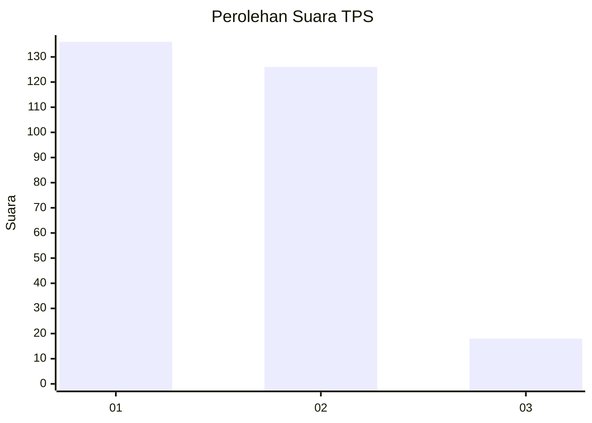
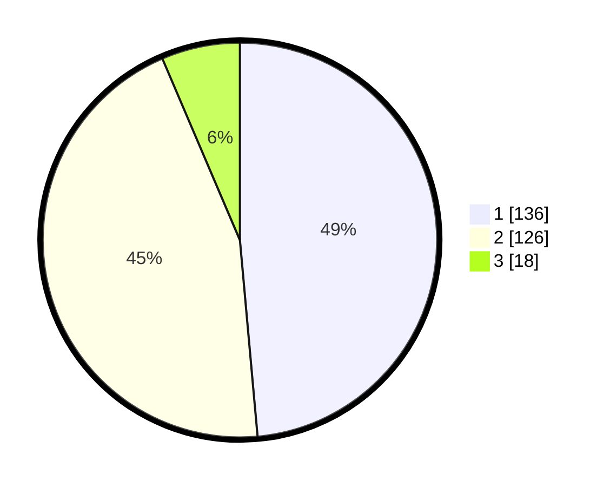

# Hasil

## Grafik

## Tabel

| No. | Nama Paslon    | Suara | Suara (raw) | Persentase |
|:--- |:-------------- | -----:| -----------:| ----------:|
| 1   | ANIES MUHAIMIN | 136   | [136][p-1]  | 48,57      |
| 2   | PRABOWO GIBRAN | 126   | [126][p-2]  | 45,00      |
| 3   | GANJAR MAHFUD  | 18    | [18][p-3]   | 6,43       |

[p-1]: https://github.com/gigit-pemilu/pemilu-2024/blob/main/pilpres/hitung-suara/sub/32-jawa-barat/sub/01-bogor/sub/01-cibinong/sub/1007-pakansari/sub/045-tps/sub/paslon-1.txt
[p-2]: https://github.com/gigit-pemilu/pemilu-2024/blob/main/pilpres/hitung-suara/sub/32-jawa-barat/sub/01-bogor/sub/01-cibinong/sub/1007-pakansari/sub/045-tps/sub/paslon-2.txt
[p-3]: https://github.com/gigit-pemilu/pemilu-2024/blob/main/pilpres/hitung-suara/sub/32-jawa-barat/sub/01-bogor/sub/01-cibinong/sub/1007-pakansari/sub/045-tps/sub/paslon-3.txt

## Foto C Plano

https://sirekap-obj-formc.kpu.go.id/3ce0/pemilu/ppwp/32/01/01/10/07/3201011007045-20240215-005804--120b6023-ac4e-44fb-8d6f-e869d9bf6b30.jpg

https://sirekap-obj-formc.kpu.go.id/3ce0/pemilu/ppwp/32/01/01/10/07/3201011007045-20240215-005931--5870e1c4-881b-40fb-964a-b1c2ea54912d.jpg

https://sirekap-obj-formc.kpu.go.id/3ce0/pemilu/ppwp/32/01/01/10/07/3201011007045-20240215-010103--1bf9b7a7-dc2c-4ce3-96c7-bd728a1168c4.jpg

## Metadata

| Key        | Value               |
| ---------- | ------------------- |
| Time Stamp | 2024-02-16 12:51:22 |

