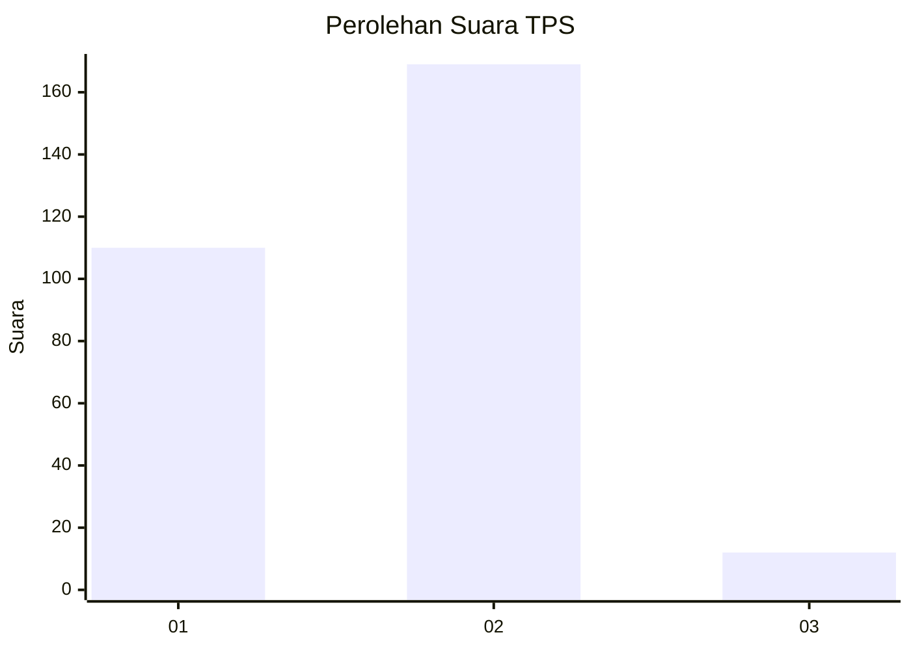
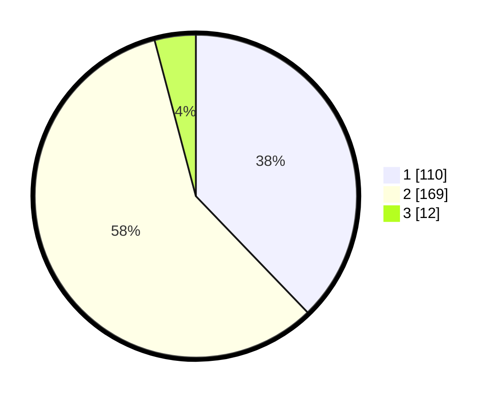

# Hasil

## Grafik

## Tabel

| No. | Nama Paslon    | Suara | Suara (raw) | Persentase |
|:--- |:-------------- | -----:| -----------:| ----------:|
| 1   | ANIES MUHAIMIN | 110   | [110][p-1]  | 37,80      |
| 2   | PRABOWO GIBRAN | 169   | [169][p-2]  | 58,08      |
| 3   | GANJAR MAHFUD  | 12    | [12][p-3]   | 4,12       |

[p-1]: https://github.com/gigit-pemilu/pemilu-2024-32-jawa-barat/blob/main/pilpres/hitung-suara/sub/32-jawa-barat/sub/01-bogor/sub/01-cibinong/sub/1008-tengah/sub/002-tps/sub/paslon-1.txt
[p-2]: https://github.com/gigit-pemilu/pemilu-2024-32-jawa-barat/blob/main/pilpres/hitung-suara/sub/32-jawa-barat/sub/01-bogor/sub/01-cibinong/sub/1008-tengah/sub/002-tps/sub/paslon-2.txt
[p-3]: https://github.com/gigit-pemilu/pemilu-2024-32-jawa-barat/blob/main/pilpres/hitung-suara/sub/32-jawa-barat/sub/01-bogor/sub/01-cibinong/sub/1008-tengah/sub/002-tps/sub/paslon-3.txt

## Foto C Plano

https://sirekap-obj-formc.kpu.go.id/3f24/pemilu/ppwp/32/01/01/10/08/3201011008002-20240215-042952--39be4b0e-ea62-4c00-9fcb-7b25c84bec55.jpg

https://sirekap-obj-formc.kpu.go.id/3f24/pemilu/ppwp/32/01/01/10/08/3201011008002-20240215-043442--51610740-6b7f-4d44-9d1d-d6c7412e7d9b.jpg

https://sirekap-obj-formc.kpu.go.id/3f24/pemilu/ppwp/32/01/01/10/08/3201011008002-20240215-043709--5ce0c337-bd64-4842-b93d-0b224459bad4.jpg

## Metadata

| Key        | Value               |
| ---------- | ------------------- |
| Time Stamp | 2024-02-16 12:51:22 |

