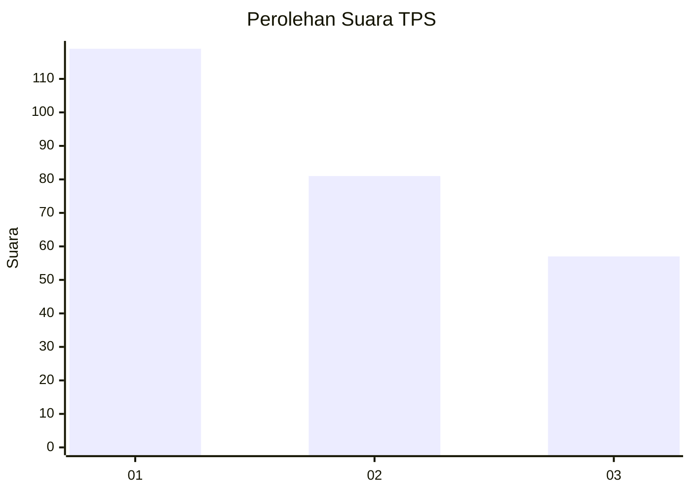
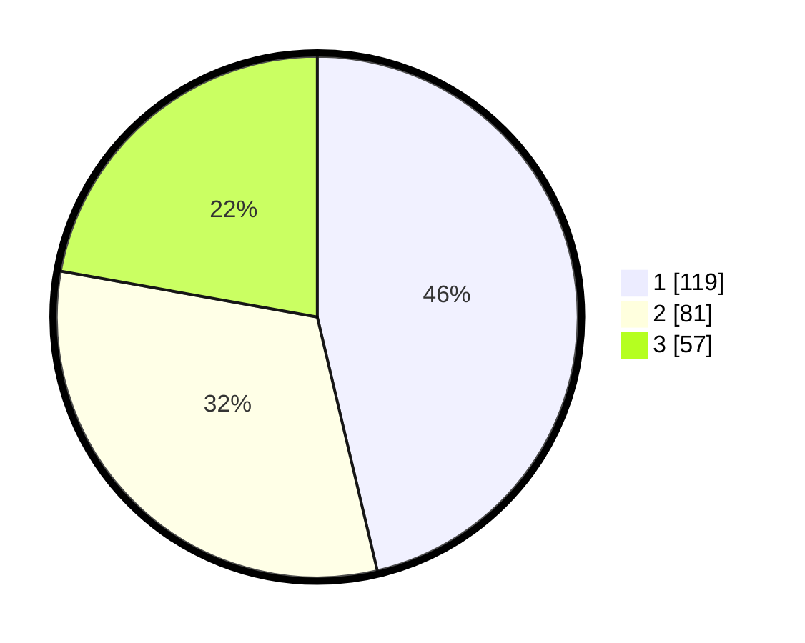

# Hasil

## Grafik

## Tabel

| No. | Nama Paslon    | Suara | Suara (raw) | Persentase |
|:--- |:-------------- | -----:| -----------:| ----------:|
| 1   | ANIES MUHAIMIN | 119   | [119][p-1]  | 46,30      |
| 2   | PRABOWO GIBRAN | 81    | [81][p-2]   | 31,52      |
| 3   | GANJAR MAHFUD  | 57    | [57][p-3]   | 22,18      |

[p-1]: https://github.com/gigit-pemilu/pemilu-2024-32-jawa-barat/blob/main/pilpres/hitung-suara/sub/32-jawa-barat/sub/01-bogor/sub/01-cibinong/sub/1008-tengah/sub/033-tps/sub/paslon-1.txt
[p-2]: https://github.com/gigit-pemilu/pemilu-2024-32-jawa-barat/blob/main/pilpres/hitung-suara/sub/32-jawa-barat/sub/01-bogor/sub/01-cibinong/sub/1008-tengah/sub/033-tps/sub/paslon-2.txt
[p-3]: https://github.com/gigit-pemilu/pemilu-2024-32-jawa-barat/blob/main/pilpres/hitung-suara/sub/32-jawa-barat/sub/01-bogor/sub/01-cibinong/sub/1008-tengah/sub/033-tps/sub/paslon-3.txt

## Foto C Plano

https://sirekap-obj-formc.kpu.go.id/786c/pemilu/ppwp/32/01/01/10/08/3201011008033-20240215-165106--84120284-c12f-49dd-a91d-2b4ccd40acf3.jpg

https://sirekap-obj-formc.kpu.go.id/786c/pemilu/ppwp/32/01/01/10/08/3201011008033-20240215-165053--035fe9e1-4ac3-46dd-9190-599103bfd49f.jpg

https://sirekap-obj-formc.kpu.go.id/786c/pemilu/ppwp/32/01/01/10/08/3201011008033-20240215-165117--3da7e9f6-f762-45a4-b095-6027edb7b1b0.jpg

## Metadata

| Key        | Value               |
| ---------- | ------------------- |
| Time Stamp | 2024-02-16 12:51:22 |

