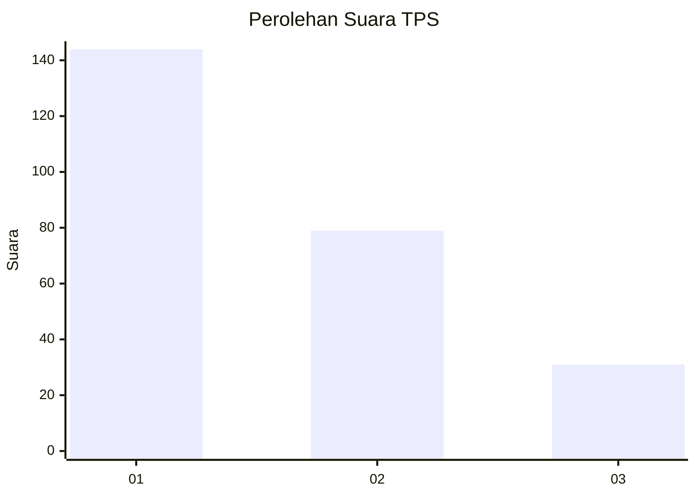
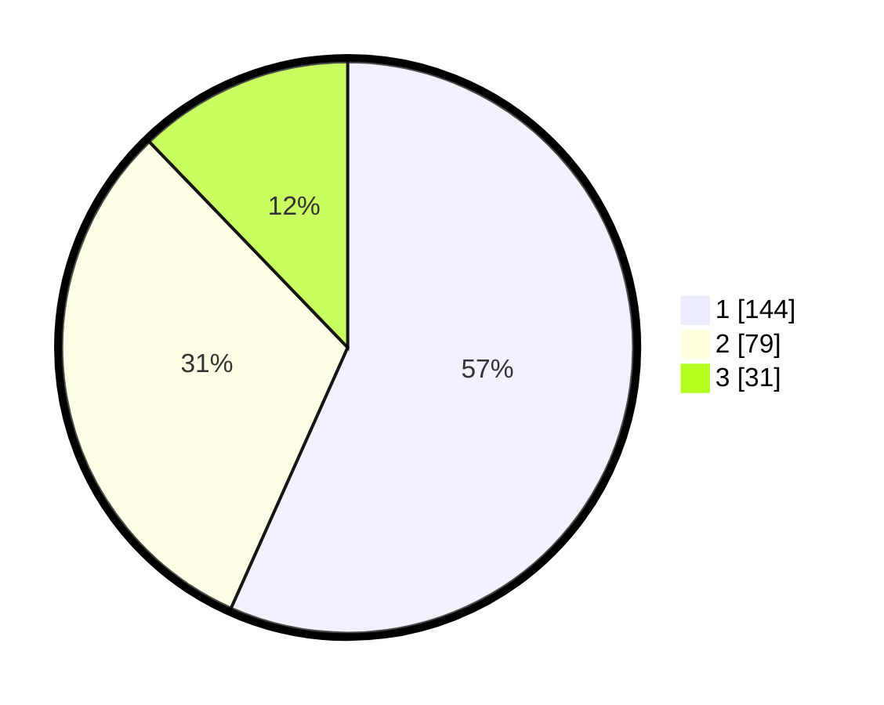

# Hasil

## Grafik

## Tabel

| No. | Nama Paslon    | Suara | Suara (raw) | Persentase |
|:--- |:-------------- | -----:| -----------:| ----------:|
| 1   | ANIES MUHAIMIN | 144   | [144][p-1]  | 56,69      |
| 2   | PRABOWO GIBRAN | 79    | [79][p-2]   | 31,10      |
| 3   | GANJAR MAHFUD  | 31    | [31][p-3]   | 12,20      |

[p-1]: https://github.com/gigit-pemilu/pemilu-2024-32-jawa-barat/blob/main/pilpres/hitung-suara/sub/32-jawa-barat/sub/01-bogor/sub/01-cibinong/sub/1009-sukahati/sub/013-tps/sub/paslon-1.txt
[p-2]: https://github.com/gigit-pemilu/pemilu-2024-32-jawa-barat/blob/main/pilpres/hitung-suara/sub/32-jawa-barat/sub/01-bogor/sub/01-cibinong/sub/1009-sukahati/sub/013-tps/sub/paslon-2.txt
[p-3]: https://github.com/gigit-pemilu/pemilu-2024-32-jawa-barat/blob/main/pilpres/hitung-suara/sub/32-jawa-barat/sub/01-bogor/sub/01-cibinong/sub/1009-sukahati/sub/013-tps/sub/paslon-3.txt

## Foto C Plano

https://sirekap-obj-formc.kpu.go.id/8e25/pemilu/ppwp/32/01/01/10/09/3201011009013-20240215-014718--8bc3fbba-e792-4537-9437-77c2471332f2.jpg

https://sirekap-obj-formc.kpu.go.id/8e25/pemilu/ppwp/32/01/01/10/09/3201011009013-20240215-014908--5f4b74aa-d8e0-452a-a509-ca1d62e0cc1d.jpg

https://sirekap-obj-formc.kpu.go.id/8e25/pemilu/ppwp/32/01/01/10/09/3201011009013-20240215-015049--30397a7c-e35e-479c-ae49-43928d1f81b4.jpg

## Metadata

| Key        | Value               |
| ---------- | ------------------- |
| Time Stamp | 2024-02-16 12:51:22 |

