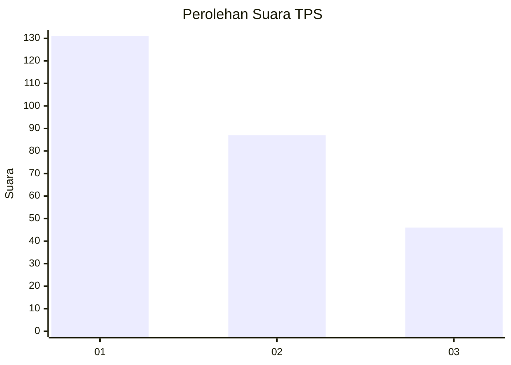
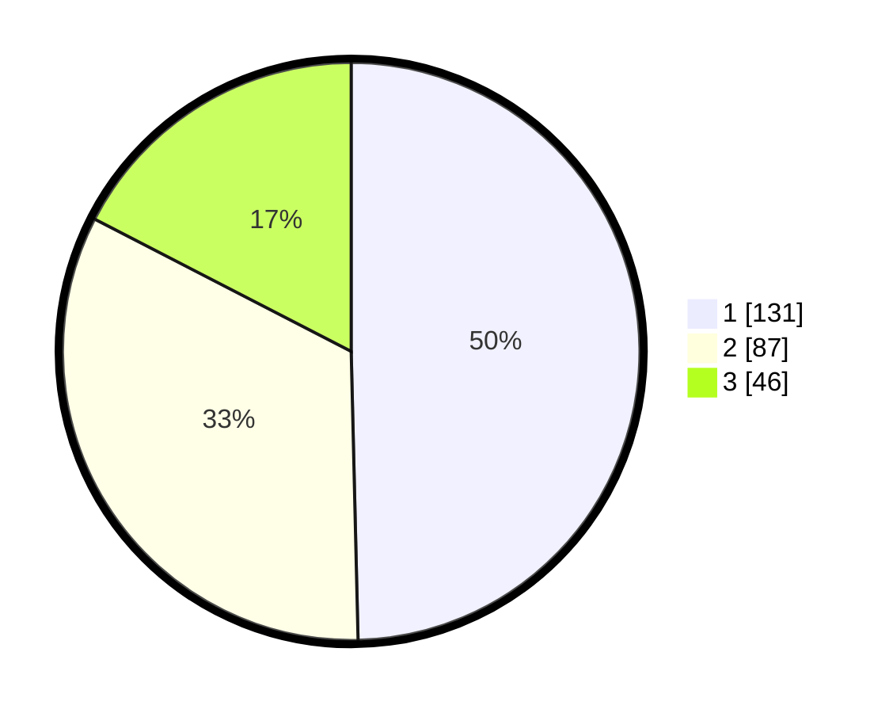

# Hasil

## Grafik

## Tabel

| No. | Nama Paslon    | Suara | Suara (raw) | Persentase |
|:--- |:-------------- | -----:| -----------:| ----------:|
| 1   | ANIES MUHAIMIN | 131   | [131][p-1]  | 49,62      |
| 2   | PRABOWO GIBRAN | 87    | [87][p-2]   | 32,95      |
| 3   | GANJAR MAHFUD  | 46    | [46][p-3]   | 17,42      |

[p-1]: https://github.com/gigit-pemilu/pemilu-2024-32-jawa-barat/blob/main/pilpres/hitung-suara/sub/32-jawa-barat/sub/01-bogor/sub/01-cibinong/sub/1009-sukahati/sub/014-tps/sub/paslon-1.txt
[p-2]: https://github.com/gigit-pemilu/pemilu-2024-32-jawa-barat/blob/main/pilpres/hitung-suara/sub/32-jawa-barat/sub/01-bogor/sub/01-cibinong/sub/1009-sukahati/sub/014-tps/sub/paslon-2.txt
[p-3]: https://github.com/gigit-pemilu/pemilu-2024-32-jawa-barat/blob/main/pilpres/hitung-suara/sub/32-jawa-barat/sub/01-bogor/sub/01-cibinong/sub/1009-sukahati/sub/014-tps/sub/paslon-3.txt

## Foto C Plano

https://sirekap-obj-formc.kpu.go.id/c139/pemilu/ppwp/32/01/01/10/09/3201011009014-20240215-060958--2a15a10b-73ca-4792-a297-7095bb9fd1f4.jpg

https://sirekap-obj-formc.kpu.go.id/c139/pemilu/ppwp/32/01/01/10/09/3201011009014-20240214-223432--587a93fb-3490-447a-a5f0-0ca18742e0e8.jpg

https://sirekap-obj-formc.kpu.go.id/c139/pemilu/ppwp/32/01/01/10/09/3201011009014-20240214-223555--3182ff75-bab6-4fc1-b42e-046f8f8eaf40.jpg

## Metadata

| Key        | Value               |
| ---------- | ------------------- |
| Time Stamp | 2024-02-15 22:30:27 |

