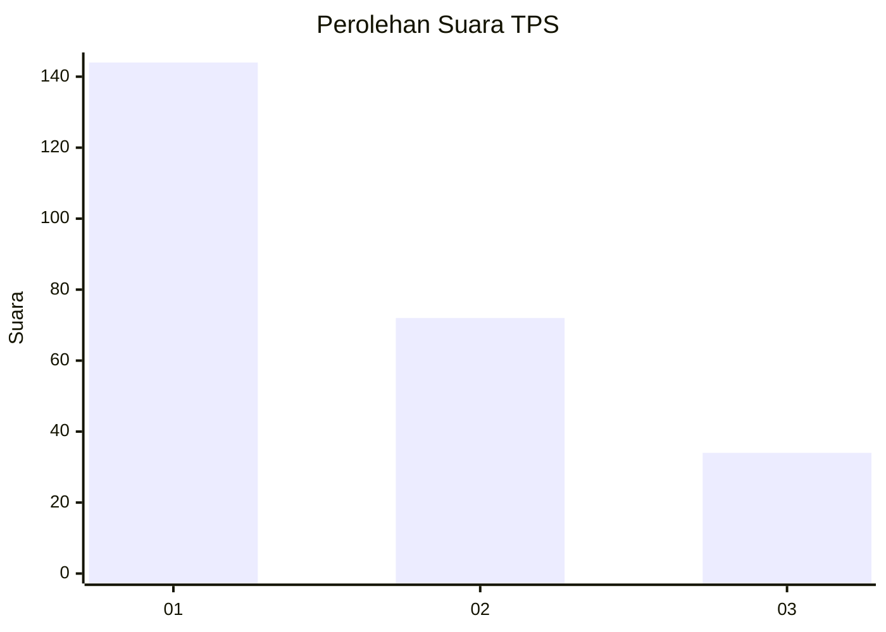
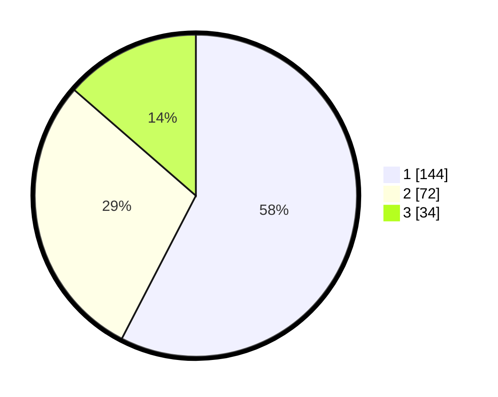

# Hasil

## Grafik

## Tabel

| No. | Nama Paslon    | Suara | Suara (raw) | Persentase |
|:--- |:-------------- | -----:| -----------:| ----------:|
| 1   | ANIES MUHAIMIN | 144   | [144][p-1]  | 57,60      |
| 2   | PRABOWO GIBRAN | 72    | [72][p-2]   | 28,80      |
| 3   | GANJAR MAHFUD  | 34    | [34][p-3]   | 13,60      |

[p-1]: https://github.com/gigit-pemilu/pemilu-2024/blob/main/pilpres/hitung-suara/sub/32-jawa-barat/sub/01-bogor/sub/01-cibinong/sub/1009-sukahati/sub/018-tps/sub/paslon-1.txt
[p-2]: https://github.com/gigit-pemilu/pemilu-2024/blob/main/pilpres/hitung-suara/sub/32-jawa-barat/sub/01-bogor/sub/01-cibinong/sub/1009-sukahati/sub/018-tps/sub/paslon-2.txt
[p-3]: https://github.com/gigit-pemilu/pemilu-2024/blob/main/pilpres/hitung-suara/sub/32-jawa-barat/sub/01-bogor/sub/01-cibinong/sub/1009-sukahati/sub/018-tps/sub/paslon-3.txt

## Foto C Plano

https://sirekap-obj-formc.kpu.go.id/615c/pemilu/ppwp/32/01/01/10/09/3201011009018-20240215-000042--9ef7e5fe-8963-48ec-8296-bcb2c0ad6c95.jpg

https://sirekap-obj-formc.kpu.go.id/615c/pemilu/ppwp/32/01/01/10/09/3201011009018-20240215-000049--4cf52dc4-704d-4d72-827b-a7ee72664a45.jpg

https://sirekap-obj-formc.kpu.go.id/615c/pemilu/ppwp/32/01/01/10/09/3201011009018-20240215-000100--ab911143-d153-4a43-b5dc-44ca7abd472e.jpg

## Metadata

| Key        | Value               |
| ---------- | ------------------- |
| Time Stamp | 2024-02-16 12:51:22 |

