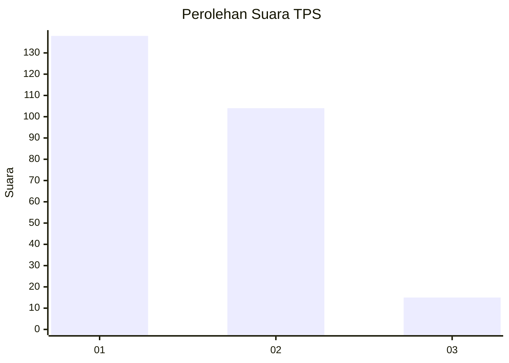
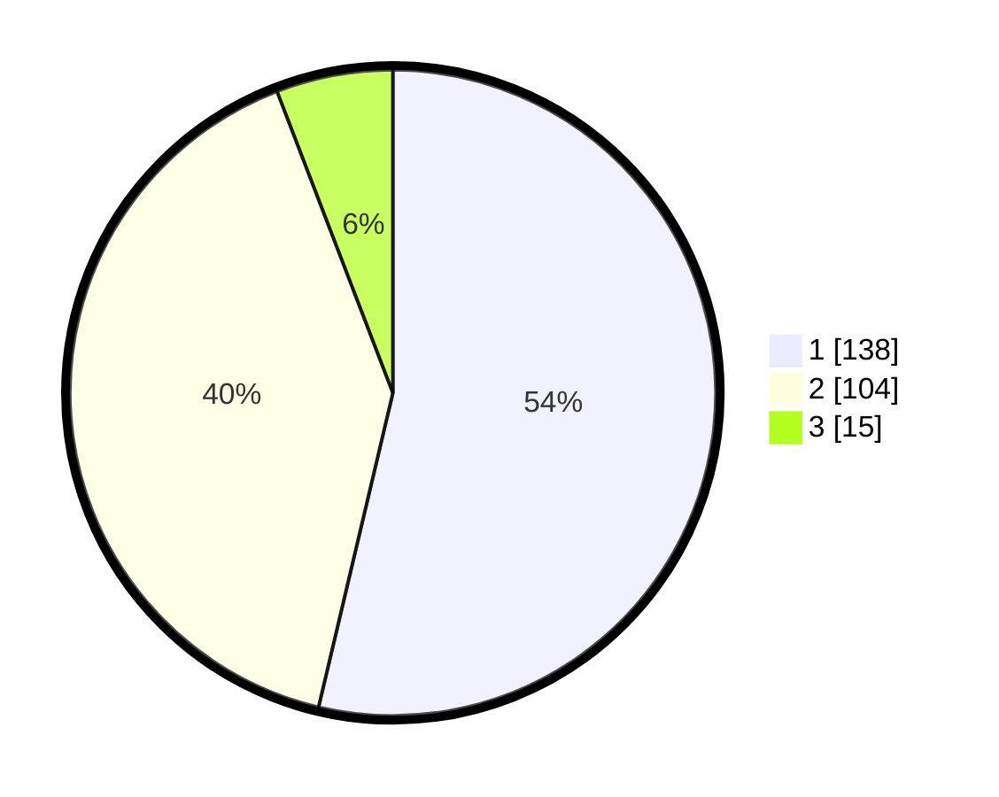

# Hasil

## Grafik

## Tabel

| No. | Nama Paslon    | Suara | Suara (raw) | Persentase |
|:--- |:-------------- | -----:| -----------:| ----------:|
| 1   | ANIES MUHAIMIN | 138   | [138][p-1]  | 53,70      |
| 2   | PRABOWO GIBRAN | 104   | [104][p-2]  | 40,47      |
| 3   | GANJAR MAHFUD  | 15    | [15][p-3]   | 5,84       |

[p-1]: https://github.com/gigit-pemilu/pemilu-2024/blob/main/pilpres/hitung-suara/sub/32-jawa-barat/sub/01-bogor/sub/01-cibinong/sub/1009-sukahati/sub/031-tps/sub/paslon-1.txt
[p-2]: https://github.com/gigit-pemilu/pemilu-2024/blob/main/pilpres/hitung-suara/sub/32-jawa-barat/sub/01-bogor/sub/01-cibinong/sub/1009-sukahati/sub/031-tps/sub/paslon-2.txt
[p-3]: https://github.com/gigit-pemilu/pemilu-2024/blob/main/pilpres/hitung-suara/sub/32-jawa-barat/sub/01-bogor/sub/01-cibinong/sub/1009-sukahati/sub/031-tps/sub/paslon-3.txt

## Foto C Plano

https://sirekap-obj-formc.kpu.go.id/1418/pemilu/ppwp/32/01/01/10/09/3201011009031-20240214-211742--131ccb2e-23a4-48c5-ab9d-107f03395954.jpg

https://sirekap-obj-formc.kpu.go.id/1418/pemilu/ppwp/32/01/01/10/09/3201011009031-20240214-211931--1da76df9-1d8d-45f5-8042-5cb043cdc701.jpg

https://sirekap-obj-formc.kpu.go.id/1418/pemilu/ppwp/32/01/01/10/09/3201011009031-20240214-212220--fd0e7542-672e-4e4b-95d6-3d5f93e68b8d.jpg

## Metadata

| Key        | Value               |
| ---------- | ------------------- |
| Time Stamp | 2024-02-16 12:51:22 |

