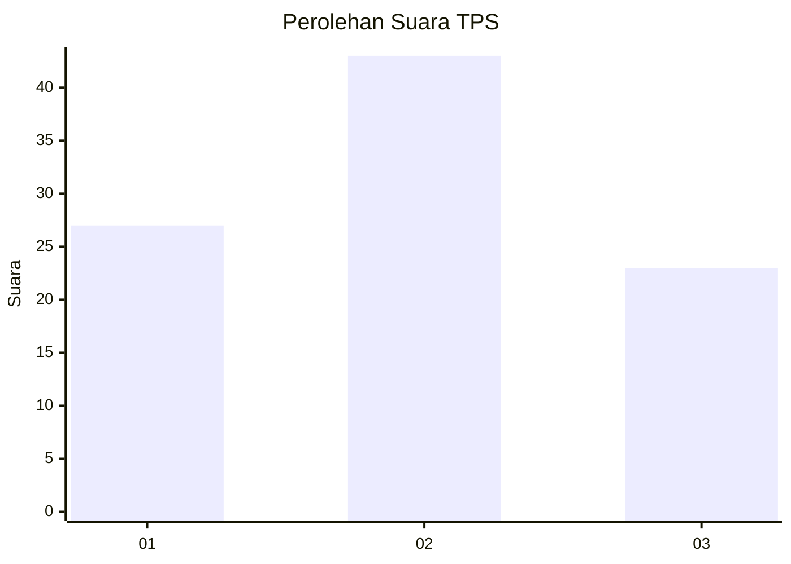
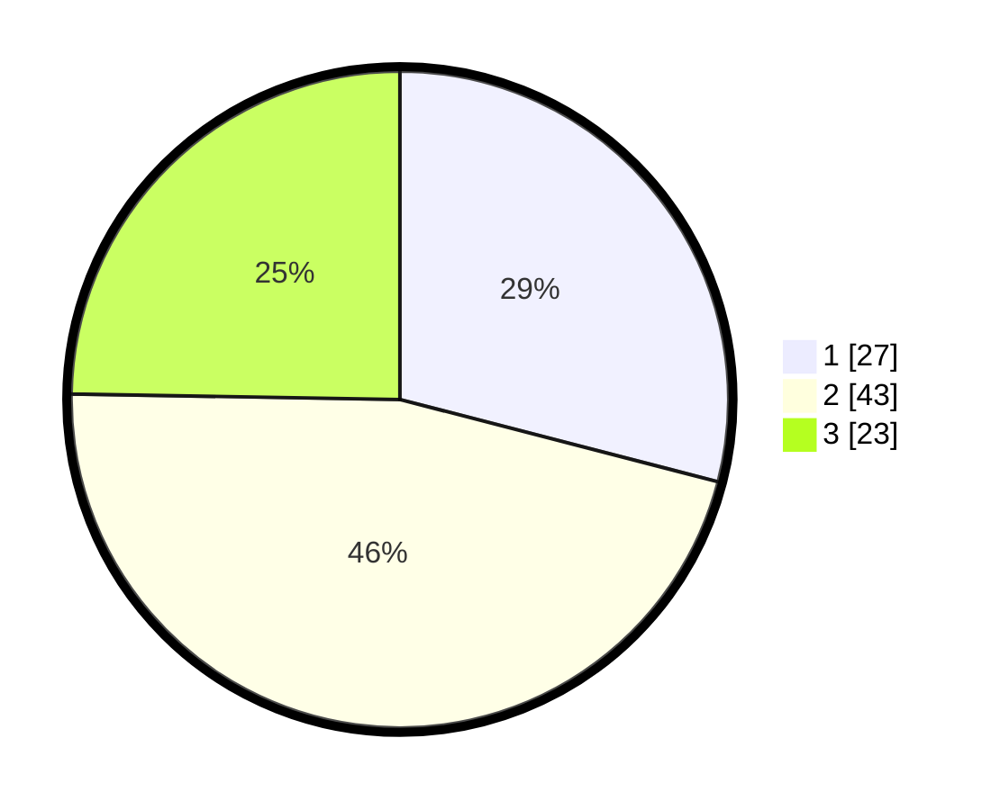

# Hasil

## Grafik

## Tabel

| No. | Nama Paslon    | Suara | Suara (raw) | Persentase |
|:--- |:-------------- | -----:| -----------:| ----------:|
| 1   | ANIES MUHAIMIN | 27    | [27][p-1]   | 29,03      |
| 2   | PRABOWO GIBRAN | 43    | [43][p-2]   | 46,24      |
| 3   | GANJAR MAHFUD  | 23    | [23][p-3]   | 24,73      |

[p-1]: https://github.com/gigit-pemilu/pemilu-2024/blob/main/pilpres/hitung-suara/sub/32-jawa-barat/sub/01-bogor/sub/01-cibinong/sub/1012-pabuaran/sub/129-tps/sub/paslon-1.txt
[p-2]: https://github.com/gigit-pemilu/pemilu-2024/blob/main/pilpres/hitung-suara/sub/32-jawa-barat/sub/01-bogor/sub/01-cibinong/sub/1012-pabuaran/sub/129-tps/sub/paslon-2.txt
[p-3]: https://github.com/gigit-pemilu/pemilu-2024/blob/main/pilpres/hitung-suara/sub/32-jawa-barat/sub/01-bogor/sub/01-cibinong/sub/1012-pabuaran/sub/129-tps/sub/paslon-3.txt

## Foto C Plano

https://sirekap-obj-formc.kpu.go.id/8e9d/pemilu/ppwp/32/01/01/10/12/3201011012129-20240214-215346--fba553b8-99b8-4c56-be1c-af4cc45023b7.jpg

https://sirekap-obj-formc.kpu.go.id/8e9d/pemilu/ppwp/32/01/01/10/12/3201011012129-20240214-215526--d975a0a6-5f9d-4c26-996b-fe68f1ed1352.jpg

https://sirekap-obj-formc.kpu.go.id/8e9d/pemilu/ppwp/32/01/01/10/12/3201011012129-20240214-215626--61b3d7ca-d02f-4a52-ab24-3a1f66fdfa84.jpg

## Metadata

| Key        | Value               |
| ---------- | ------------------- |
| Time Stamp | 2024-02-16 00:00:26 |

