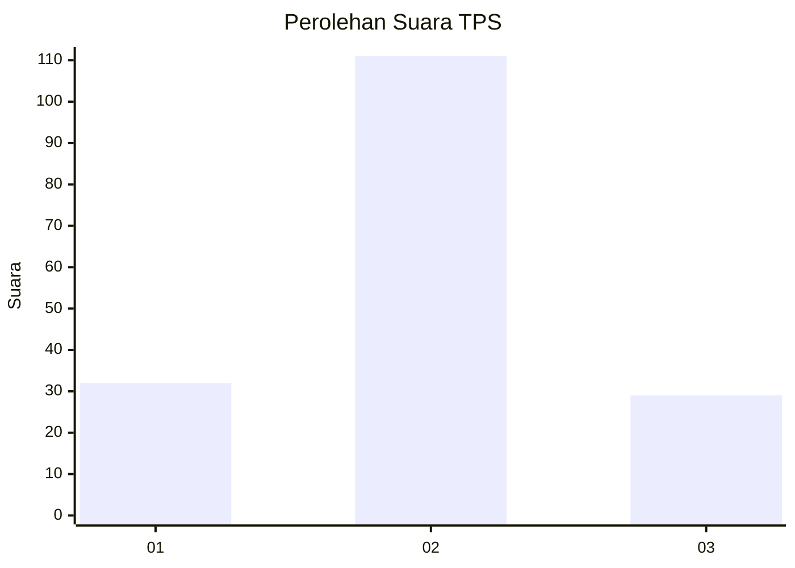
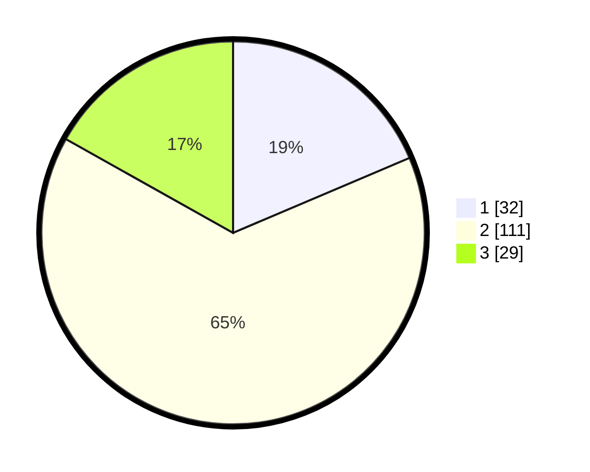

# Hasil

## Grafik

## Tabel

| No. | Nama Paslon    | Suara | Suara (raw) | Persentase |
|:--- |:-------------- | -----:| -----------:| ----------:|
| 1   | ANIES MUHAIMIN | 32    | [32][p-1]   | 18,60      |
| 2   | PRABOWO GIBRAN | 111   | [111][p-2]  | 64,53      |
| 3   | GANJAR MAHFUD  | 29    | [29][p-3]   | 16,86      |

[p-1]: https://github.com/gigit-pemilu/pemilu-2024/blob/main/pilpres/hitung-suara/sub/32-jawa-barat/sub/01-bogor/sub/01-cibinong/sub/1013-pabuaran-mekar/sub/009-tps/sub/paslon-1.txt
[p-2]: https://github.com/gigit-pemilu/pemilu-2024/blob/main/pilpres/hitung-suara/sub/32-jawa-barat/sub/01-bogor/sub/01-cibinong/sub/1013-pabuaran-mekar/sub/009-tps/sub/paslon-2.txt
[p-3]: https://github.com/gigit-pemilu/pemilu-2024/blob/main/pilpres/hitung-suara/sub/32-jawa-barat/sub/01-bogor/sub/01-cibinong/sub/1013-pabuaran-mekar/sub/009-tps/sub/paslon-3.txt

## Foto C Plano

https://sirekap-obj-formc.kpu.go.id/8620/pemilu/ppwp/32/01/01/10/13/3201011013009-20240214-141828--a9b8370a-b066-4485-90dc-cc7e98f7b4a3.jpg

https://sirekap-obj-formc.kpu.go.id/8620/pemilu/ppwp/32/01/01/10/13/3201011013009-20240215-012742--d123ceaf-fcae-42ef-9a23-76e624555e89.jpg

https://sirekap-obj-formc.kpu.go.id/8620/pemilu/ppwp/32/01/01/10/13/3201011013009-20240215-012750--bd2aa96d-d718-4b52-ba4d-345fb7dc2d45.jpg

## Metadata

| Key        | Value               |
| ---------- | ------------------- |
| Time Stamp | 2024-02-16 12:51:22 |

