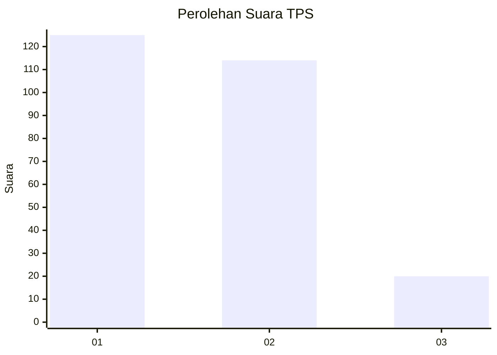
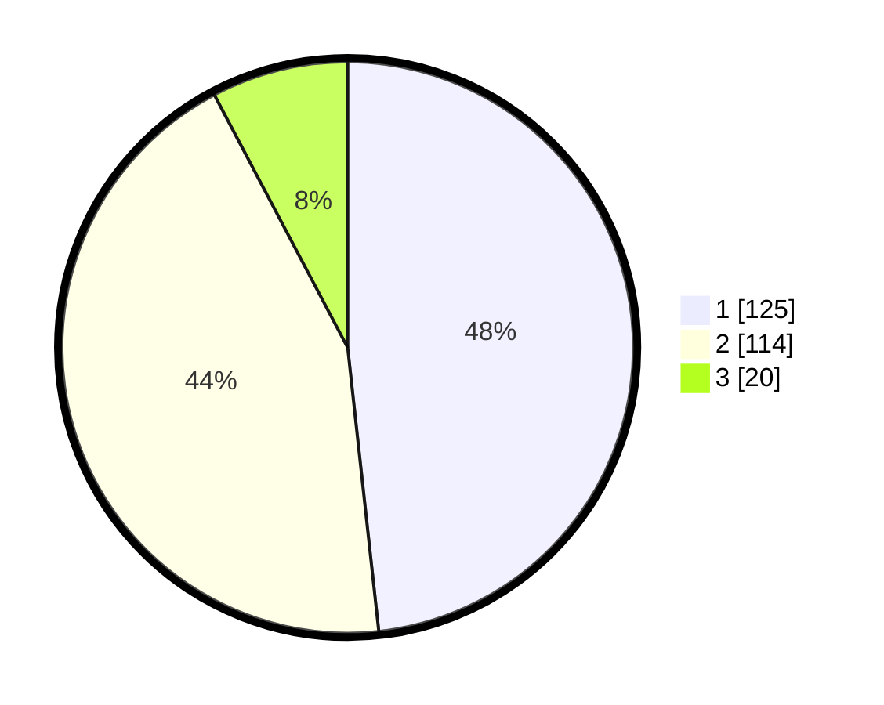

# Hasil

## Grafik

## Tabel

| No. | Nama Paslon    | Suara | Suara (raw) | Persentase |
|:--- |:-------------- | -----:| -----------:| ----------:|
| 1   | ANIES MUHAIMIN | 125   | [125][p-1]  | 48,26      |
| 2   | PRABOWO GIBRAN | 114   | [114][p-2]  | 44,02      |
| 3   | GANJAR MAHFUD  | 20    | [20][p-3]   | 7,72       |

[p-1]: https://github.com/gigit-pemilu/pemilu-2024/blob/main/pilpres/hitung-suara/sub/32-jawa-barat/sub/01-bogor/sub/01-cibinong/sub/1013-pabuaran-mekar/sub/055-tps/sub/paslon-1.txt
[p-2]: https://github.com/gigit-pemilu/pemilu-2024/blob/main/pilpres/hitung-suara/sub/32-jawa-barat/sub/01-bogor/sub/01-cibinong/sub/1013-pabuaran-mekar/sub/055-tps/sub/paslon-2.txt
[p-3]: https://github.com/gigit-pemilu/pemilu-2024/blob/main/pilpres/hitung-suara/sub/32-jawa-barat/sub/01-bogor/sub/01-cibinong/sub/1013-pabuaran-mekar/sub/055-tps/sub/paslon-3.txt

## Foto C Plano

https://sirekap-obj-formc.kpu.go.id/37b3/pemilu/ppwp/32/01/01/10/13/3201011013055-20240214-155754--3cabc26a-ffad-414f-b74e-feb213aae338.jpg

https://sirekap-obj-formc.kpu.go.id/37b3/pemilu/ppwp/32/01/01/10/13/3201011013055-20240214-160108--8e2ecee0-a5e5-41e7-a783-0e3068f879f5.jpg

https://sirekap-obj-formc.kpu.go.id/37b3/pemilu/ppwp/32/01/01/10/13/3201011013055-20240214-160058--82a3ba86-f240-415d-b32b-bb161e76d0f2.jpg

## Metadata

| Key        | Value               |
| ---------- | ------------------- |
| Time Stamp | 2024-02-14 21:46:01 |

