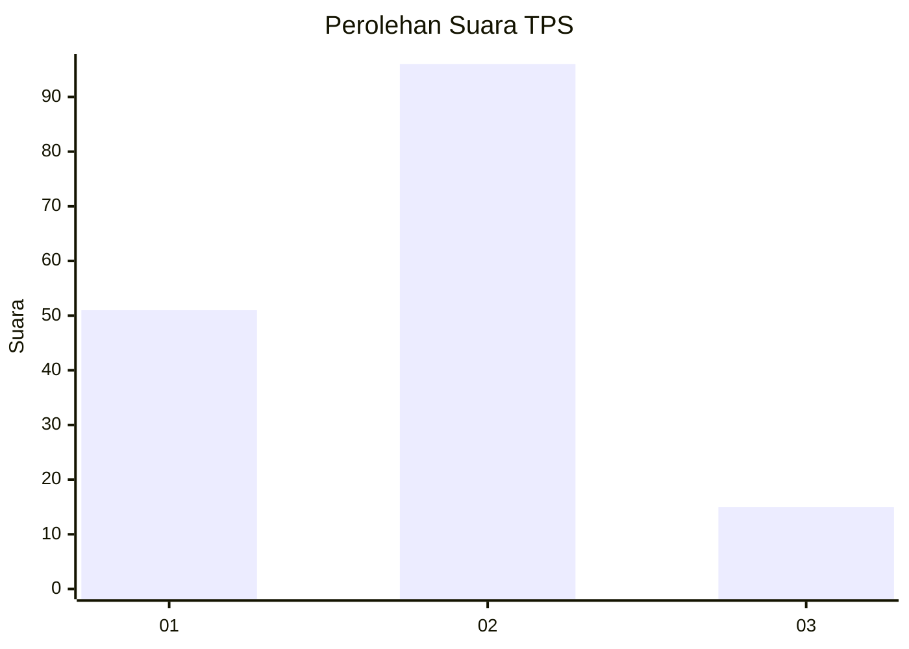
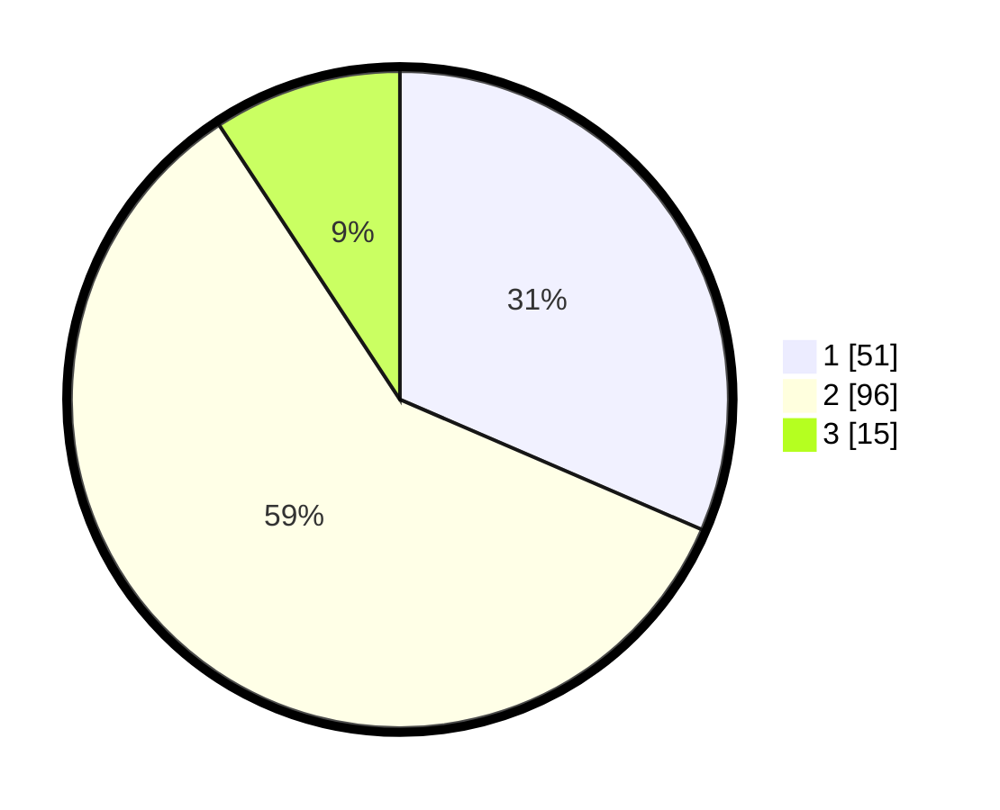

# Hasil

## Grafik

## Tabel

| No. | Nama Paslon    | Suara | Suara (raw) | Persentase |
|:--- |:-------------- | -----:| -----------:| ----------:|
| 1   | ANIES MUHAIMIN | 51    | [51][p-1]   | 31,48      |
| 2   | PRABOWO GIBRAN | 96    | [96][p-2]   | 59,26      |
| 3   | GANJAR MAHFUD  | 15    | [15][p-3]   | 9,26       |

[p-1]: https://github.com/gigit-pemilu/pemilu-2024/blob/main/pilpres/hitung-suara/sub/32-jawa-barat/sub/01-bogor/sub/02-gunung-putri/sub/2001-wanaherang/sub/001-tps/sub/paslon-1.txt
[p-2]: https://github.com/gigit-pemilu/pemilu-2024/blob/main/pilpres/hitung-suara/sub/32-jawa-barat/sub/01-bogor/sub/02-gunung-putri/sub/2001-wanaherang/sub/001-tps/sub/paslon-2.txt
[p-3]: https://github.com/gigit-pemilu/pemilu-2024/blob/main/pilpres/hitung-suara/sub/32-jawa-barat/sub/01-bogor/sub/02-gunung-putri/sub/2001-wanaherang/sub/001-tps/sub/paslon-3.txt

## Foto C Plano

https://sirekap-obj-formc.kpu.go.id/15c7/pemilu/ppwp/32/01/02/20/01/3201022001001-20240214-200404--f2ad3535-7ff2-4231-886b-e4e57fc61c2a.jpg

https://sirekap-obj-formc.kpu.go.id/15c7/pemilu/ppwp/32/01/02/20/01/3201022001001-20240214-200515--f33d9f3c-06a8-4563-92f7-adef887086b1.jpg

https://sirekap-obj-formc.kpu.go.id/15c7/pemilu/ppwp/32/01/02/20/01/3201022001001-20240214-200629--ef8ce729-5332-4d26-84b5-950b2187e943.jpg

## Metadata

| Key        | Value               |
| ---------- | ------------------- |
| Time Stamp | 2024-02-15 09:00:24 |

