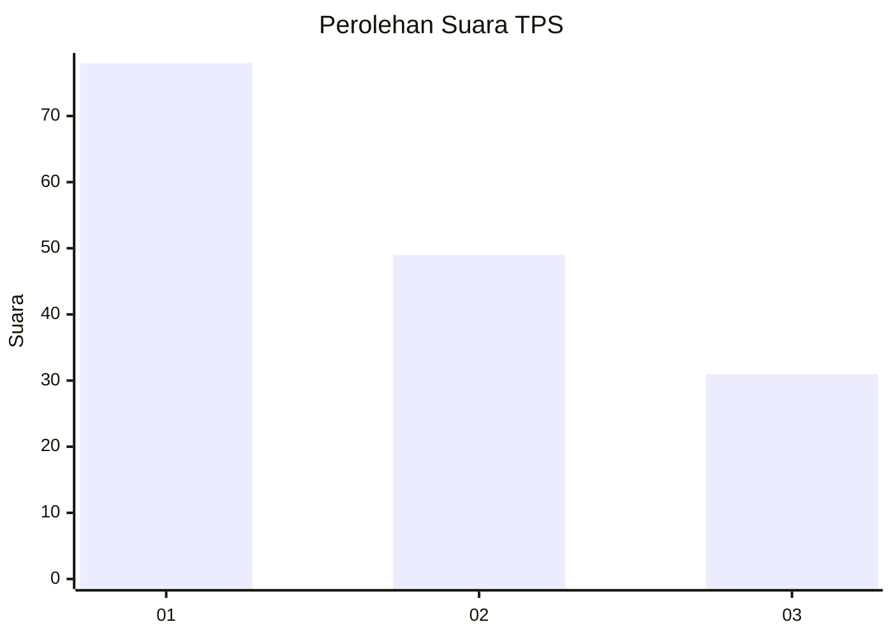
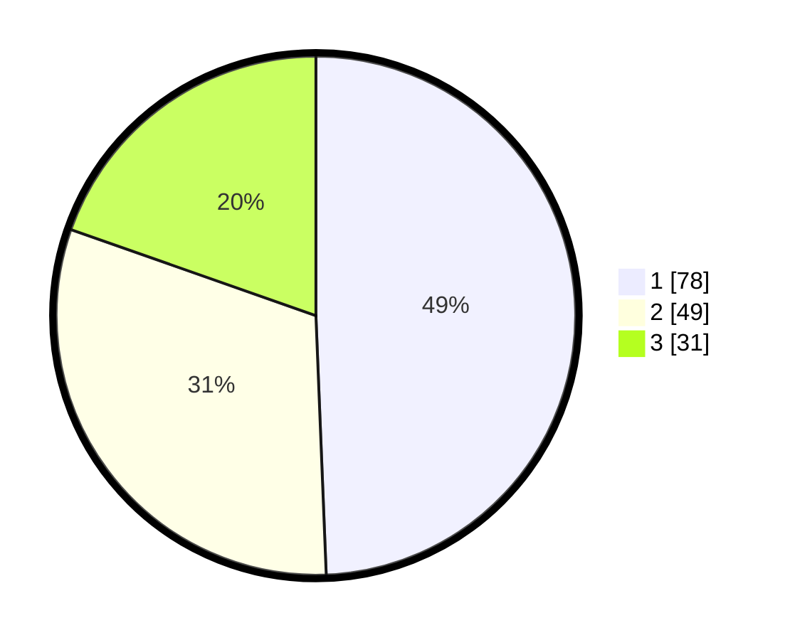

# Hasil

## Grafik

## Tabel

| No. | Nama Paslon    | Suara | Suara (raw) | Persentase |
|:--- |:-------------- | -----:| -----------:| ----------:|
| 1   | ANIES MUHAIMIN | 78    | [78][p-1]   | 49,37      |
| 2   | PRABOWO GIBRAN | 49    | [49][p-2]   | 31,01      |
| 3   | GANJAR MAHFUD  | 31    | [31][p-3]   | 19,62      |

[p-1]: https://github.com/gigit-pemilu/pemilu-2024-32-jawa-barat/blob/main/pilpres/hitung-suara/sub/32-jawa-barat/sub/01-bogor/sub/02-gunung-putri/sub/2002-bojong-kulur/sub/046-tps/sub/paslon-1.txt
[p-2]: https://github.com/gigit-pemilu/pemilu-2024-32-jawa-barat/blob/main/pilpres/hitung-suara/sub/32-jawa-barat/sub/01-bogor/sub/02-gunung-putri/sub/2002-bojong-kulur/sub/046-tps/sub/paslon-2.txt
[p-3]: https://github.com/gigit-pemilu/pemilu-2024-32-jawa-barat/blob/main/pilpres/hitung-suara/sub/32-jawa-barat/sub/01-bogor/sub/02-gunung-putri/sub/2002-bojong-kulur/sub/046-tps/sub/paslon-3.txt

## Foto C Plano

https://sirekap-obj-formc.kpu.go.id/c6fc/pemilu/ppwp/32/01/02/20/02/3201022002046-20240214-201739--ddbcef43-4e49-4672-9a8a-8cefcaaf2e53.jpg

https://sirekap-obj-formc.kpu.go.id/c6fc/pemilu/ppwp/32/01/02/20/02/3201022002046-20240214-202327--bae0b265-4b3a-445d-9a5b-3162536f5ca1.jpg

https://sirekap-obj-formc.kpu.go.id/c6fc/pemilu/ppwp/32/01/02/20/02/3201022002046-20240214-202625--739e7271-3862-40ff-b4d6-8ff074d3076d.jpg

## Metadata

| Key        | Value               |
| ---------- | ------------------- |
| Time Stamp | 2024-02-15 12:00:28 |

