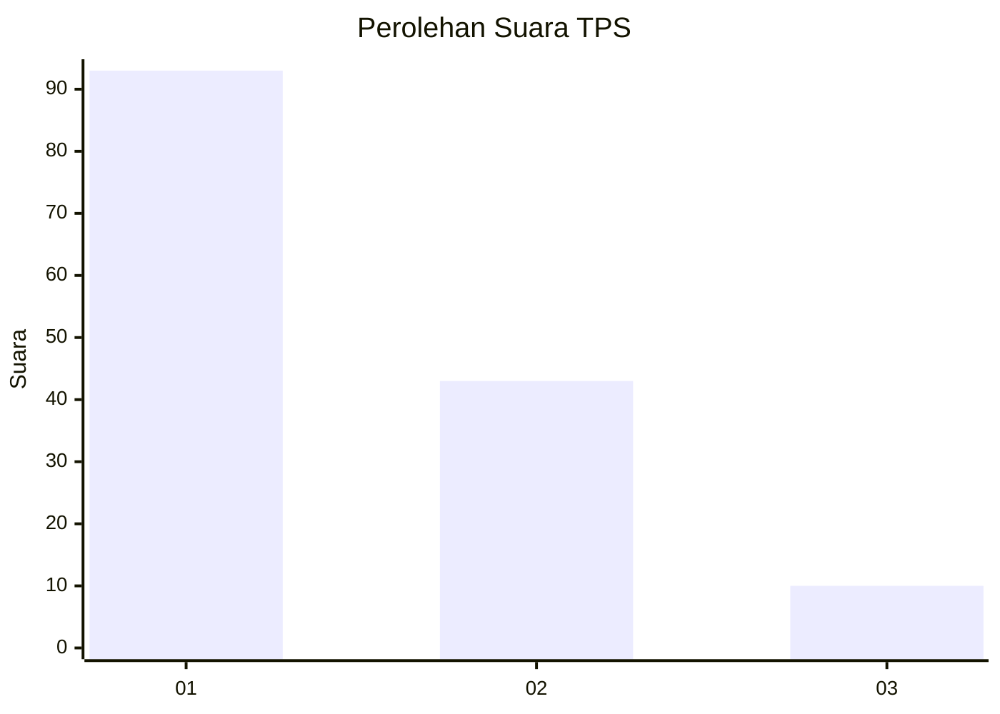
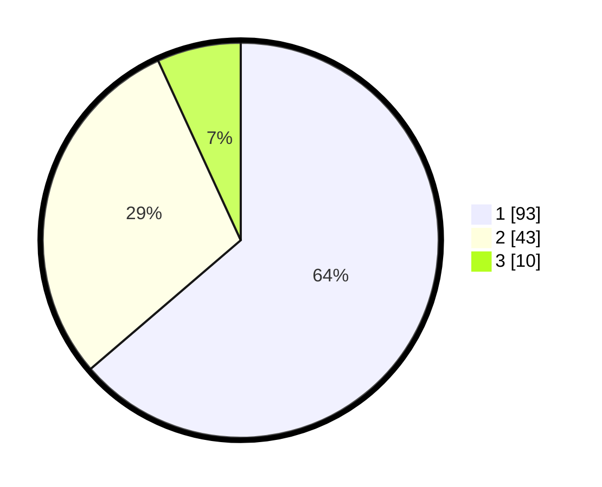

# Hasil

## Grafik

## Tabel

| No. | Nama Paslon    | Suara | Suara (raw) | Persentase |
|:--- |:-------------- | -----:| -----------:| ----------:|
| 1   | ANIES MUHAIMIN | 93    | [93][p-1]   | 63,70      |
| 2   | PRABOWO GIBRAN | 43    | [43][p-2]   | 29,45      |
| 3   | GANJAR MAHFUD  | 10    | [10][p-3]   | 6,85       |

[p-1]: https://github.com/gigit-pemilu/pemilu-2024-32-jawa-barat/blob/main/pilpres/hitung-suara/sub/32-jawa-barat/sub/01-bogor/sub/02-gunung-putri/sub/2002-bojong-kulur/sub/124-tps/sub/paslon-1.txt
[p-2]: https://github.com/gigit-pemilu/pemilu-2024-32-jawa-barat/blob/main/pilpres/hitung-suara/sub/32-jawa-barat/sub/01-bogor/sub/02-gunung-putri/sub/2002-bojong-kulur/sub/124-tps/sub/paslon-2.txt
[p-3]: https://github.com/gigit-pemilu/pemilu-2024-32-jawa-barat/blob/main/pilpres/hitung-suara/sub/32-jawa-barat/sub/01-bogor/sub/02-gunung-putri/sub/2002-bojong-kulur/sub/124-tps/sub/paslon-3.txt

## Foto C Plano

https://sirekap-obj-formc.kpu.go.id/5142/pemilu/ppwp/32/01/02/20/02/3201022002124-20240214-140935--22fd0467-9a71-49ac-b78f-5bbe2bce4143.jpg

https://sirekap-obj-formc.kpu.go.id/5142/pemilu/ppwp/32/01/02/20/02/3201022002124-20240214-141040--f49bd635-b4fd-4686-8bf3-4b32c10db7cb.jpg

https://sirekap-obj-formc.kpu.go.id/5142/pemilu/ppwp/32/01/02/20/02/3201022002124-20240214-141200--3dd7bc74-be5a-4b22-a651-8b364ae9c8c7.jpg

## Metadata

| Key        | Value               |
| ---------- | ------------------- |
| Time Stamp | 2024-02-15 12:00:28 |

