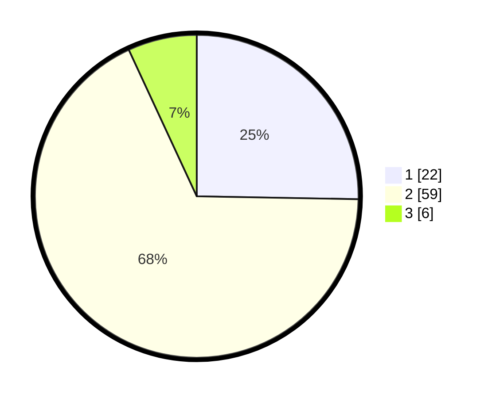

# Hasil

## Grafik

## Tabel

| No. | Nama Paslon    | Suara | Suara (raw) | Persentase |
|:--- |:-------------- | -----:| -----------:| ----------:|
| 1   | ANIES MUHAIMIN | 22    | [22][p-1]   | 25,29      |
| 2   | PRABOWO GIBRAN | 59    | [59][p-2]   | 67,82      |
| 3   | GANJAR MAHFUD  | 6     | [6][p-3]    | 6,90       |

[p-1]: https://github.com/gigit-pemilu/pemilu-2024/blob/main/pilpres/hitung-suara/sub/32-jawa-barat/sub/01-bogor/sub/02-gunung-putri/sub/2003-ciangsana/sub/034-tps/sub/paslon-1.txt
[p-2]: https://github.com/gigit-pemilu/pemilu-2024/blob/main/pilpres/hitung-suara/sub/32-jawa-barat/sub/01-bogor/sub/02-gunung-putri/sub/2003-ciangsana/sub/034-tps/sub/paslon-2.txt
[p-3]: https://github.com/gigit-pemilu/pemilu-2024/blob/main/pilpres/hitung-suara/sub/32-jawa-barat/sub/01-bogor/sub/02-gunung-putri/sub/2003-ciangsana/sub/034-tps/sub/paslon-3.txt

## Foto C Plano

https://sirekap-obj-formc.kpu.go.id/0041/pemilu/ppwp/32/01/02/20/03/3201022003034-20240215-050811--59a1a203-0b0a-4c38-950a-240bb563cb4f.jpg

https://sirekap-obj-formc.kpu.go.id/0041/pemilu/ppwp/32/01/02/20/03/3201022003034-20240215-042502--b6e68f9a-9cb2-4974-a4dc-146fca71129c.jpg

https://sirekap-obj-formc.kpu.go.id/0041/pemilu/ppwp/32/01/02/20/03/3201022003034-20240215-042549--9f64bfb6-b4c5-455c-8303-339b8c7497f8.jpg

## Metadata

| Key        | Value               |
| ---------- | ------------------- |
| Time Stamp | 2024-02-15 19:30:26 |

