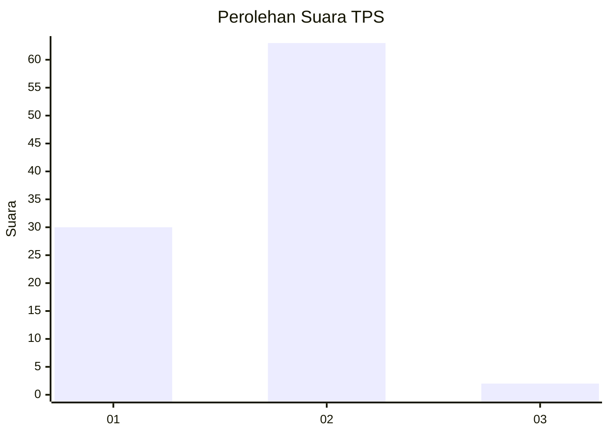
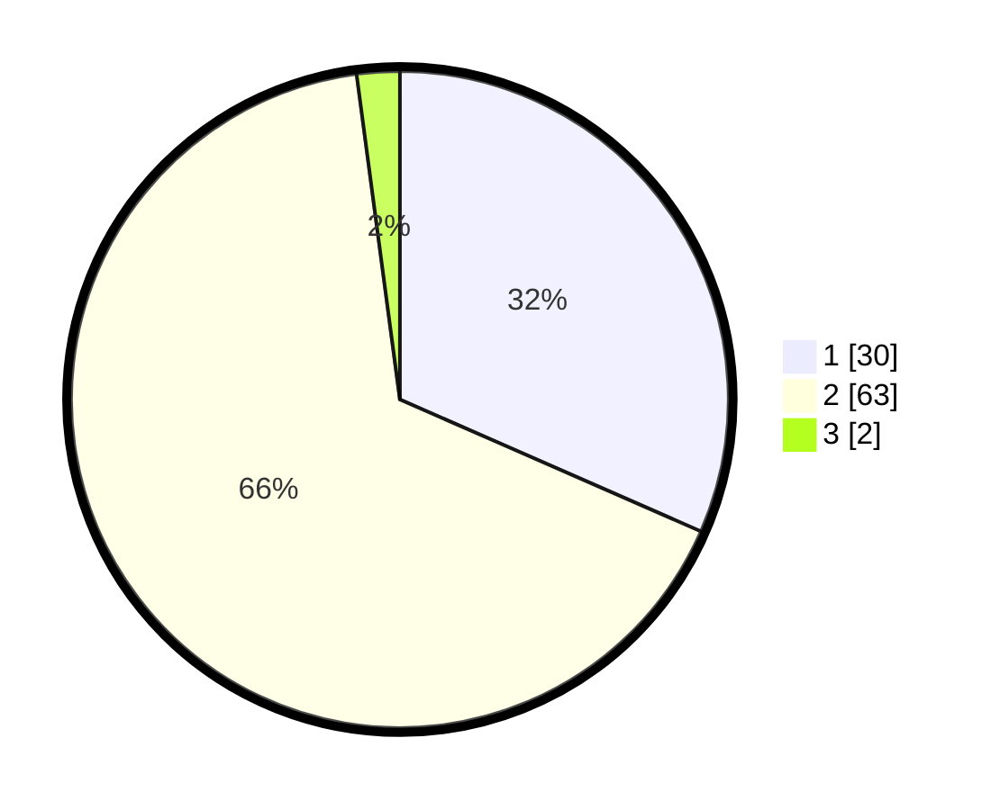

# Hasil

## Grafik

## Tabel

| No. | Nama Paslon    | Suara | Suara (raw) | Persentase |
|:--- |:-------------- | -----:| -----------:| ----------:|
| 1   | ANIES MUHAIMIN | 30    | [30][p-1]   | 31,58      |
| 2   | PRABOWO GIBRAN | 63    | [63][p-2]   | 66,32      |
| 3   | GANJAR MAHFUD  | 2     | [2][p-3]    | 2,11       |

[p-1]: https://github.com/gigit-pemilu/pemilu-2024-32-jawa-barat/blob/main/pilpres/hitung-suara/sub/32-jawa-barat/sub/01-bogor/sub/02-gunung-putri/sub/2004-gunung-putri/sub/019-tps/sub/paslon-1.txt
[p-2]: https://github.com/gigit-pemilu/pemilu-2024-32-jawa-barat/blob/main/pilpres/hitung-suara/sub/32-jawa-barat/sub/01-bogor/sub/02-gunung-putri/sub/2004-gunung-putri/sub/019-tps/sub/paslon-2.txt
[p-3]: https://github.com/gigit-pemilu/pemilu-2024-32-jawa-barat/blob/main/pilpres/hitung-suara/sub/32-jawa-barat/sub/01-bogor/sub/02-gunung-putri/sub/2004-gunung-putri/sub/019-tps/sub/paslon-3.txt

## Foto C Plano

https://sirekap-obj-formc.kpu.go.id/93c9/pemilu/ppwp/32/01/02/20/04/3201022004019-20240214-213514--f4de99b4-a976-4784-a4c1-f3125e36fbb2.jpg

https://sirekap-obj-formc.kpu.go.id/93c9/pemilu/ppwp/32/01/02/20/04/3201022004019-20240214-204204--8cb3f34a-81c9-4d27-8119-dfbab2c0425f.jpg

https://sirekap-obj-formc.kpu.go.id/93c9/pemilu/ppwp/32/01/02/20/04/3201022004019-20240214-213612--8eb4779b-f314-4a1e-9b7a-b87adbc2a87f.jpg

## Metadata

| Key        | Value               |
| ---------- | ------------------- |
| Time Stamp | 2024-02-15 20:30:46 |

