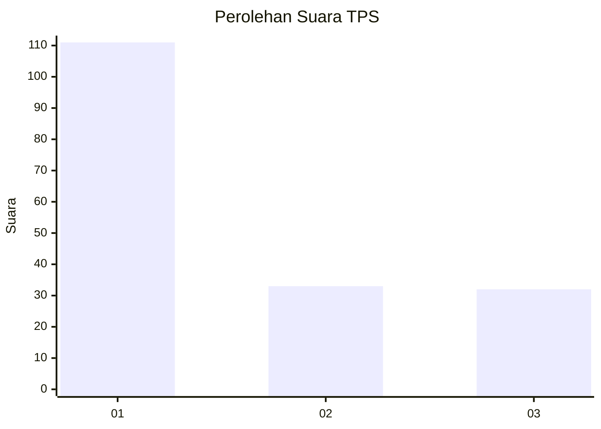
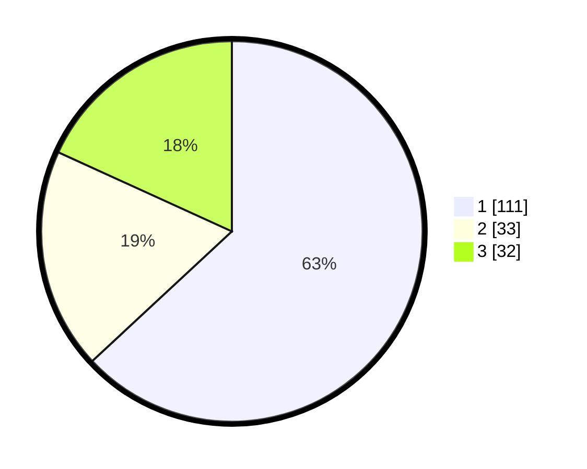

# Hasil

## Grafik

## Tabel

| No. | Nama Paslon    | Suara | Suara (raw) | Persentase |
|:--- |:-------------- | -----:| -----------:| ----------:|
| 1   | ANIES MUHAIMIN | 111   | [111][p-1]  | 63,07      |
| 2   | PRABOWO GIBRAN | 33    | [33][p-2]   | 18,75      |
| 3   | GANJAR MAHFUD  | 32    | [32][p-3]   | 18,18      |

[p-1]: https://github.com/gigit-pemilu/pemilu-2024/blob/main/pilpres/hitung-suara/sub/32-jawa-barat/sub/01-bogor/sub/02-gunung-putri/sub/2005-bojong-nangka/sub/027-tps/sub/paslon-1.txt
[p-2]: https://github.com/gigit-pemilu/pemilu-2024/blob/main/pilpres/hitung-suara/sub/32-jawa-barat/sub/01-bogor/sub/02-gunung-putri/sub/2005-bojong-nangka/sub/027-tps/sub/paslon-2.txt
[p-3]: https://github.com/gigit-pemilu/pemilu-2024/blob/main/pilpres/hitung-suara/sub/32-jawa-barat/sub/01-bogor/sub/02-gunung-putri/sub/2005-bojong-nangka/sub/027-tps/sub/paslon-3.txt

## Foto C Plano

https://sirekap-obj-formc.kpu.go.id/b160/pemilu/ppwp/32/01/02/20/05/3201022005027-20240216-213205--e7b2e068-da1a-49e9-8ab1-c647c2a95a80.jpg

https://sirekap-obj-formc.kpu.go.id/b160/pemilu/ppwp/32/01/02/20/05/3201022005027-20240215-015144--4e8d6f34-52f0-434d-a052-28f7c497a0c7.jpg

https://sirekap-obj-formc.kpu.go.id/b160/pemilu/ppwp/32/01/02/20/05/3201022005027-20240216-080542--91a1c86a-7160-4775-9674-2a49398c021e.jpg

## Metadata

| Key        | Value               |
| ---------- | ------------------- |
| Time Stamp | 2024-02-16 22:01:00 |

