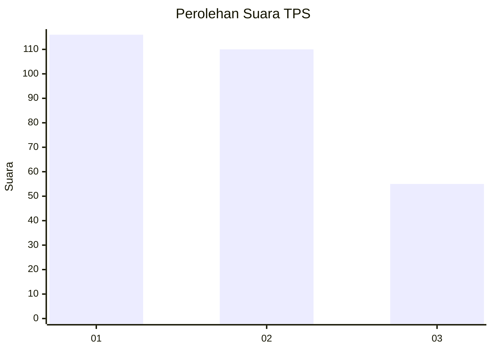
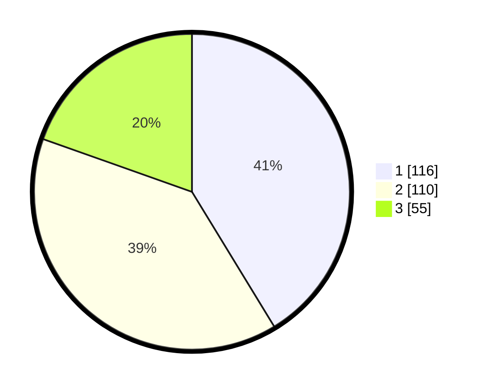

# Hasil

## Grafik

## Tabel

| No. | Nama Paslon    | Suara | Suara (raw) | Persentase |
|:--- |:-------------- | -----:| -----------:| ----------:|
| 1   | ANIES MUHAIMIN | 116   | [116][p-1]  | 41,28      |
| 2   | PRABOWO GIBRAN | 110   | [110][p-2]  | 39,15      |
| 3   | GANJAR MAHFUD  | 55    | [55][p-3]   | 19,57      |

[p-1]: https://github.com/gigit-pemilu/pemilu-2024-32-jawa-barat/blob/main/pilpres/hitung-suara/sub/32-jawa-barat/sub/01-bogor/sub/02-gunung-putri/sub/2005-bojong-nangka/sub/039-tps/sub/paslon-1.txt
[p-2]: https://github.com/gigit-pemilu/pemilu-2024-32-jawa-barat/blob/main/pilpres/hitung-suara/sub/32-jawa-barat/sub/01-bogor/sub/02-gunung-putri/sub/2005-bojong-nangka/sub/039-tps/sub/paslon-2.txt
[p-3]: https://github.com/gigit-pemilu/pemilu-2024-32-jawa-barat/blob/main/pilpres/hitung-suara/sub/32-jawa-barat/sub/01-bogor/sub/02-gunung-putri/sub/2005-bojong-nangka/sub/039-tps/sub/paslon-3.txt

## Foto C Plano

https://sirekap-obj-formc.kpu.go.id/f445/pemilu/ppwp/32/01/02/20/05/3201022005039-20240214-221430--48bae5d2-ed67-4059-97e4-b3ffc7771c45.jpg

https://sirekap-obj-formc.kpu.go.id/f445/pemilu/ppwp/32/01/02/20/05/3201022005039-20240214-224240--94c4839a-1a6b-4872-b822-ae3f4531ead9.jpg

https://sirekap-obj-formc.kpu.go.id/f445/pemilu/ppwp/32/01/02/20/05/3201022005039-20240214-224456--a5121678-64ce-48c7-9ea2-449a2a3e8b02.jpg

## Metadata

| Key        | Value               |
| ---------- | ------------------- |
| Time Stamp | 2024-02-15 15:00:29 |

