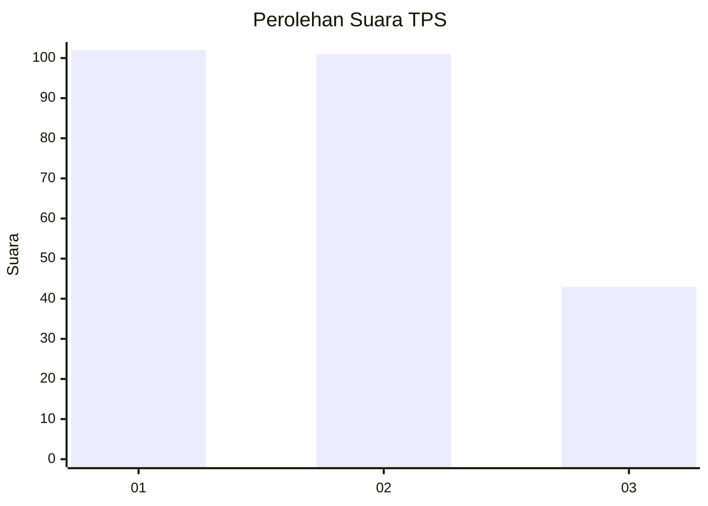
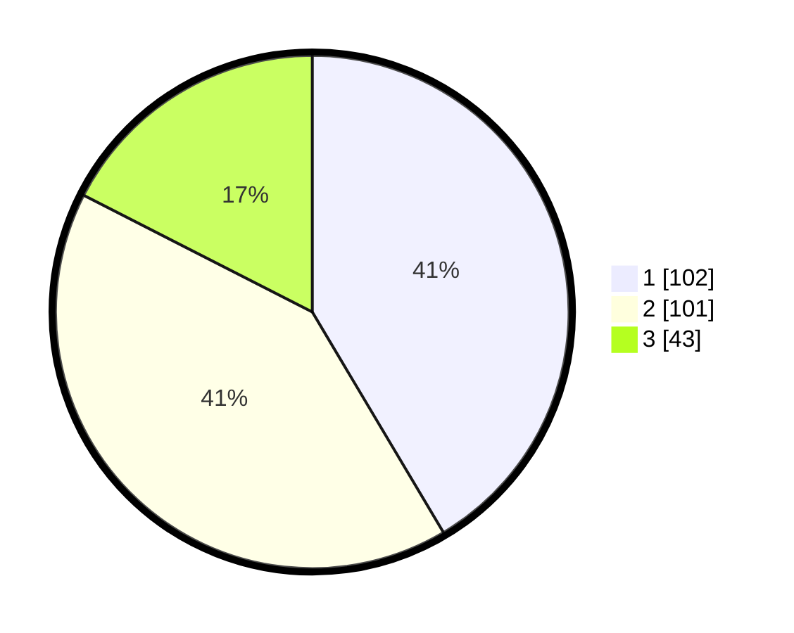

# Hasil

## Grafik

## Tabel

| No. | Nama Paslon    | Suara | Suara (raw) | Persentase |
|:--- |:-------------- | -----:| -----------:| ----------:|
| 1   | ANIES MUHAIMIN | 102   | [102][p-1]  | 41,46      |
| 2   | PRABOWO GIBRAN | 101   | [101][p-2]  | 41,06      |
| 3   | GANJAR MAHFUD  | 43    | [43][p-3]   | 17,48      |

[p-1]: https://github.com/gigit-pemilu/pemilu-2024/blob/main/pilpres/hitung-suara/sub/32-jawa-barat/sub/01-bogor/sub/02-gunung-putri/sub/2005-bojong-nangka/sub/041-tps/sub/paslon-1.txt
[p-2]: https://github.com/gigit-pemilu/pemilu-2024/blob/main/pilpres/hitung-suara/sub/32-jawa-barat/sub/01-bogor/sub/02-gunung-putri/sub/2005-bojong-nangka/sub/041-tps/sub/paslon-2.txt
[p-3]: https://github.com/gigit-pemilu/pemilu-2024/blob/main/pilpres/hitung-suara/sub/32-jawa-barat/sub/01-bogor/sub/02-gunung-putri/sub/2005-bojong-nangka/sub/041-tps/sub/paslon-3.txt

## Foto C Plano

https://sirekap-obj-formc.kpu.go.id/734a/pemilu/ppwp/32/01/02/20/05/3201022005041-20240215-004203--97a83aee-791d-4c23-b097-bc9488fe5209.jpg

https://sirekap-obj-formc.kpu.go.id/734a/pemilu/ppwp/32/01/02/20/05/3201022005041-20240215-004808--287b9e16-18ff-440b-b26a-3a4b9c92beba.jpg

https://sirekap-obj-formc.kpu.go.id/734a/pemilu/ppwp/32/01/02/20/05/3201022005041-20240215-005120--8309a8e3-75f6-440e-b071-70e5187abd98.jpg

## Metadata

| Key        | Value               |
| ---------- | ------------------- |
| Time Stamp | 2024-02-15 15:00:29 |

