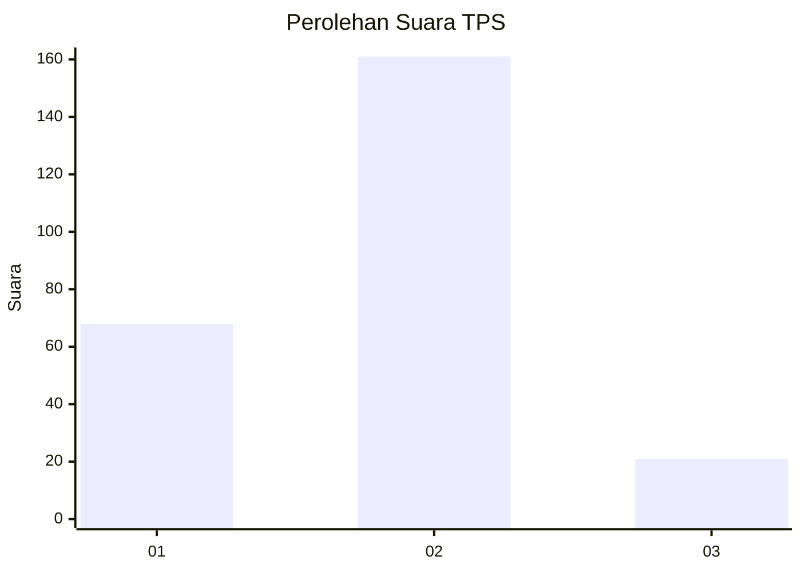
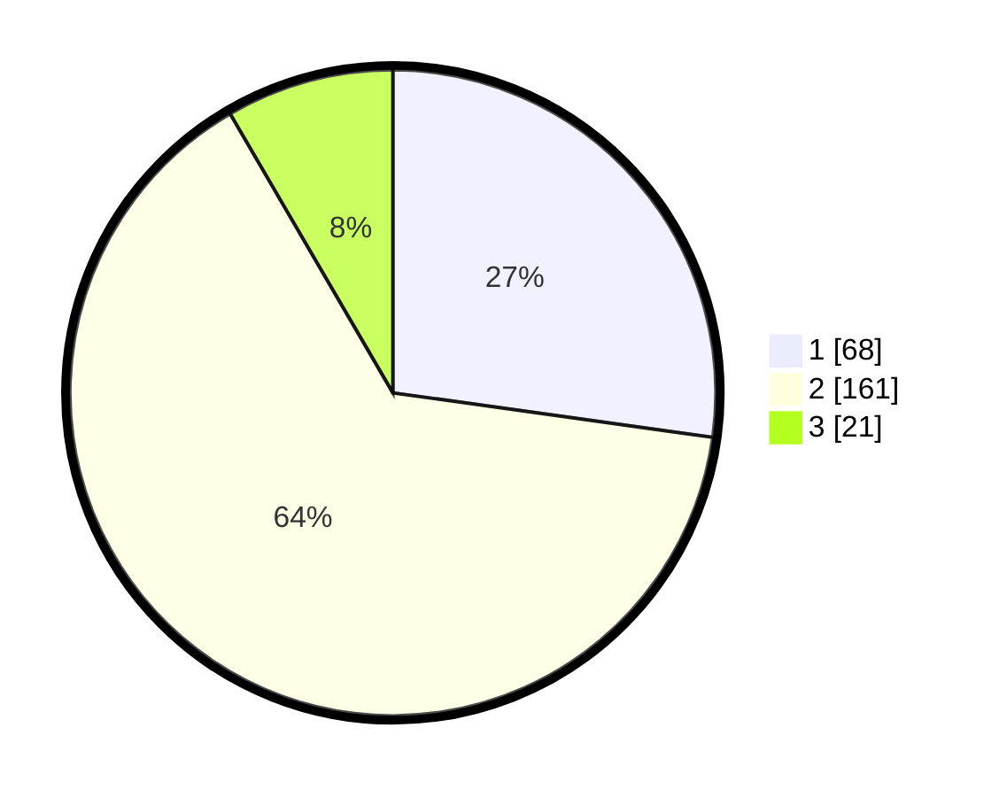

# Hasil

## Grafik

## Tabel

| No. | Nama Paslon    | Suara | Suara (raw) | Persentase |
|:--- |:-------------- | -----:| -----------:| ----------:|
| 1   | ANIES MUHAIMIN | 68    | [68][p-1]   | 27,20      |
| 2   | PRABOWO GIBRAN | 161   | [161][p-2]  | 64,40      |
| 3   | GANJAR MAHFUD  | 21    | [21][p-3]   | 8,40       |

[p-1]: https://github.com/gigit-pemilu/pemilu-2024/blob/main/pilpres/hitung-suara/sub/32-jawa-barat/sub/01-bogor/sub/02-gunung-putri/sub/2006-tlajung-udik/sub/004-tps/sub/paslon-1.txt
[p-2]: https://github.com/gigit-pemilu/pemilu-2024/blob/main/pilpres/hitung-suara/sub/32-jawa-barat/sub/01-bogor/sub/02-gunung-putri/sub/2006-tlajung-udik/sub/004-tps/sub/paslon-2.txt
[p-3]: https://github.com/gigit-pemilu/pemilu-2024/blob/main/pilpres/hitung-suara/sub/32-jawa-barat/sub/01-bogor/sub/02-gunung-putri/sub/2006-tlajung-udik/sub/004-tps/sub/paslon-3.txt

## Foto C Plano

https://sirekap-obj-formc.kpu.go.id/6407/pemilu/ppwp/32/01/02/20/06/3201022006004-20240215-021506--eab9abc1-9cf9-460c-a3f5-a8da1f83d203.jpg

https://sirekap-obj-formc.kpu.go.id/6407/pemilu/ppwp/32/01/02/20/06/3201022006004-20240215-021616--4aa4edca-c368-497e-81b8-99d7283c32a9.jpg

https://sirekap-obj-formc.kpu.go.id/6407/pemilu/ppwp/32/01/02/20/06/3201022006004-20240215-021727--bdc48caa-6923-4df8-ab24-90aba95110f2.jpg

## Metadata

| Key        | Value               |
| ---------- | ------------------- |
| Time Stamp | 2024-02-15 15:00:29 |

