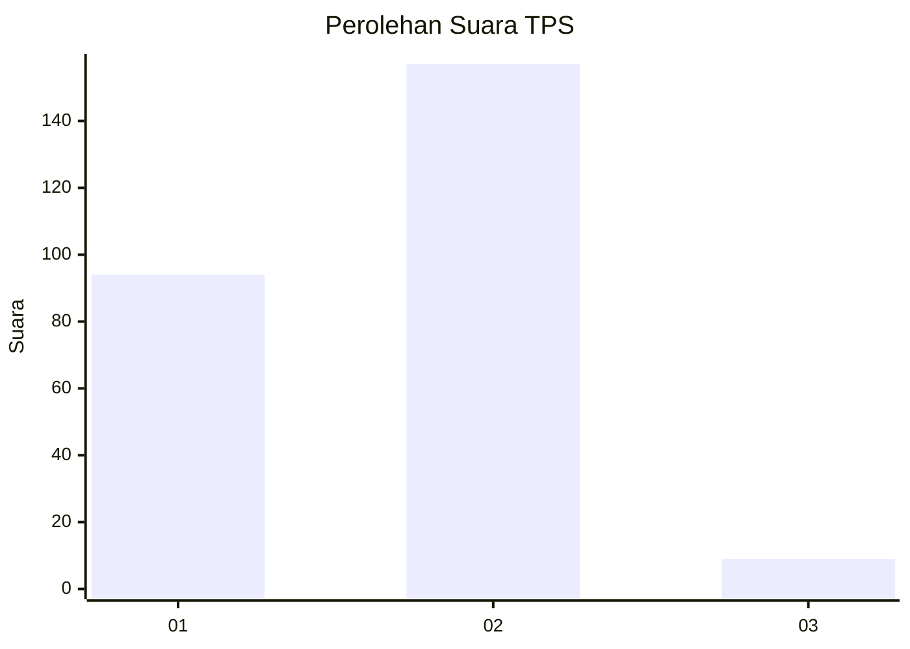
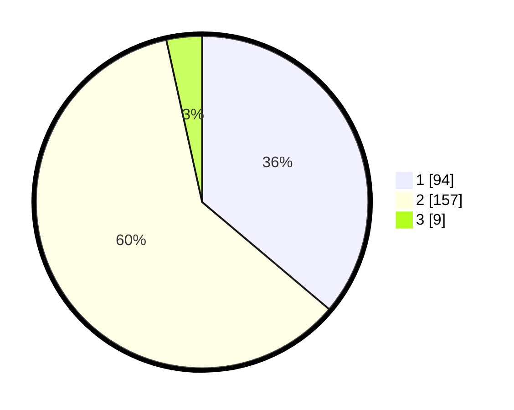

# Hasil

## Grafik

## Tabel

| No. | Nama Paslon    | Suara | Suara (raw) | Persentase |
|:--- |:-------------- | -----:| -----------:| ----------:|
| 1   | ANIES MUHAIMIN | 94    | [94][p-1]   | 36,15      |
| 2   | PRABOWO GIBRAN | 157   | [157][p-2]  | 60,38      |
| 3   | GANJAR MAHFUD  | 9     | [9][p-3]    | 3,46       |

[p-1]: https://github.com/gigit-pemilu/pemilu-2024/blob/main/pilpres/hitung-suara/sub/32-jawa-barat/sub/01-bogor/sub/02-gunung-putri/sub/2006-tlajung-udik/sub/057-tps/sub/paslon-1.txt
[p-2]: https://github.com/gigit-pemilu/pemilu-2024/blob/main/pilpres/hitung-suara/sub/32-jawa-barat/sub/01-bogor/sub/02-gunung-putri/sub/2006-tlajung-udik/sub/057-tps/sub/paslon-2.txt
[p-3]: https://github.com/gigit-pemilu/pemilu-2024/blob/main/pilpres/hitung-suara/sub/32-jawa-barat/sub/01-bogor/sub/02-gunung-putri/sub/2006-tlajung-udik/sub/057-tps/sub/paslon-3.txt

## Foto C Plano

https://sirekap-obj-formc.kpu.go.id/8077/pemilu/ppwp/32/01/02/20/06/3201022006057-20240214-193813--692c6844-1f54-46fa-8879-b984e1e4cd87.jpg

https://sirekap-obj-formc.kpu.go.id/8077/pemilu/ppwp/32/01/02/20/06/3201022006057-20240214-191707--de07789f-2e5a-462c-a112-f7e457c8bd4c.jpg

https://sirekap-obj-formc.kpu.go.id/8077/pemilu/ppwp/32/01/02/20/06/3201022006057-20240214-191721--3798eb35-32b2-4b7b-860b-d7c7deb0476d.jpg

## Metadata

| Key        | Value               |
| ---------- | ------------------- |
| Time Stamp | 2024-02-25 12:00:00 |

