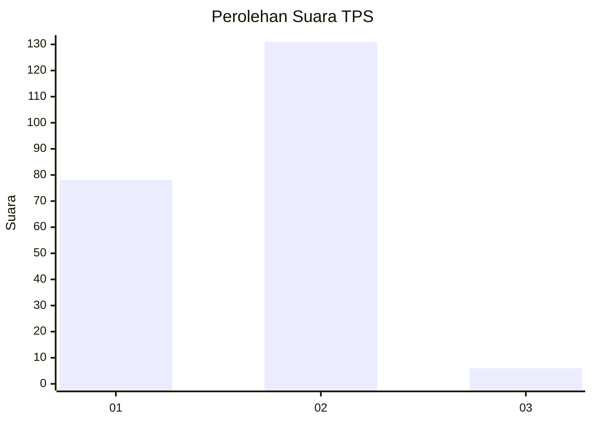
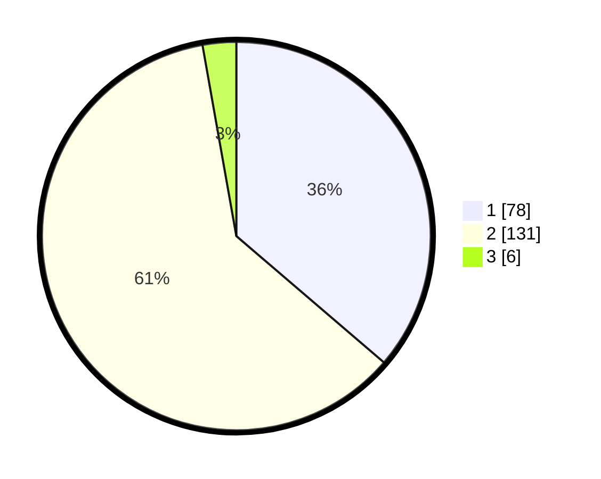

# Hasil

## Grafik

## Tabel

| No. | Nama Paslon    | Suara | Suara (raw) | Persentase |
|:--- |:-------------- | -----:| -----------:| ----------:|
| 1   | ANIES MUHAIMIN | 78    | [78][p-1]   | 36,28      |
| 2   | PRABOWO GIBRAN | 131   | [131][p-2]  | 60,93      |
| 3   | GANJAR MAHFUD  | 6     | [6][p-3]    | 2,79       |

[p-1]: https://github.com/gigit-pemilu/pemilu-2024/blob/main/pilpres/hitung-suara/sub/32-jawa-barat/sub/01-bogor/sub/03-citeureup/sub/1006-puspanegara/sub/011-tps/sub/paslon-1.txt
[p-2]: https://github.com/gigit-pemilu/pemilu-2024/blob/main/pilpres/hitung-suara/sub/32-jawa-barat/sub/01-bogor/sub/03-citeureup/sub/1006-puspanegara/sub/011-tps/sub/paslon-2.txt
[p-3]: https://github.com/gigit-pemilu/pemilu-2024/blob/main/pilpres/hitung-suara/sub/32-jawa-barat/sub/01-bogor/sub/03-citeureup/sub/1006-puspanegara/sub/011-tps/sub/paslon-3.txt

## Foto C Plano

https://sirekap-obj-formc.kpu.go.id/60b5/pemilu/ppwp/32/01/03/10/06/3201031006011-20240214-201729--7a1366fb-15ba-4382-a857-3fbfa956a670.jpg

https://sirekap-obj-formc.kpu.go.id/60b5/pemilu/ppwp/32/01/03/10/06/3201031006011-20240214-201751--2feea22d-2982-4b8d-919c-3f31e524983c.jpg

https://sirekap-obj-formc.kpu.go.id/60b5/pemilu/ppwp/32/01/03/10/06/3201031006011-20240214-201805--63ffb427-ddd9-4b50-9fe6-cffee3a4c21a.jpg

## Metadata

| Key        | Value               |
| ---------- | ------------------- |
| Time Stamp | 2024-02-26 21:00:00 |

