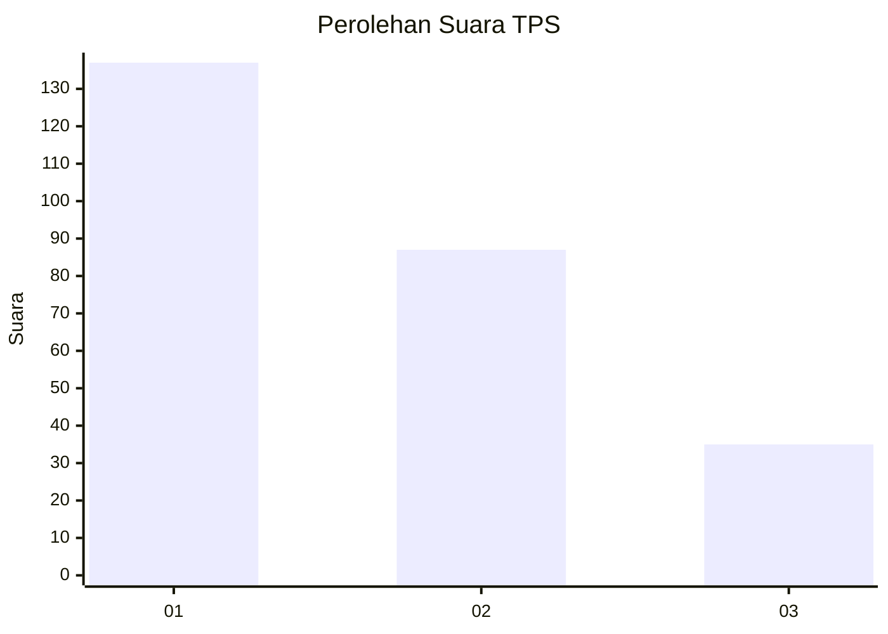
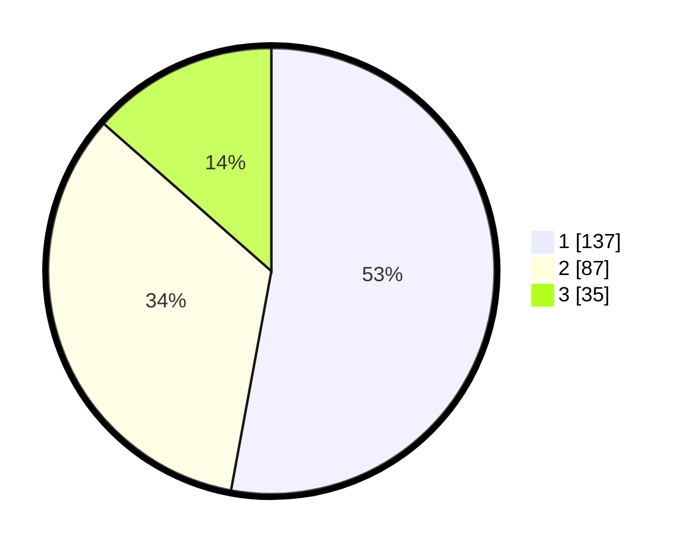

# Hasil

## Grafik

## Tabel

| No. | Nama Paslon    | Suara | Suara (raw) | Persentase |
|:--- |:-------------- | -----:| -----------:| ----------:|
| 1   | ANIES MUHAIMIN | 137   | [137][p-1]  | 52,90      |
| 2   | PRABOWO GIBRAN | 87    | [87][p-2]   | 33,59      |
| 3   | GANJAR MAHFUD  | 35    | [35][p-3]   | 13,51      |

[p-1]: https://github.com/gigit-pemilu/pemilu-2024-32-jawa-barat/blob/main/pilpres/hitung-suara/sub/32-jawa-barat/sub/01-bogor/sub/03-citeureup/sub/1007-karang-asem-barat/sub/056-tps/sub/paslon-1.txt
[p-2]: https://github.com/gigit-pemilu/pemilu-2024-32-jawa-barat/blob/main/pilpres/hitung-suara/sub/32-jawa-barat/sub/01-bogor/sub/03-citeureup/sub/1007-karang-asem-barat/sub/056-tps/sub/paslon-2.txt
[p-3]: https://github.com/gigit-pemilu/pemilu-2024-32-jawa-barat/blob/main/pilpres/hitung-suara/sub/32-jawa-barat/sub/01-bogor/sub/03-citeureup/sub/1007-karang-asem-barat/sub/056-tps/sub/paslon-3.txt

## Foto C Plano

https://sirekap-obj-formc.kpu.go.id/2d7d/pemilu/ppwp/32/01/03/10/07/3201031007056-20240214-225651--abb84cc2-63b0-4cc9-905c-f9456ccdcaf3.jpg

https://sirekap-obj-formc.kpu.go.id/2d7d/pemilu/ppwp/32/01/03/10/07/3201031007056-20240214-212556--5cade2e9-a8ce-48e4-a4d9-845649b2c9fb.jpg

https://sirekap-obj-formc.kpu.go.id/2d7d/pemilu/ppwp/32/01/03/10/07/3201031007056-20240214-230841--8fcd1ef4-2949-46bd-8f67-b259862e28d2.jpg

## Metadata

| Key        | Value               |
| ---------- | ------------------- |
| Time Stamp | 2024-02-16 00:00:26 |

