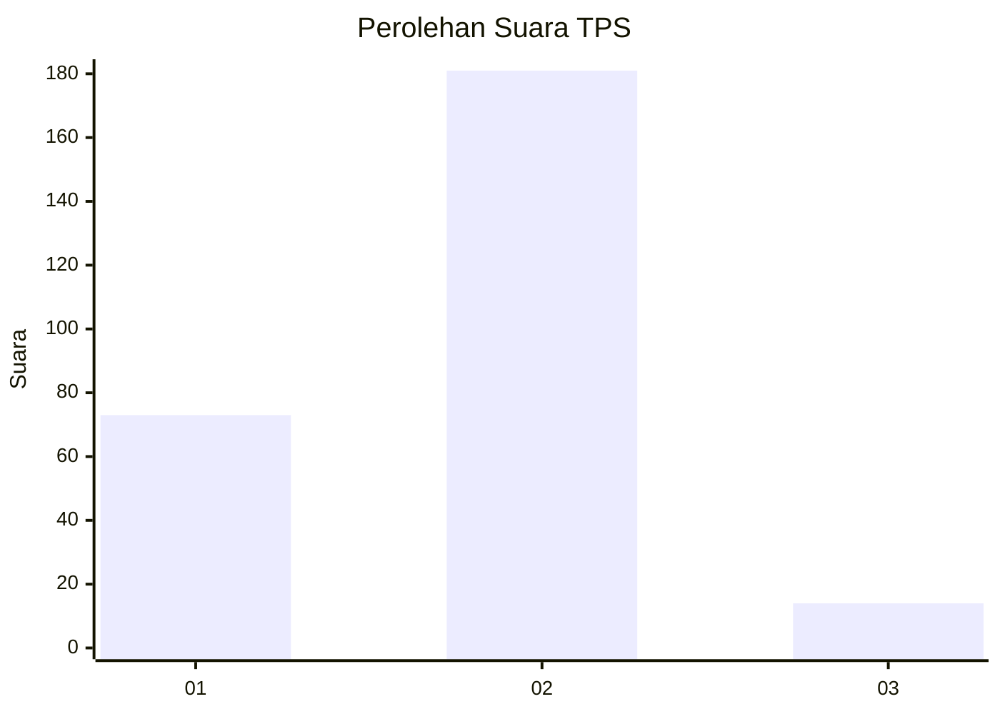
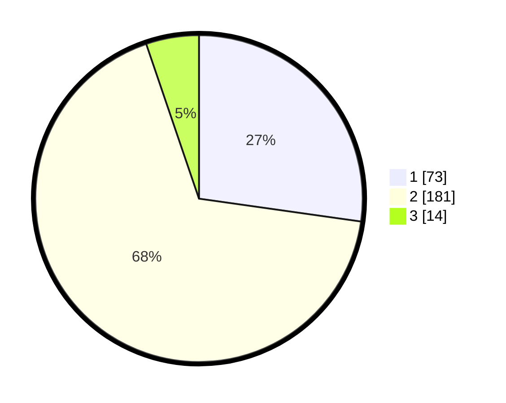

# Hasil

## Grafik

## Tabel

| No. | Nama Paslon    | Suara | Suara (raw) | Persentase |
|:--- |:-------------- | -----:| -----------:| ----------:|
| 1   | ANIES MUHAIMIN | 73    | [73][p-1]   | 27,24      |
| 2   | PRABOWO GIBRAN | 181   | [181][p-2]  | 67,54      |
| 3   | GANJAR MAHFUD  | 14    | [14][p-3]   | 5,22       |

[p-1]: https://github.com/gigit-pemilu/pemilu-2024-32-jawa-barat/blob/main/pilpres/hitung-suara/sub/32-jawa-barat/sub/01-bogor/sub/03-citeureup/sub/2001-puspasari/sub/029-tps/sub/paslon-1.txt
[p-2]: https://github.com/gigit-pemilu/pemilu-2024-32-jawa-barat/blob/main/pilpres/hitung-suara/sub/32-jawa-barat/sub/01-bogor/sub/03-citeureup/sub/2001-puspasari/sub/029-tps/sub/paslon-2.txt
[p-3]: https://github.com/gigit-pemilu/pemilu-2024-32-jawa-barat/blob/main/pilpres/hitung-suara/sub/32-jawa-barat/sub/01-bogor/sub/03-citeureup/sub/2001-puspasari/sub/029-tps/sub/paslon-3.txt

## Foto C Plano

https://sirekap-obj-formc.kpu.go.id/a18b/pemilu/ppwp/32/01/03/20/01/3201032001029-20240214-195245--ba1f1012-0b7a-4b54-9e85-e175ffc6c8e2.jpg

https://sirekap-obj-formc.kpu.go.id/a18b/pemilu/ppwp/32/01/03/20/01/3201032001029-20240214-195905--1172a5a1-00c9-4bfe-8bf0-0bbfdcf2dcb0.jpg

https://sirekap-obj-formc.kpu.go.id/a18b/pemilu/ppwp/32/01/03/20/01/3201032001029-20240214-195621--38b831c0-e36c-49ae-aa05-2d60f5fa07e0.jpg

## Metadata

| Key        | Value               |
| ---------- | ------------------- |
| Time Stamp | 2024-02-15 15:00:29 |

