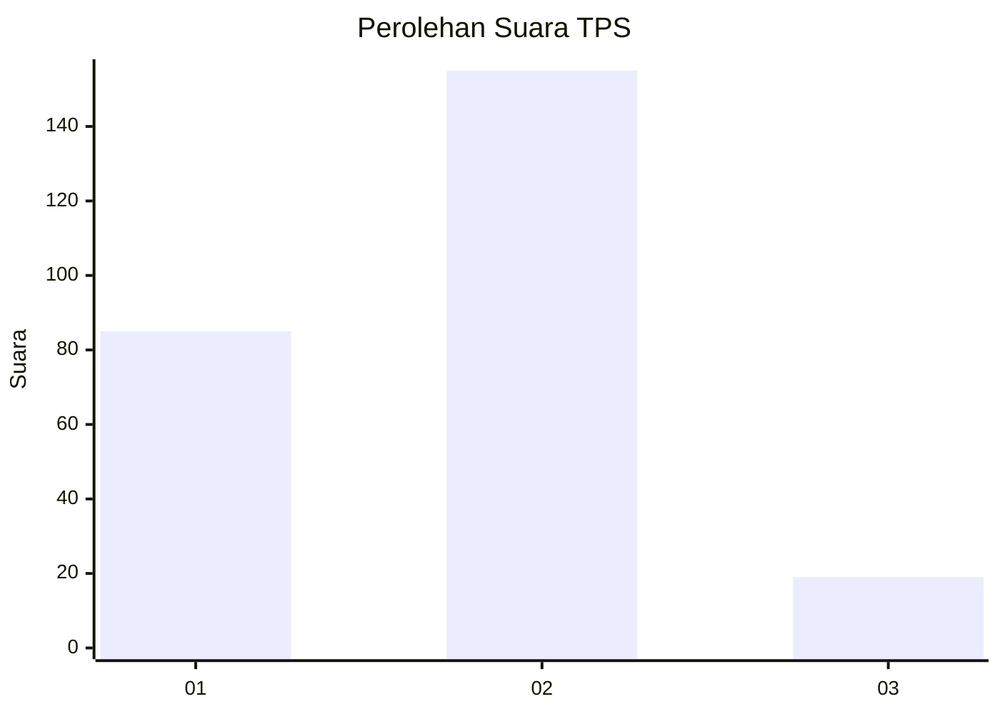
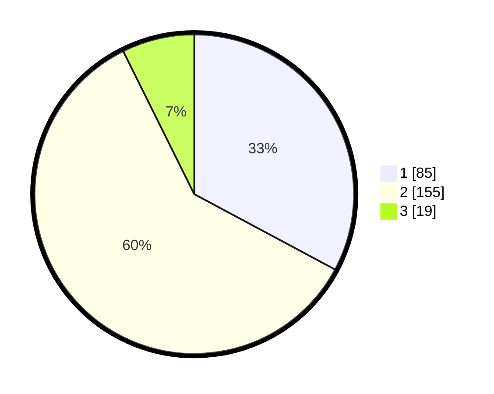

# Hasil

## Grafik

## Tabel

| No. | Nama Paslon    | Suara | Suara (raw) | Persentase |
|:--- |:-------------- | -----:| -----------:| ----------:|
| 1   | ANIES MUHAIMIN | 85    | [85][p-1]   | 32,82      |
| 2   | PRABOWO GIBRAN | 155   | [155][p-2]  | 59,85      |
| 3   | GANJAR MAHFUD  | 19    | [19][p-3]   | 7,34       |

[p-1]: https://github.com/gigit-pemilu/pemilu-2024-32-jawa-barat/blob/main/pilpres/hitung-suara/sub/32-jawa-barat/sub/01-bogor/sub/03-citeureup/sub/2001-puspasari/sub/034-tps/sub/paslon-1.txt
[p-2]: https://github.com/gigit-pemilu/pemilu-2024-32-jawa-barat/blob/main/pilpres/hitung-suara/sub/32-jawa-barat/sub/01-bogor/sub/03-citeureup/sub/2001-puspasari/sub/034-tps/sub/paslon-2.txt
[p-3]: https://github.com/gigit-pemilu/pemilu-2024-32-jawa-barat/blob/main/pilpres/hitung-suara/sub/32-jawa-barat/sub/01-bogor/sub/03-citeureup/sub/2001-puspasari/sub/034-tps/sub/paslon-3.txt

## Foto C Plano

https://sirekap-obj-formc.kpu.go.id/daa0/pemilu/ppwp/32/01/03/20/01/3201032001034-20240214-214104--07c83966-1843-42ed-8d96-ade507151d04.jpg

https://sirekap-obj-formc.kpu.go.id/daa0/pemilu/ppwp/32/01/03/20/01/3201032001034-20240214-214227--aa4fddcc-f7e8-46b3-9bb2-b7948c4087d2.jpg

https://sirekap-obj-formc.kpu.go.id/daa0/pemilu/ppwp/32/01/03/20/01/3201032001034-20240214-214321--04f8e909-7cb0-42a0-897f-89b197e586ee.jpg

## Metadata

| Key        | Value               |
| ---------- | ------------------- |
| Time Stamp | 2024-02-15 15:00:29 |

