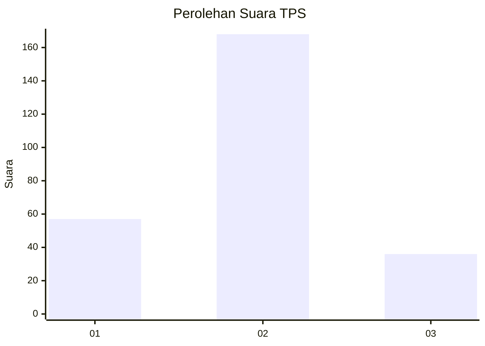
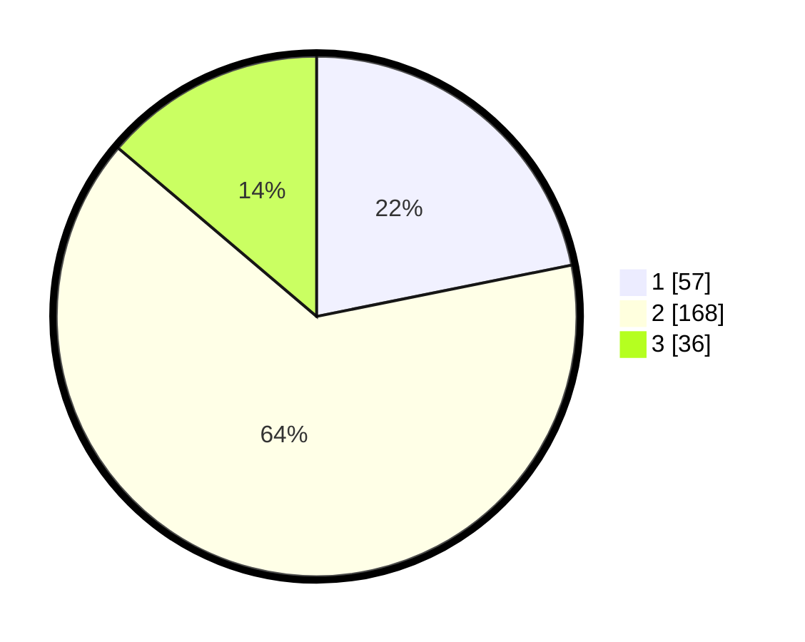

# Hasil

## Grafik

## Tabel

| No. | Nama Paslon    | Suara | Suara (raw) | Persentase |
|:--- |:-------------- | -----:| -----------:| ----------:|
| 1   | ANIES MUHAIMIN | 57    | [57][p-1]   | 21,84      |
| 2   | PRABOWO GIBRAN | 168   | [168][p-2]  | 64,37      |
| 3   | GANJAR MAHFUD  | 36    | [36][p-3]   | 13,79      |

[p-1]: https://github.com/gigit-pemilu/pemilu-2024-32-jawa-barat/blob/main/pilpres/hitung-suara/sub/32-jawa-barat/sub/01-bogor/sub/03-citeureup/sub/2004-tajur/sub/004-tps/sub/paslon-1.txt
[p-2]: https://github.com/gigit-pemilu/pemilu-2024-32-jawa-barat/blob/main/pilpres/hitung-suara/sub/32-jawa-barat/sub/01-bogor/sub/03-citeureup/sub/2004-tajur/sub/004-tps/sub/paslon-2.txt
[p-3]: https://github.com/gigit-pemilu/pemilu-2024-32-jawa-barat/blob/main/pilpres/hitung-suara/sub/32-jawa-barat/sub/01-bogor/sub/03-citeureup/sub/2004-tajur/sub/004-tps/sub/paslon-3.txt

## Foto C Plano

https://sirekap-obj-formc.kpu.go.id/07d0/pemilu/ppwp/32/01/03/20/04/3201032004004-20240214-210313--53884c0d-8a09-487f-9616-248e55f72f0a.jpg

https://sirekap-obj-formc.kpu.go.id/07d0/pemilu/ppwp/32/01/03/20/04/3201032004004-20240214-210753--55f1e82f-4c8a-4d20-9203-ff30302adb4b.jpg

https://sirekap-obj-formc.kpu.go.id/07d0/pemilu/ppwp/32/01/03/20/04/3201032004004-20240214-211139--dc80cd42-7f16-4f55-9716-0d889f89b456.jpg

## Metadata

| Key        | Value               |
| ---------- | ------------------- |
| Time Stamp | 2024-02-15 16:00:26 |

