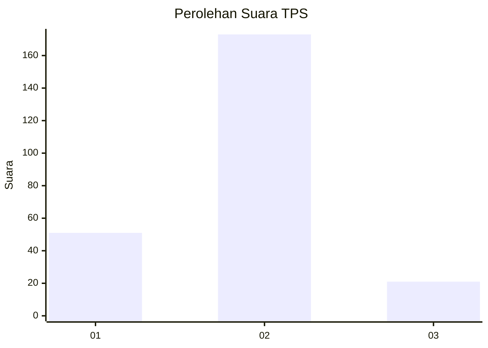

# Hasil

## Grafik

## Tabel

| No. | Nama Paslon    | Suara | Suara (raw) | Persentase |
|:--- |:-------------- | -----:| -----------:| ----------:|
| 1   | ANIES MUHAIMIN | 51    | [51][p-1]   | 20,82      |
| 2   | PRABOWO GIBRAN | 173   | [173][p-2]  | 70,61      |
| 3   | GANJAR MAHFUD  | 21    | [21][p-3]   | 8,57       |

[p-1]: https://github.com/gigit-pemilu/pemilu-2024/blob/main/pilpres/hitung-suara/sub/32-jawa-barat/sub/01-bogor/sub/03-citeureup/sub/2008-karang-asem-timur/sub/002-tps/sub/paslon-1.txt
[p-2]: https://github.com/gigit-pemilu/pemilu-2024/blob/main/pilpres/hitung-suara/sub/32-jawa-barat/sub/01-bogor/sub/03-citeureup/sub/2008-karang-asem-timur/sub/002-tps/sub/paslon-2.txt
[p-3]: https://github.com/gigit-pemilu/pemilu-2024/blob/main/pilpres/hitung-suara/sub/32-jawa-barat/sub/01-bogor/sub/03-citeureup/sub/2008-karang-asem-timur/sub/002-tps/sub/paslon-3.txt

## Foto C Plano

https://sirekap-obj-formc.kpu.go.id/7a27/pemilu/ppwp/32/01/03/20/08/3201032008002-20240214-232352--af5a1ef5-29a7-4f35-8dda-c7d846445e5c.jpg

https://sirekap-obj-formc.kpu.go.id/7a27/pemilu/ppwp/32/01/03/20/08/3201032008002-20240214-232549--03533c0a-f01a-4809-a75a-23b2d87c3cf6.jpg

https://sirekap-obj-formc.kpu.go.id/7a27/pemilu/ppwp/32/01/03/20/08/3201032008002-20240214-233057--693a3d0a-46b0-4924-bcd6-7786966be747.jpg

## Metadata

| Key        | Value               |
| ---------- | ------------------- |
| Time Stamp | 2024-02-15 15:00:29 |

