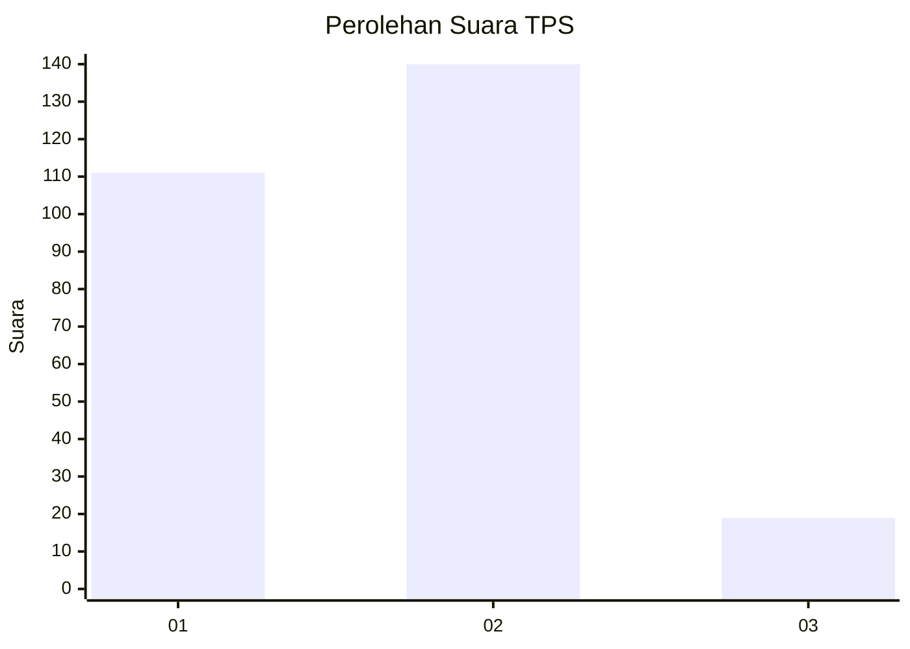

# Hasil

## Grafik

## Tabel

| No. | Nama Paslon    | Suara | Suara (raw) | Persentase |
|:--- |:-------------- | -----:| -----------:| ----------:|
| 1   | ANIES MUHAIMIN | 111   | [111][p-1]  | 41,11      |
| 2   | PRABOWO GIBRAN | 140   | [140][p-2]  | 51,85      |
| 3   | GANJAR MAHFUD  | 19    | [19][p-3]   | 7,04       |

[p-1]: https://github.com/gigit-pemilu/pemilu-2024/blob/main/pilpres/hitung-suara/sub/32-jawa-barat/sub/01-bogor/sub/03-citeureup/sub/2009-tarikolot/sub/042-tps/sub/paslon-1.txt
[p-2]: https://github.com/gigit-pemilu/pemilu-2024/blob/main/pilpres/hitung-suara/sub/32-jawa-barat/sub/01-bogor/sub/03-citeureup/sub/2009-tarikolot/sub/042-tps/sub/paslon-2.txt
[p-3]: https://github.com/gigit-pemilu/pemilu-2024/blob/main/pilpres/hitung-suara/sub/32-jawa-barat/sub/01-bogor/sub/03-citeureup/sub/2009-tarikolot/sub/042-tps/sub/paslon-3.txt

## Foto C Plano

https://sirekap-obj-formc.kpu.go.id/f13d/pemilu/ppwp/32/01/03/20/09/3201032009042-20240218-191110--0e4aecec-516f-4ba2-b1e8-3e2b74e01eed.jpg

https://sirekap-obj-formc.kpu.go.id/f13d/pemilu/ppwp/32/01/03/20/09/3201032009042-20240218-233345--f5cf24f6-494c-4010-a120-9720133ebb6c.jpg

https://sirekap-obj-formc.kpu.go.id/f13d/pemilu/ppwp/32/01/03/20/09/3201032009042-20240218-233445--4e37462f-926a-4c55-b720-066e05caf235.jpg

## Metadata

| Key        | Value               |
| ---------- | ------------------- |
| Time Stamp | 2024-02-21 16:00:00 |

