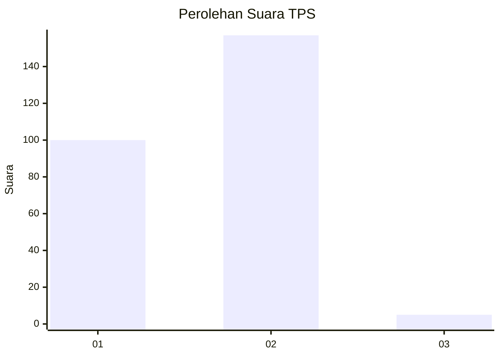
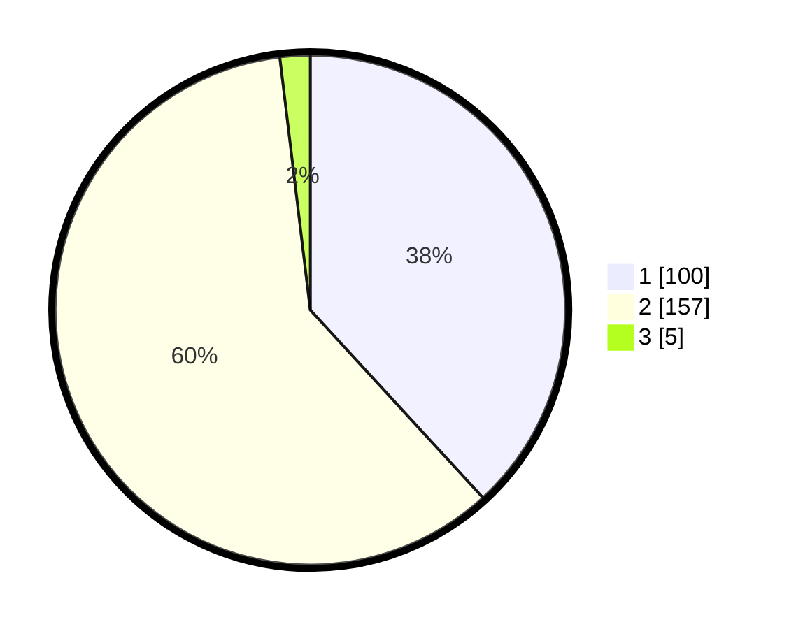

# Hasil

## Grafik

## Tabel

| No. | Nama Paslon    | Suara | Suara (raw) | Persentase |
|:--- |:-------------- | -----:| -----------:| ----------:|
| 1   | ANIES MUHAIMIN | 100   | [100][p-1]  | 38,17      |
| 2   | PRABOWO GIBRAN | 157   | [157][p-2]  | 59,92      |
| 3   | GANJAR MAHFUD  | 5     | [5][p-3]    | 1,91       |

[p-1]: https://github.com/gigit-pemilu/pemilu-2024-32-jawa-barat/blob/main/pilpres/hitung-suara/sub/32-jawa-barat/sub/01-bogor/sub/03-citeureup/sub/2012-sukahati/sub/002-tps/sub/paslon-1.txt
[p-2]: https://github.com/gigit-pemilu/pemilu-2024-32-jawa-barat/blob/main/pilpres/hitung-suara/sub/32-jawa-barat/sub/01-bogor/sub/03-citeureup/sub/2012-sukahati/sub/002-tps/sub/paslon-2.txt
[p-3]: https://github.com/gigit-pemilu/pemilu-2024-32-jawa-barat/blob/main/pilpres/hitung-suara/sub/32-jawa-barat/sub/01-bogor/sub/03-citeureup/sub/2012-sukahati/sub/002-tps/sub/paslon-3.txt

## Foto C Plano

https://sirekap-obj-formc.kpu.go.id/bec1/pemilu/ppwp/32/01/03/20/12/3201032012002-20240215-014950--11dbf702-908b-4b1a-963e-6bc3d54c6164.jpg

https://sirekap-obj-formc.kpu.go.id/bec1/pemilu/ppwp/32/01/03/20/12/3201032012002-20240215-015002--75db26fd-7639-4d83-9d62-440caf1f68bf.jpg

https://sirekap-obj-formc.kpu.go.id/bec1/pemilu/ppwp/32/01/03/20/12/3201032012002-20240215-015010--6b119611-9205-476a-804c-636d9b3cd227.jpg

## Metadata

| Key        | Value               |
| ---------- | ------------------- |
| Time Stamp | 2024-02-15 12:00:28 |

