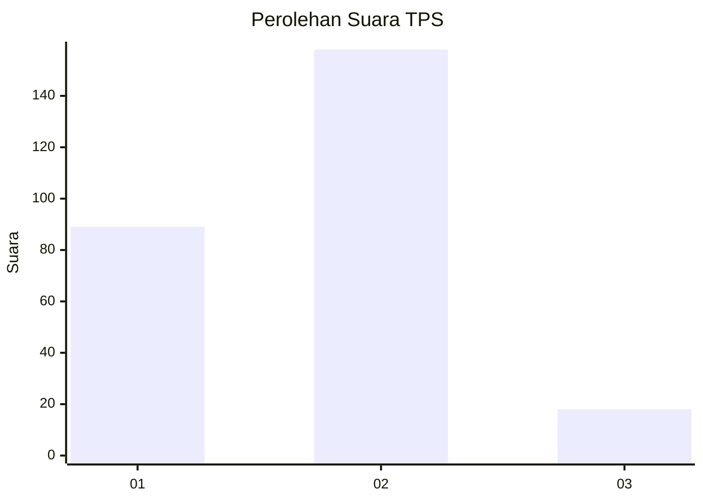
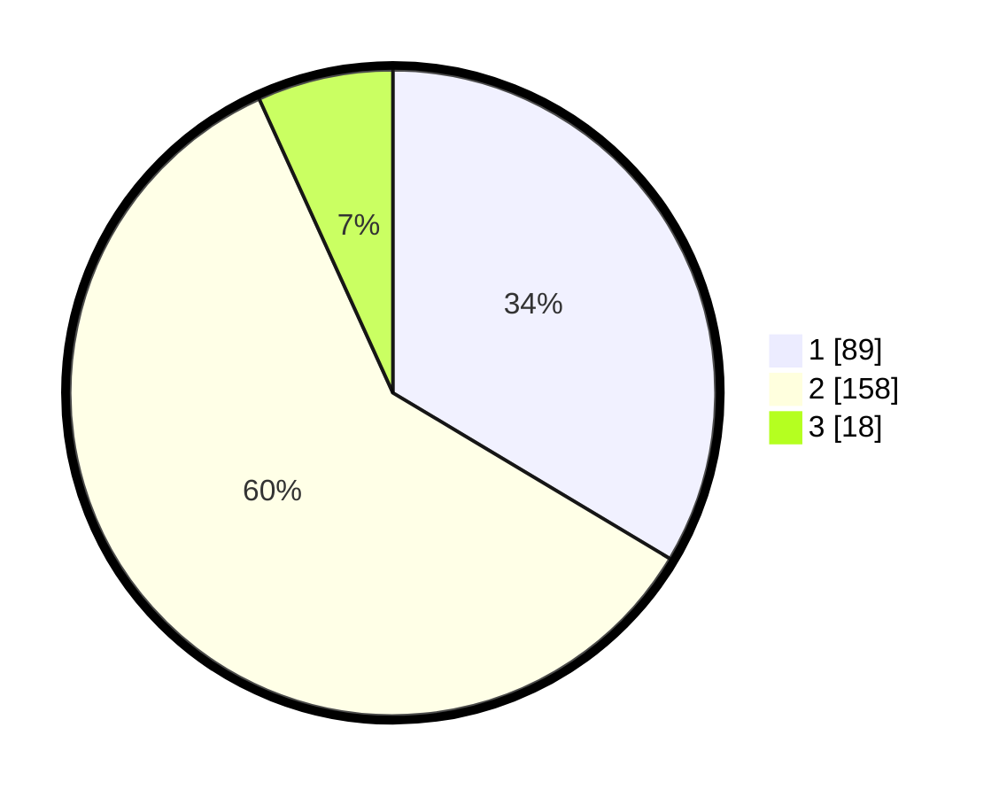

# Hasil

## Grafik

## Tabel

| No. | Nama Paslon    | Suara | Suara (raw) | Persentase |
|:--- |:-------------- | -----:| -----------:| ----------:|
| 1   | ANIES MUHAIMIN | 89    | [89][p-1]   | 33,58      |
| 2   | PRABOWO GIBRAN | 158   | [158][p-2]  | 59,62      |
| 3   | GANJAR MAHFUD  | 18    | [18][p-3]   | 6,79       |

[p-1]: https://github.com/gigit-pemilu/pemilu-2024/blob/main/pilpres/hitung-suara/sub/32-jawa-barat/sub/01-bogor/sub/03-citeureup/sub/2013-hambalang/sub/028-tps/sub/paslon-1.txt
[p-2]: https://github.com/gigit-pemilu/pemilu-2024/blob/main/pilpres/hitung-suara/sub/32-jawa-barat/sub/01-bogor/sub/03-citeureup/sub/2013-hambalang/sub/028-tps/sub/paslon-2.txt
[p-3]: https://github.com/gigit-pemilu/pemilu-2024/blob/main/pilpres/hitung-suara/sub/32-jawa-barat/sub/01-bogor/sub/03-citeureup/sub/2013-hambalang/sub/028-tps/sub/paslon-3.txt

## Foto C Plano

https://sirekap-obj-formc.kpu.go.id/2b06/pemilu/ppwp/32/01/03/20/13/3201032013028-20240214-235256--f83a034b-4c1e-442a-a71b-d509dddd5778.jpg

https://sirekap-obj-formc.kpu.go.id/2b06/pemilu/ppwp/32/01/03/20/13/3201032013028-20240214-194924--16d1b72d-00dc-4b45-a901-62092b246923.jpg

https://sirekap-obj-formc.kpu.go.id/2b06/pemilu/ppwp/32/01/03/20/13/3201032013028-20240214-235355--27cf0125-5dac-4277-a42d-b65ebca893a6.jpg

## Metadata

| Key        | Value               |
| ---------- | ------------------- |
| Time Stamp | 2024-02-15 15:00:29 |

