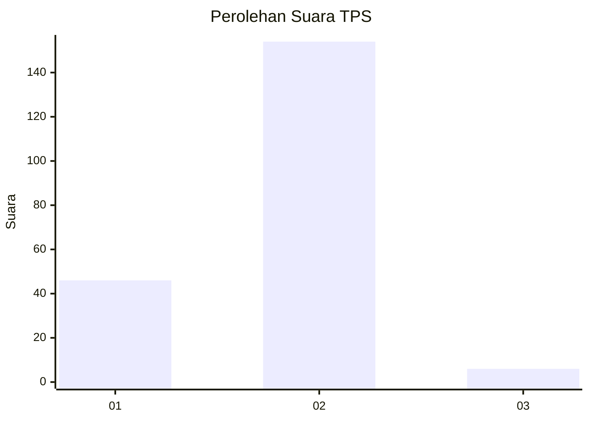

# Hasil

## Grafik

## Tabel

| No. | Nama Paslon    | Suara | Suara (raw) | Persentase |
|:--- |:-------------- | -----:| -----------:| ----------:|
| 1   | ANIES MUHAIMIN | 46    | [46][p-1]   | 22,33      |
| 2   | PRABOWO GIBRAN | 154   | [154][p-2]  | 74,76      |
| 3   | GANJAR MAHFUD  | 6     | [6][p-3]    | 2,91       |

[p-1]: https://github.com/gigit-pemilu/pemilu-2024/blob/main/pilpres/hitung-suara/sub/32-jawa-barat/sub/01-bogor/sub/04-sukaraja/sub/2008-cikeas/sub/005-tps/sub/paslon-1.txt
[p-2]: https://github.com/gigit-pemilu/pemilu-2024/blob/main/pilpres/hitung-suara/sub/32-jawa-barat/sub/01-bogor/sub/04-sukaraja/sub/2008-cikeas/sub/005-tps/sub/paslon-2.txt
[p-3]: https://github.com/gigit-pemilu/pemilu-2024/blob/main/pilpres/hitung-suara/sub/32-jawa-barat/sub/01-bogor/sub/04-sukaraja/sub/2008-cikeas/sub/005-tps/sub/paslon-3.txt

## Foto C Plano

https://sirekap-obj-formc.kpu.go.id/f3b9/pemilu/ppwp/32/01/04/20/08/3201042008005-20240215-182202--9f03f389-7f71-4aab-837f-d18d5a1c70fb.jpg

https://sirekap-obj-formc.kpu.go.id/f3b9/pemilu/ppwp/32/01/04/20/08/3201042008005-20240215-182217--957e59a5-ea7e-4935-a7bd-e3fb94b04dfa.jpg

https://sirekap-obj-formc.kpu.go.id/f3b9/pemilu/ppwp/32/01/04/20/08/3201042008005-20240215-182229--6045cba0-f184-4b22-8ba2-cf3eaec8e024.jpg

## Metadata

| Key        | Value               |
| ---------- | ------------------- |
| Time Stamp | 2024-02-17 11:30:03 |

