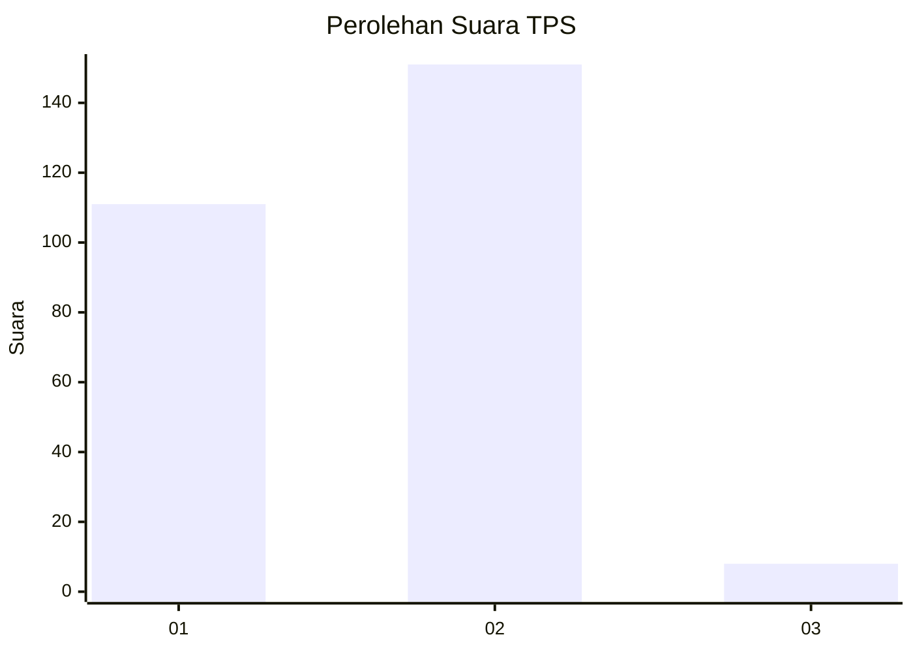
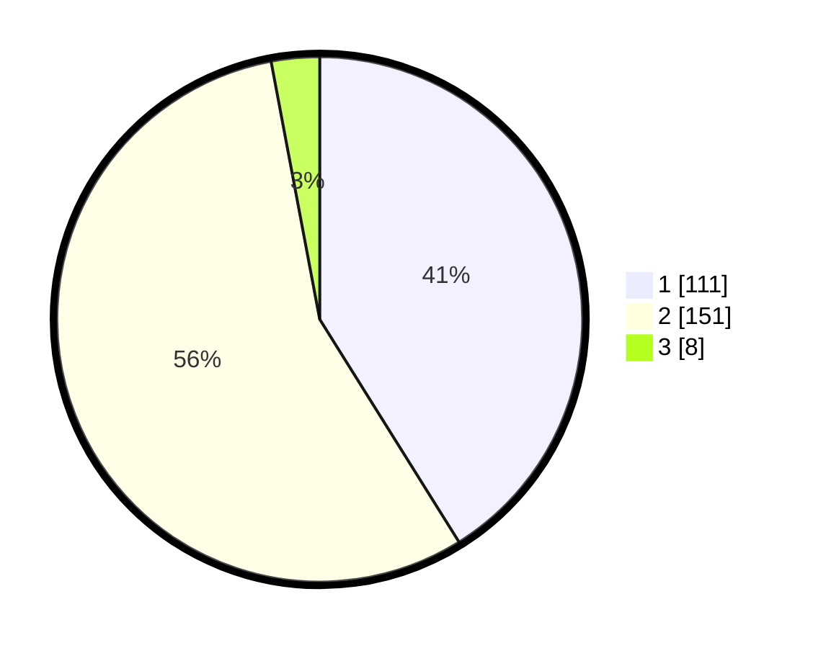

# Hasil

## Grafik

## Tabel

| No. | Nama Paslon    | Suara | Suara (raw) | Persentase |
|:--- |:-------------- | -----:| -----------:| ----------:|
| 1   | ANIES MUHAIMIN | 111   | [111][p-1]  | 41,11      |
| 2   | PRABOWO GIBRAN | 151   | [151][p-2]  | 55,93      |
| 3   | GANJAR MAHFUD  | 8     | [8][p-3]    | 2,96       |

[p-1]: https://github.com/gigit-pemilu/pemilu-2024/blob/main/pilpres/hitung-suara/sub/32-jawa-barat/sub/01-bogor/sub/04-sukaraja/sub/2008-cikeas/sub/013-tps/sub/paslon-1.txt
[p-2]: https://github.com/gigit-pemilu/pemilu-2024/blob/main/pilpres/hitung-suara/sub/32-jawa-barat/sub/01-bogor/sub/04-sukaraja/sub/2008-cikeas/sub/013-tps/sub/paslon-2.txt
[p-3]: https://github.com/gigit-pemilu/pemilu-2024/blob/main/pilpres/hitung-suara/sub/32-jawa-barat/sub/01-bogor/sub/04-sukaraja/sub/2008-cikeas/sub/013-tps/sub/paslon-3.txt

## Foto C Plano

https://sirekap-obj-formc.kpu.go.id/7051/pemilu/ppwp/32/01/04/20/08/3201042008013-20240215-145848--c6872102-74ef-4728-bf07-b6710b894ab8.jpg

https://sirekap-obj-formc.kpu.go.id/7051/pemilu/ppwp/32/01/04/20/08/3201042008013-20240215-145920--b21af06c-0fbc-4d0e-ace6-650c058a50e4.jpg

https://sirekap-obj-formc.kpu.go.id/7051/pemilu/ppwp/32/01/04/20/08/3201042008013-20240215-145941--a9dacbf6-7280-4e17-99bf-be57c1d3d528.jpg

## Metadata

| Key        | Value               |
| ---------- | ------------------- |
| Time Stamp | 2024-02-17 11:30:03 |

