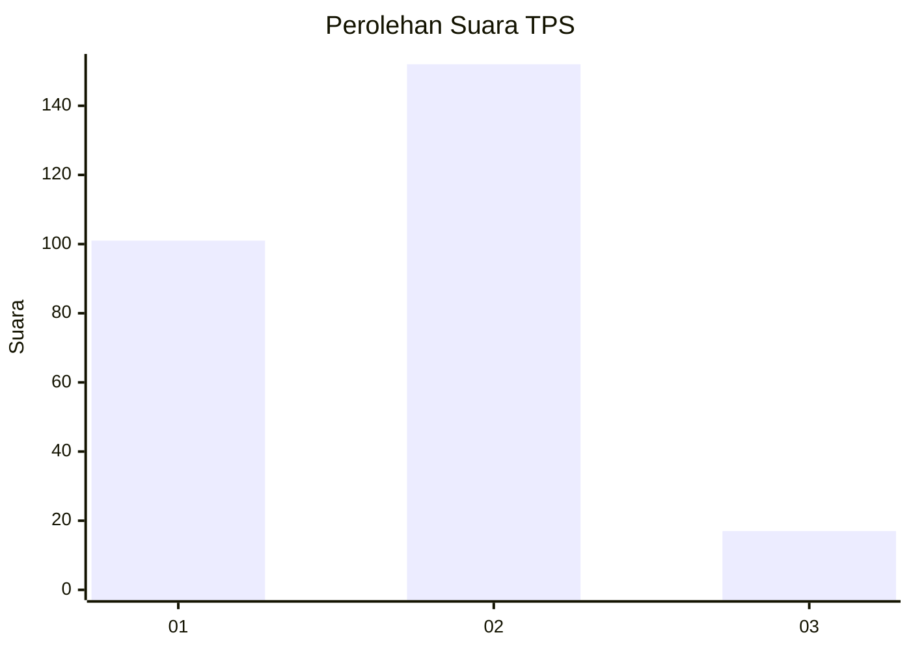
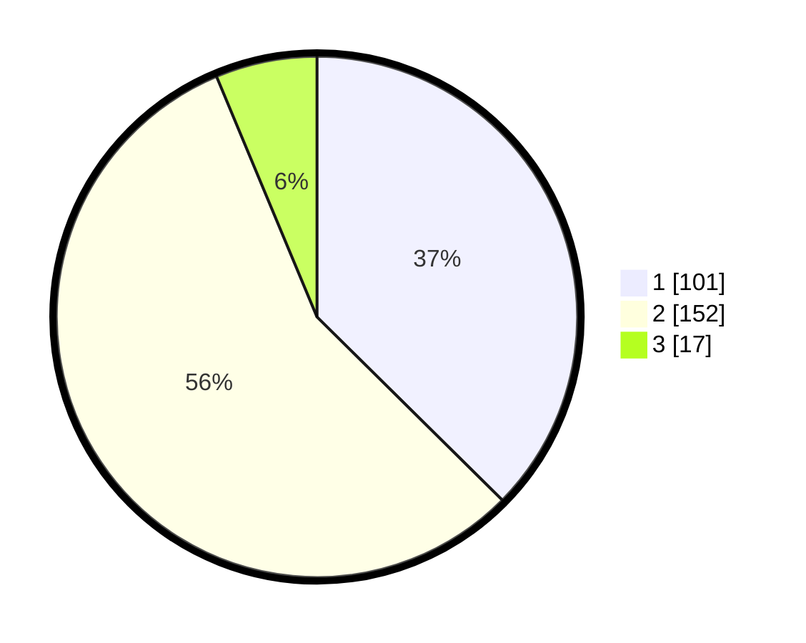

# Hasil

## Grafik

## Tabel

| No. | Nama Paslon    | Suara | Suara (raw) | Persentase |
|:--- |:-------------- | -----:| -----------:| ----------:|
| 1   | ANIES MUHAIMIN | 101   | [101][p-1]  | 37,41      |
| 2   | PRABOWO GIBRAN | 152   | [152][p-2]  | 56,30      |
| 3   | GANJAR MAHFUD  | 17    | [17][p-3]   | 6,30       |

[p-1]: https://github.com/gigit-pemilu/pemilu-2024-32-jawa-barat/blob/main/pilpres/hitung-suara/sub/32-jawa-barat/sub/01-bogor/sub/04-sukaraja/sub/2009-pasir-jambu/sub/024-tps/sub/paslon-1.txt
[p-2]: https://github.com/gigit-pemilu/pemilu-2024-32-jawa-barat/blob/main/pilpres/hitung-suara/sub/32-jawa-barat/sub/01-bogor/sub/04-sukaraja/sub/2009-pasir-jambu/sub/024-tps/sub/paslon-2.txt
[p-3]: https://github.com/gigit-pemilu/pemilu-2024-32-jawa-barat/blob/main/pilpres/hitung-suara/sub/32-jawa-barat/sub/01-bogor/sub/04-sukaraja/sub/2009-pasir-jambu/sub/024-tps/sub/paslon-3.txt

## Foto C Plano

https://sirekap-obj-formc.kpu.go.id/dfe8/pemilu/ppwp/32/01/04/20/09/3201042009024-20240214-233722--2a3cd541-66ff-4bb7-a0df-4b01f0eff903.jpg

https://sirekap-obj-formc.kpu.go.id/dfe8/pemilu/ppwp/32/01/04/20/09/3201042009024-20240214-233812--7f478d4f-38c0-493a-980b-0439dd428c79.jpg

https://sirekap-obj-formc.kpu.go.id/dfe8/pemilu/ppwp/32/01/04/20/09/3201042009024-20240214-233850--524c03bf-d018-4836-9092-95350aa415f4.jpg

## Metadata

| Key        | Value               |
| ---------- | ------------------- |
| Time Stamp | 2024-02-17 11:30:03 |

