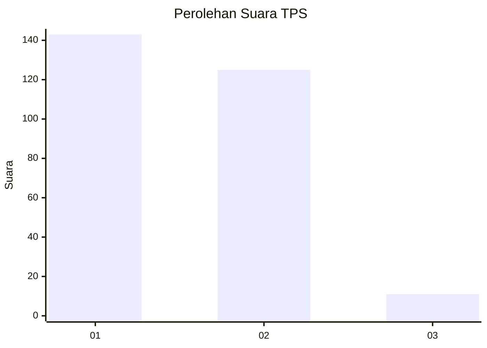
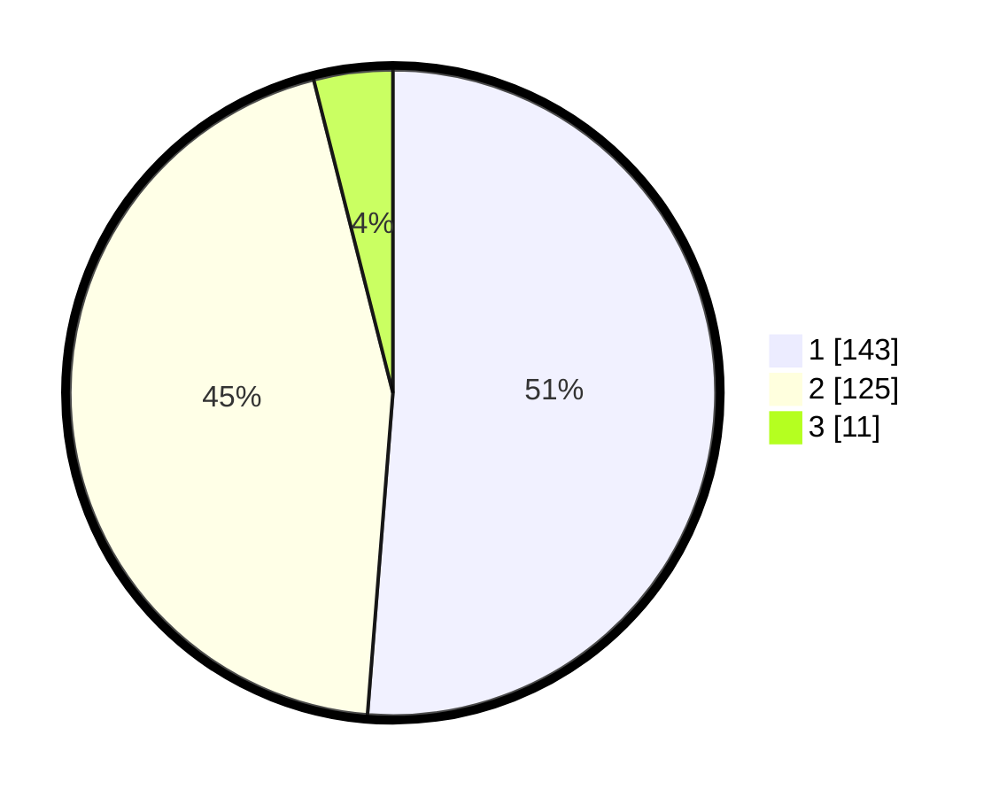

# Hasil

## Grafik

## Tabel

| No. | Nama Paslon    | Suara | Suara (raw) | Persentase |
|:--- |:-------------- | -----:| -----------:| ----------:|
| 1   | ANIES MUHAIMIN | 143   | [143][p-1]  | 51,25      |
| 2   | PRABOWO GIBRAN | 125   | [125][p-2]  | 44,80      |
| 3   | GANJAR MAHFUD  | 11    | [11][p-3]   | 3,94       |

[p-1]: https://github.com/gigit-pemilu/pemilu-2024-32-jawa-barat/blob/main/pilpres/hitung-suara/sub/32-jawa-barat/sub/01-bogor/sub/04-sukaraja/sub/2009-pasir-jambu/sub/036-tps/sub/paslon-1.txt
[p-2]: https://github.com/gigit-pemilu/pemilu-2024-32-jawa-barat/blob/main/pilpres/hitung-suara/sub/32-jawa-barat/sub/01-bogor/sub/04-sukaraja/sub/2009-pasir-jambu/sub/036-tps/sub/paslon-2.txt
[p-3]: https://github.com/gigit-pemilu/pemilu-2024-32-jawa-barat/blob/main/pilpres/hitung-suara/sub/32-jawa-barat/sub/01-bogor/sub/04-sukaraja/sub/2009-pasir-jambu/sub/036-tps/sub/paslon-3.txt

## Foto C Plano

https://sirekap-obj-formc.kpu.go.id/f086/pemilu/ppwp/32/01/04/20/09/3201042009036-20240215-004536--df84c4b5-a0d8-46f9-9880-a0011dc42353.jpg

https://sirekap-obj-formc.kpu.go.id/f086/pemilu/ppwp/32/01/04/20/09/3201042009036-20240215-004733--f3d5f3e5-fde7-4671-bf72-459960cb7a34.jpg

https://sirekap-obj-formc.kpu.go.id/f086/pemilu/ppwp/32/01/04/20/09/3201042009036-20240215-004828--3a6a0a0d-761b-4d25-9a04-72b38f9cd192.jpg

## Metadata

| Key        | Value               |
| ---------- | ------------------- |
| Time Stamp | 2024-02-15 12:00:28 |

