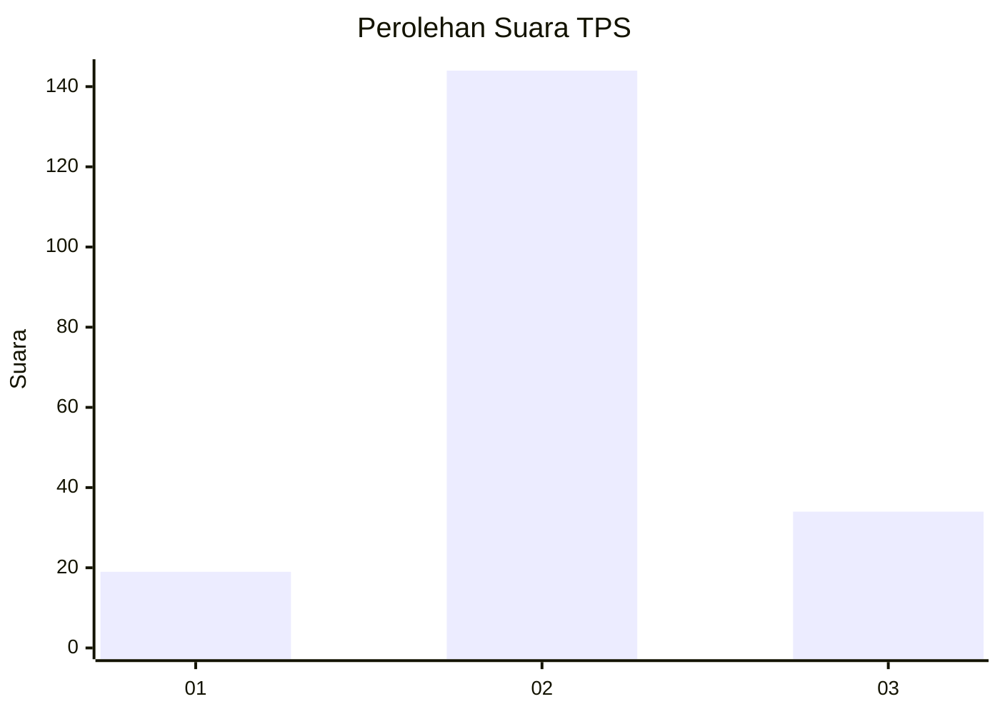
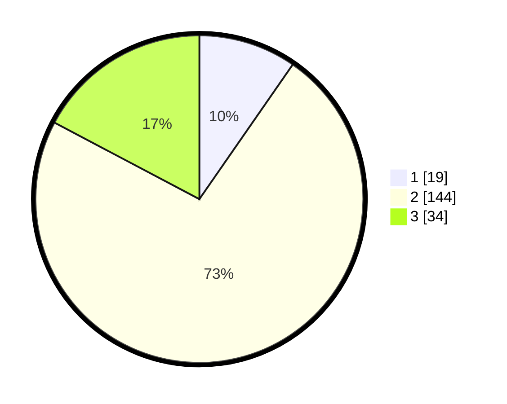

# Hasil

## Grafik

## Tabel

| No. | Nama Paslon    | Suara | Suara (raw) | Persentase |
|:--- |:-------------- | -----:| -----------:| ----------:|
| 1   | ANIES MUHAIMIN | 19    | [19][p-1]   | 9,64       |
| 2   | PRABOWO GIBRAN | 144   | [144][p-2]  | 73,10      |
| 3   | GANJAR MAHFUD  | 34    | [34][p-3]   | 17,26      |

[p-1]: https://github.com/gigit-pemilu/pemilu-2024/blob/main/pilpres/hitung-suara/sub/32-jawa-barat/sub/01-bogor/sub/05-babakan-madang/sub/2001-cijayanti/sub/002-tps/sub/paslon-1.txt
[p-2]: https://github.com/gigit-pemilu/pemilu-2024/blob/main/pilpres/hitung-suara/sub/32-jawa-barat/sub/01-bogor/sub/05-babakan-madang/sub/2001-cijayanti/sub/002-tps/sub/paslon-2.txt
[p-3]: https://github.com/gigit-pemilu/pemilu-2024/blob/main/pilpres/hitung-suara/sub/32-jawa-barat/sub/01-bogor/sub/05-babakan-madang/sub/2001-cijayanti/sub/002-tps/sub/paslon-3.txt

## Foto C Plano

https://sirekap-obj-formc.kpu.go.id/a4f7/pemilu/ppwp/32/01/05/20/01/3201052001002-20240215-013403--94f9b4ae-c0de-448c-8d6e-927df981a3f7.jpg

https://sirekap-obj-formc.kpu.go.id/a4f7/pemilu/ppwp/32/01/05/20/01/3201052001002-20240215-012832--af450bab-a6ad-4df4-a0b9-ee655dfdca54.jpg

https://sirekap-obj-formc.kpu.go.id/a4f7/pemilu/ppwp/32/01/05/20/01/3201052001002-20240215-013900--1fb08283-8da9-4539-b25b-c37460d7f5da.jpg

## Metadata

| Key        | Value               |
| ---------- | ------------------- |
| Time Stamp | 2024-02-15 20:30:46 |

