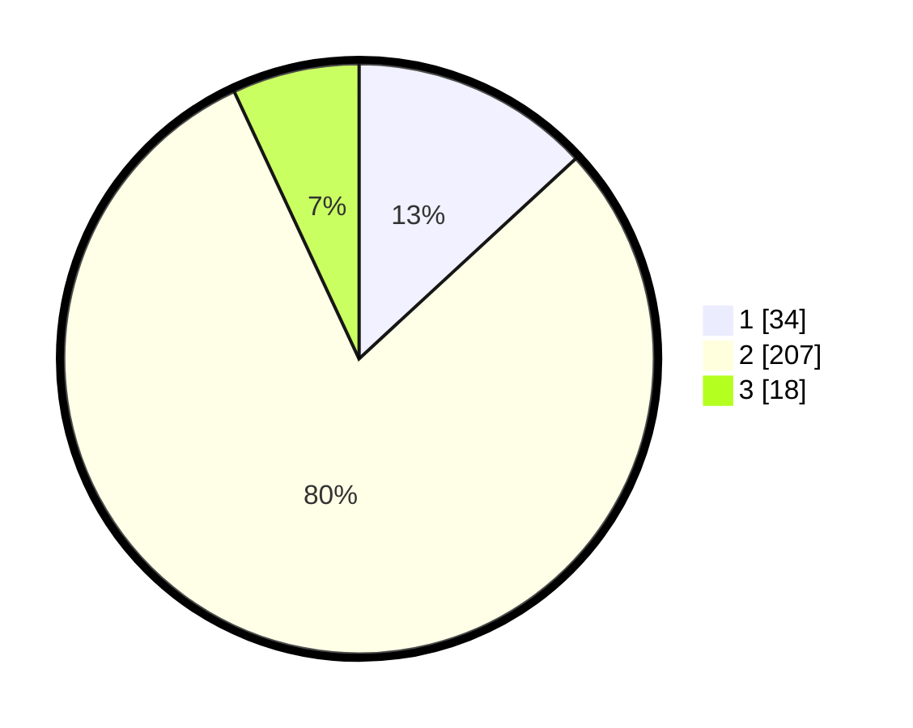

# Hasil

## Grafik

## Tabel

| No. | Nama Paslon    | Suara | Suara (raw) | Persentase |
|:--- |:-------------- | -----:| -----------:| ----------:|
| 1   | ANIES MUHAIMIN | 34    | [34][p-1]   | 13,13      |
| 2   | PRABOWO GIBRAN | 207   | [207][p-2]  | 79,92      |
| 3   | GANJAR MAHFUD  | 18    | [18][p-3]   | 6,95       |

[p-1]: https://github.com/gigit-pemilu/pemilu-2024-32-jawa-barat/blob/main/pilpres/hitung-suara/sub/32-jawa-barat/sub/01-bogor/sub/05-babakan-madang/sub/2001-cijayanti/sub/003-tps/sub/paslon-1.txt
[p-2]: https://github.com/gigit-pemilu/pemilu-2024-32-jawa-barat/blob/main/pilpres/hitung-suara/sub/32-jawa-barat/sub/01-bogor/sub/05-babakan-madang/sub/2001-cijayanti/sub/003-tps/sub/paslon-2.txt
[p-3]: https://github.com/gigit-pemilu/pemilu-2024-32-jawa-barat/blob/main/pilpres/hitung-suara/sub/32-jawa-barat/sub/01-bogor/sub/05-babakan-madang/sub/2001-cijayanti/sub/003-tps/sub/paslon-3.txt

## Foto C Plano

https://sirekap-obj-formc.kpu.go.id/6d07/pemilu/ppwp/32/01/05/20/01/3201052001003-20240214-155636--89090a9c-e357-4ff7-bf3e-5a0dd9415e91.jpg

https://sirekap-obj-formc.kpu.go.id/6d07/pemilu/ppwp/32/01/05/20/01/3201052001003-20240214-155909--88c0bec0-12bb-4db1-8698-d838ba08c139.jpg

https://sirekap-obj-formc.kpu.go.id/6d07/pemilu/ppwp/32/01/05/20/01/3201052001003-20240215-183217--543cacba-afb3-4a28-aaed-4b146660d4a5.jpg

## Metadata

| Key        | Value               |
| ---------- | ------------------- |
| Time Stamp | 2024-02-15 20:30:46 |

