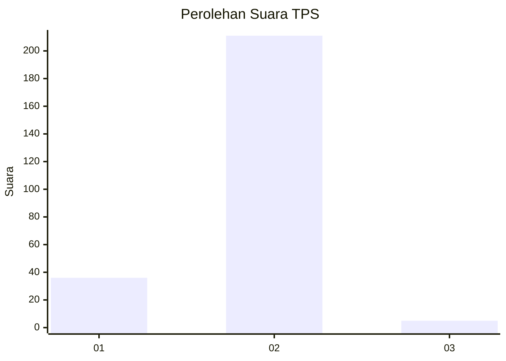
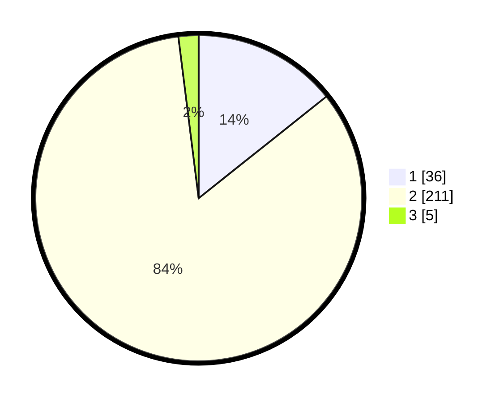

# Hasil

## Grafik

## Tabel

| No. | Nama Paslon    | Suara | Suara (raw) | Persentase |
|:--- |:-------------- | -----:| -----------:| ----------:|
| 1   | ANIES MUHAIMIN | 36    | [36][p-1]   | 14,29      |
| 2   | PRABOWO GIBRAN | 211   | [211][p-2]  | 83,73      |
| 3   | GANJAR MAHFUD  | 5     | [5][p-3]    | 1,98       |

[p-1]: https://github.com/gigit-pemilu/pemilu-2024/blob/main/pilpres/hitung-suara/sub/32-jawa-barat/sub/01-bogor/sub/05-babakan-madang/sub/2001-cijayanti/sub/005-tps/sub/paslon-1.txt
[p-2]: https://github.com/gigit-pemilu/pemilu-2024/blob/main/pilpres/hitung-suara/sub/32-jawa-barat/sub/01-bogor/sub/05-babakan-madang/sub/2001-cijayanti/sub/005-tps/sub/paslon-2.txt
[p-3]: https://github.com/gigit-pemilu/pemilu-2024/blob/main/pilpres/hitung-suara/sub/32-jawa-barat/sub/01-bogor/sub/05-babakan-madang/sub/2001-cijayanti/sub/005-tps/sub/paslon-3.txt

## Foto C Plano

https://sirekap-obj-formc.kpu.go.id/50c4/pemilu/ppwp/32/01/05/20/01/3201052001005-20240215-012409--8c32dbfe-d649-4d0e-93bf-7cc388311850.jpg

https://sirekap-obj-formc.kpu.go.id/50c4/pemilu/ppwp/32/01/05/20/01/3201052001005-20240215-012908--93555144-c4b1-461d-a7ab-60de0e1ccf1f.jpg

https://sirekap-obj-formc.kpu.go.id/50c4/pemilu/ppwp/32/01/05/20/01/3201052001005-20240215-013116--28aa3a1d-f310-4311-a682-bd35f7d70ff6.jpg

## Metadata

| Key        | Value               |
| ---------- | ------------------- |
| Time Stamp | 2024-02-16 00:00:26 |

