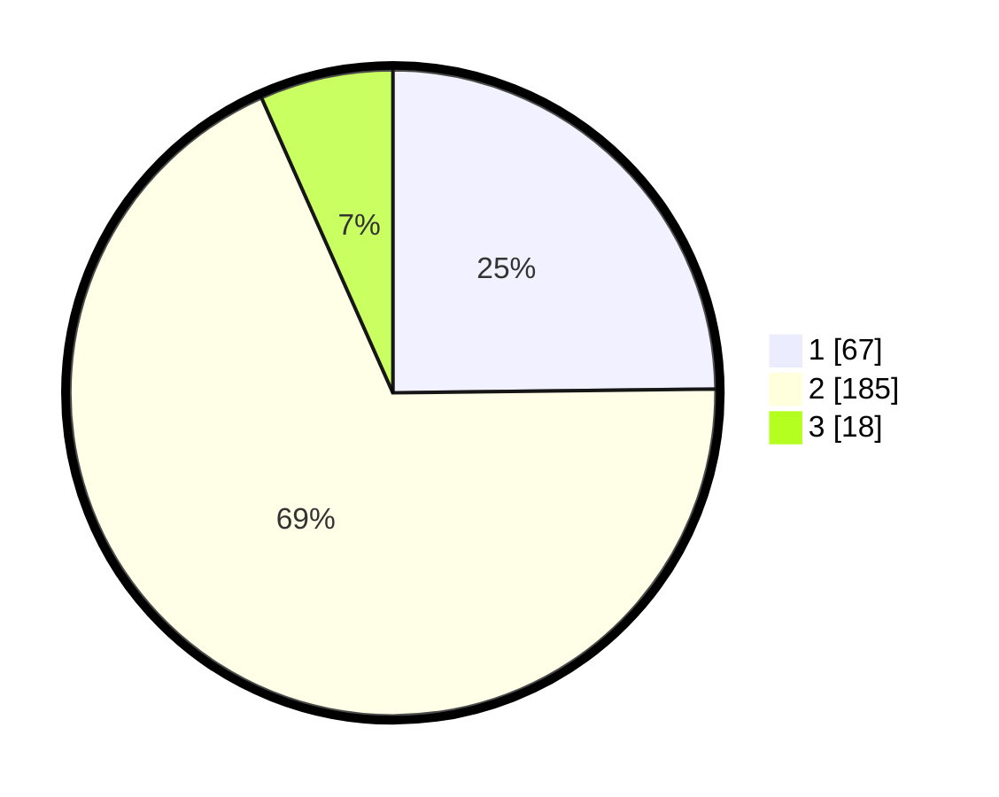

# Hasil

## Grafik

## Tabel

| No. | Nama Paslon    | Suara | Suara (raw) | Persentase |
|:--- |:-------------- | -----:| -----------:| ----------:|
| 1   | ANIES MUHAIMIN | 67    | [67][p-1]   | 24,81      |
| 2   | PRABOWO GIBRAN | 185   | [185][p-2]  | 68,52      |
| 3   | GANJAR MAHFUD  | 18    | [18][p-3]   | 6,67       |

[p-1]: https://github.com/gigit-pemilu/pemilu-2024-32-jawa-barat/blob/main/pilpres/hitung-suara/sub/32-jawa-barat/sub/01-bogor/sub/05-babakan-madang/sub/2003-sentul/sub/002-tps/sub/paslon-1.txt
[p-2]: https://github.com/gigit-pemilu/pemilu-2024-32-jawa-barat/blob/main/pilpres/hitung-suara/sub/32-jawa-barat/sub/01-bogor/sub/05-babakan-madang/sub/2003-sentul/sub/002-tps/sub/paslon-2.txt
[p-3]: https://github.com/gigit-pemilu/pemilu-2024-32-jawa-barat/blob/main/pilpres/hitung-suara/sub/32-jawa-barat/sub/01-bogor/sub/05-babakan-madang/sub/2003-sentul/sub/002-tps/sub/paslon-3.txt

## Foto C Plano

https://sirekap-obj-formc.kpu.go.id/d150/pemilu/ppwp/32/01/05/20/03/3201052003002-20240214-200006--ddd4a24f-8ec9-4991-a2ba-22391f40bb99.jpg

https://sirekap-obj-formc.kpu.go.id/d150/pemilu/ppwp/32/01/05/20/03/3201052003002-20240214-195334--fcac99d4-71a4-409c-90c4-98b97a82278d.jpg

https://sirekap-obj-formc.kpu.go.id/d150/pemilu/ppwp/32/01/05/20/03/3201052003002-20240214-195639--203de54f-9bf5-4db9-9d90-f4bf11a948e4.jpg

## Metadata

| Key        | Value               |
| ---------- | ------------------- |
| Time Stamp | 2024-02-16 00:30:27 |

