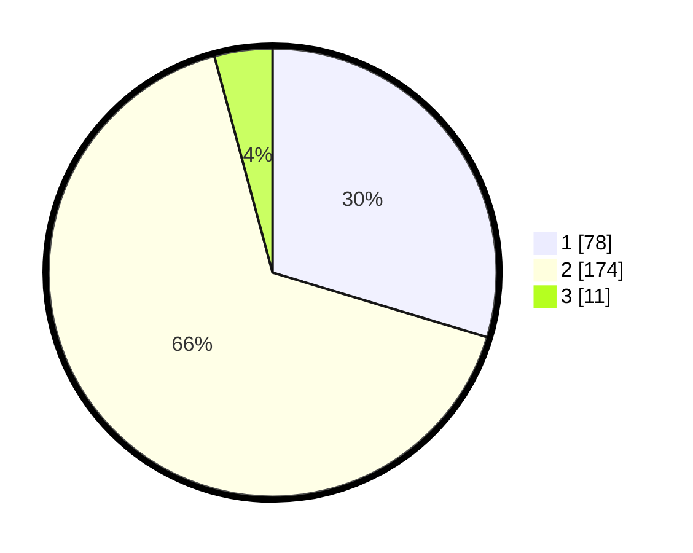

# Hasil

## Grafik

## Tabel

| No. | Nama Paslon    | Suara | Suara (raw) | Persentase |
|:--- |:-------------- | -----:| -----------:| ----------:|
| 1   | ANIES MUHAIMIN | 78    | [78][p-1]   | 29,66      |
| 2   | PRABOWO GIBRAN | 174   | [174][p-2]  | 66,16      |
| 3   | GANJAR MAHFUD  | 11    | [11][p-3]   | 4,18       |

[p-1]: https://github.com/gigit-pemilu/pemilu-2024/blob/main/pilpres/hitung-suara/sub/32-jawa-barat/sub/01-bogor/sub/05-babakan-madang/sub/2004-karang-tengah/sub/002-tps/sub/paslon-1.txt
[p-2]: https://github.com/gigit-pemilu/pemilu-2024/blob/main/pilpres/hitung-suara/sub/32-jawa-barat/sub/01-bogor/sub/05-babakan-madang/sub/2004-karang-tengah/sub/002-tps/sub/paslon-2.txt
[p-3]: https://github.com/gigit-pemilu/pemilu-2024/blob/main/pilpres/hitung-suara/sub/32-jawa-barat/sub/01-bogor/sub/05-babakan-madang/sub/2004-karang-tengah/sub/002-tps/sub/paslon-3.txt

## Foto C Plano

https://sirekap-obj-formc.kpu.go.id/9ecd/pemilu/ppwp/32/01/05/20/04/3201052004002-20240214-193408--fbf169a7-320b-4891-8fd1-e73833697233.jpg

https://sirekap-obj-formc.kpu.go.id/9ecd/pemilu/ppwp/32/01/05/20/04/3201052004002-20240214-193415--9f096dbc-dc82-45dc-bf96-b7b4c1f42f5b.jpg

https://sirekap-obj-formc.kpu.go.id/9ecd/pemilu/ppwp/32/01/05/20/04/3201052004002-20240214-193420--19841688-fa68-4413-b36b-3b0789c040df.jpg

## Metadata

| Key        | Value               |
| ---------- | ------------------- |
| Time Stamp | 2024-02-15 15:00:29 |

