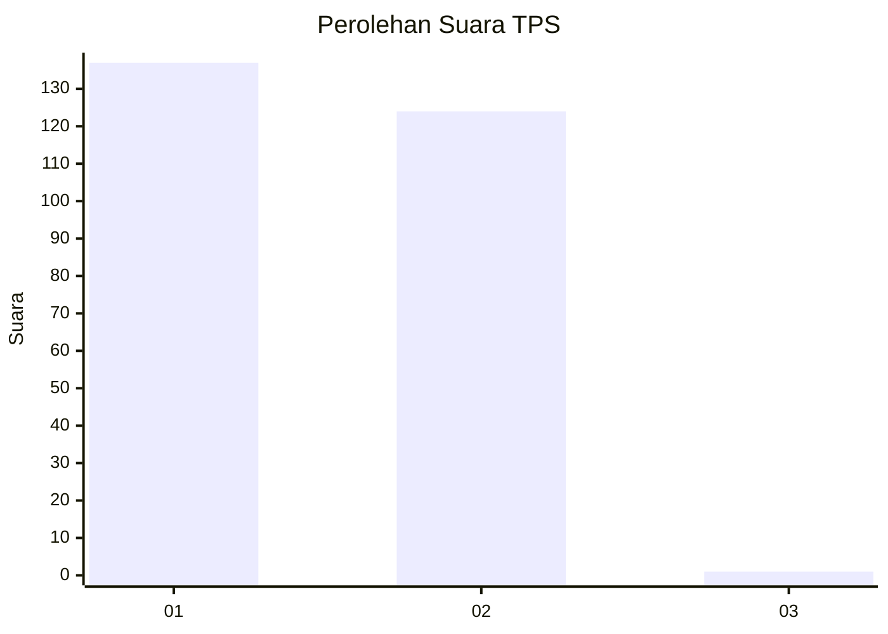
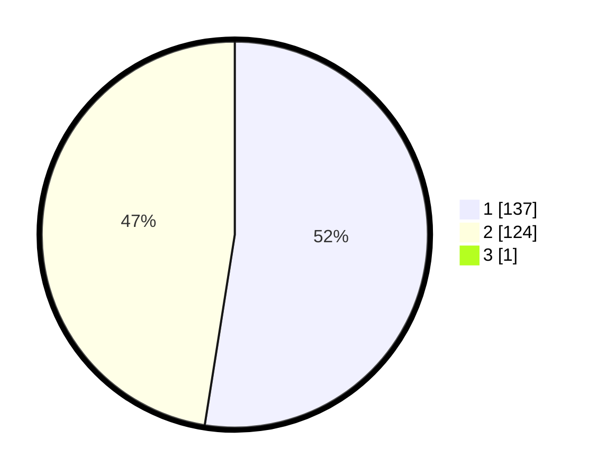

# Hasil

## Grafik

## Tabel

| No. | Nama Paslon    | Suara | Suara (raw) | Persentase |
|:--- |:-------------- | -----:| -----------:| ----------:|
| 1   | ANIES MUHAIMIN | 137   | [137][p-1]  | 52,29      |
| 2   | PRABOWO GIBRAN | 124   | [124][p-2]  | 47,33      |
| 3   | GANJAR MAHFUD  | 1     | [1][p-3]    | 0,38       |

[p-1]: https://github.com/gigit-pemilu/pemilu-2024/blob/main/pilpres/hitung-suara/sub/32-jawa-barat/sub/01-bogor/sub/05-babakan-madang/sub/2004-karang-tengah/sub/005-tps/sub/paslon-1.txt
[p-2]: https://github.com/gigit-pemilu/pemilu-2024/blob/main/pilpres/hitung-suara/sub/32-jawa-barat/sub/01-bogor/sub/05-babakan-madang/sub/2004-karang-tengah/sub/005-tps/sub/paslon-2.txt
[p-3]: https://github.com/gigit-pemilu/pemilu-2024/blob/main/pilpres/hitung-suara/sub/32-jawa-barat/sub/01-bogor/sub/05-babakan-madang/sub/2004-karang-tengah/sub/005-tps/sub/paslon-3.txt

## Foto C Plano

https://sirekap-obj-formc.kpu.go.id/8299/pemilu/ppwp/32/01/05/20/04/3201052004005-20240214-235610--24df39dd-9fdf-415a-bbc4-2ee897cdde02.jpg

https://sirekap-obj-formc.kpu.go.id/8299/pemilu/ppwp/32/01/05/20/04/3201052004005-20240215-001757--c8b83980-1efb-4ee4-b316-d3d3db8d9831.jpg

https://sirekap-obj-formc.kpu.go.id/8299/pemilu/ppwp/32/01/05/20/04/3201052004005-20240215-001837--d563414e-46c3-4617-9fbb-55bce27a859c.jpg

## Metadata

| Key        | Value               |
| ---------- | ------------------- |
| Time Stamp | 2024-02-15 15:00:29 |

