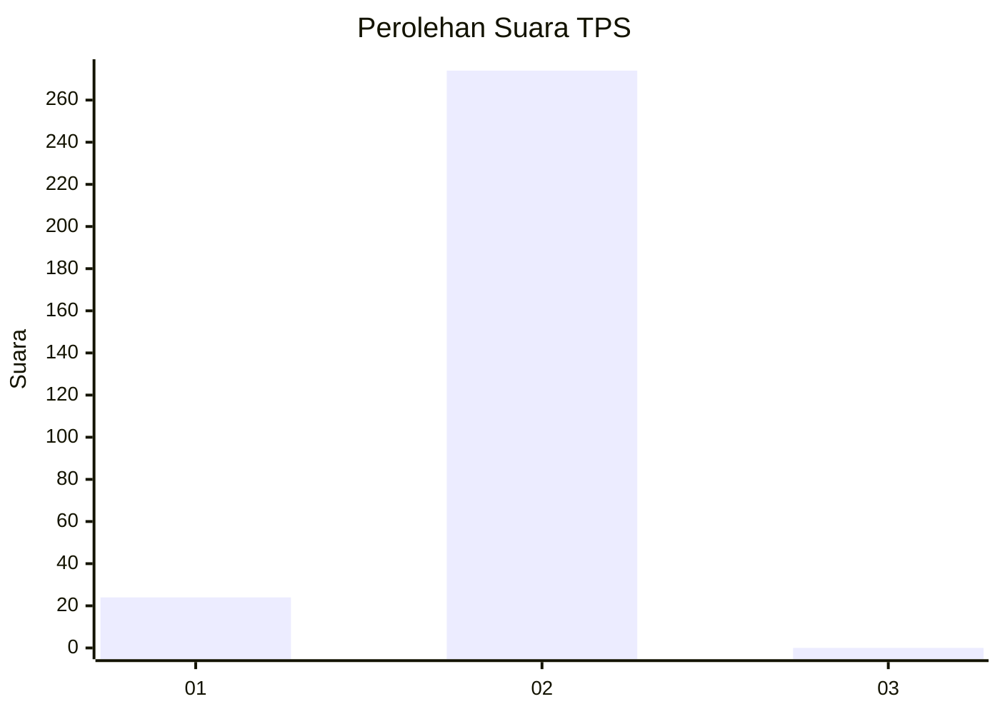
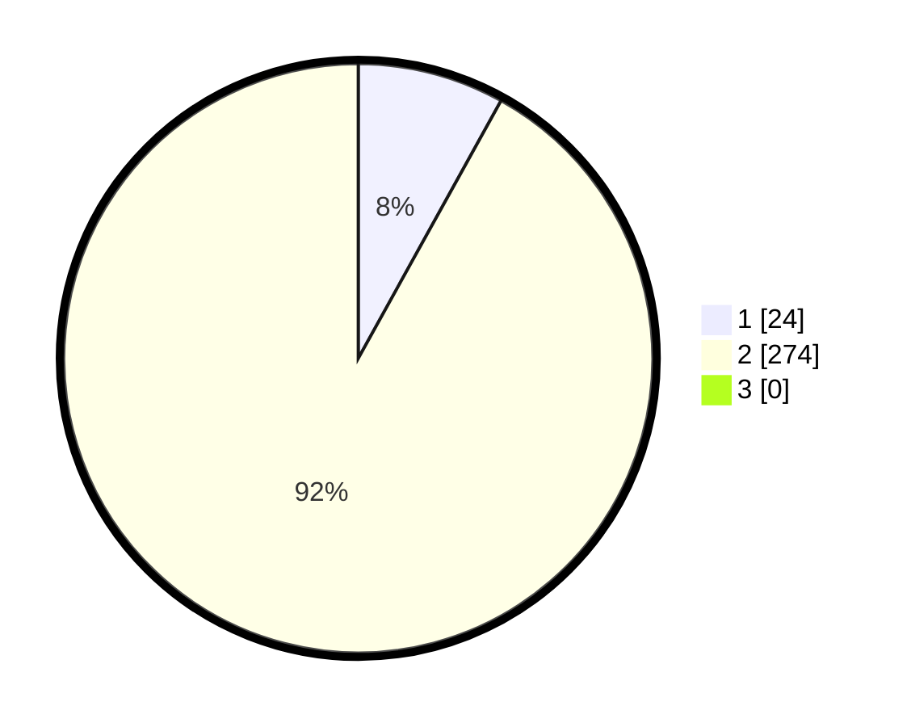

# Hasil

## Grafik

## Tabel

| No. | Nama Paslon    | Suara | Suara (raw) | Persentase |
|:--- |:-------------- | -----:| -----------:| ----------:|
| 1   | ANIES MUHAIMIN | 24    | [24][p-1]   | 8,05       |
| 2   | PRABOWO GIBRAN | 274   | [274][p-2]  | 91,95      |
| 3   | GANJAR MAHFUD  | 0     | [0][p-3]    | 0,00       |

[p-1]: https://github.com/gigit-pemilu/pemilu-2024-32-jawa-barat/blob/main/pilpres/hitung-suara/sub/32-jawa-barat/sub/01-bogor/sub/05-babakan-madang/sub/2009-bojong-koneng/sub/008-tps/sub/paslon-1.txt
[p-2]: https://github.com/gigit-pemilu/pemilu-2024-32-jawa-barat/blob/main/pilpres/hitung-suara/sub/32-jawa-barat/sub/01-bogor/sub/05-babakan-madang/sub/2009-bojong-koneng/sub/008-tps/sub/paslon-2.txt
[p-3]: https://github.com/gigit-pemilu/pemilu-2024-32-jawa-barat/blob/main/pilpres/hitung-suara/sub/32-jawa-barat/sub/01-bogor/sub/05-babakan-madang/sub/2009-bojong-koneng/sub/008-tps/sub/paslon-3.txt

## Foto C Plano

https://sirekap-obj-formc.kpu.go.id/3a29/pemilu/ppwp/32/01/05/20/09/3201052009008-20240214-202209--645c6e62-7adf-44c5-b16c-0f00931bd659.jpg

https://sirekap-obj-formc.kpu.go.id/3a29/pemilu/ppwp/32/01/05/20/09/3201052009008-20240214-202224--8b0da92c-184e-4bf1-a841-a52056317c75.jpg

https://sirekap-obj-formc.kpu.go.id/3a29/pemilu/ppwp/32/01/05/20/09/3201052009008-20240214-202256--d053cda6-29ba-4fe3-b1f1-5c93d7881725.jpg

## Metadata

| Key        | Value               |
| ---------- | ------------------- |
| Time Stamp | 2024-02-15 15:00:29 |

